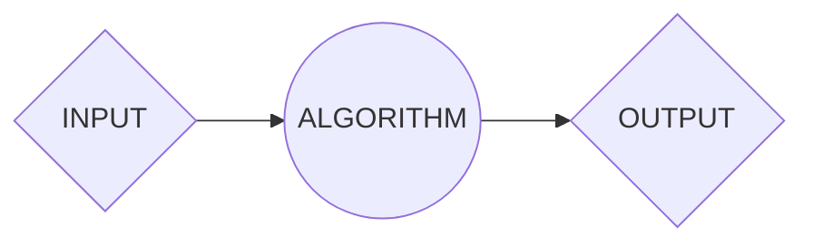
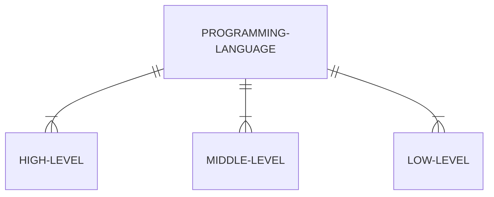
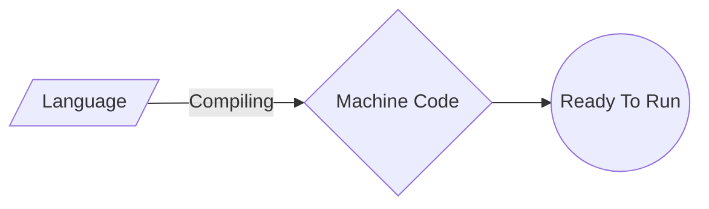
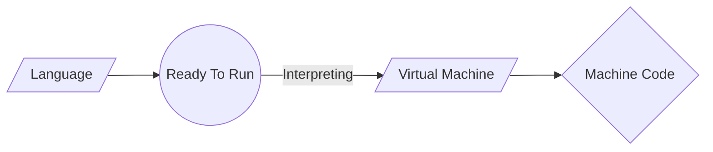

## Introduction

Let's delve into the fascinating historical journey of the Python programming language, understanding its origins, evolution over time, and how it has become one of the most popular and versatile languages today. Additionally, we'll examine the various practical applications of Python, ranging from web development to task automation, artificial intelligence, and data analysis, showcasing its relevance across diverse domains.

Furthermore, we will explore fundamental programming concepts in Python, emphasizing flow control structures, data types, functions, and object-oriented programming. These concepts are crucial for any programmer, regardless of the chosen language, and will lay a solid foundation for those looking to enhance their coding skills.

While far from being an exhaustive guide, our aim is to provide a comprehensive overview that allows Python beginners to gain a high-level understanding of its essential principles. With a solid foundation in these universal concepts, programmers will be better equipped to tackle more advanced challenges and assimilate new technologies that may emerge in the programming landscape in the future.

## Computational Thinking

> *"Solving human's problems by analisis and system conception that simulate human behavior against that problem."*

That was a phrase that i heard from a incredible teacher in my first year of **Computer Engineer** in **Universidade de São Paulo (USP)**, and it really changed my mentality as a student.

Computational Thinking is a *problem-solving* technique that imitates the process computer programmers go through when writing computer programmes and algorithms. This process requires programmers to break down complex problems and scenarios into bite size pieces that can be fully understood in order to then develop solutions that are clear to both computers and humans. 

In short, computational thinking encourages people to approach any problem in a systematic manner, and to develop and articulate solutions in terms that are simple enough to be executed by a computer – or another person. 

#### Four main aspects of Computational Thinking

* **Decomposition:** Breaking down a big problem into small, manageable parts
* **Pattern Recognition:** Observing similarities and patterns in these smaller parts, to help us solve complex problems more efficiently
* **Abstraction:** Identifying and extracting the important parts of the problem
* **Algorithm:** Creating the step-by-step instructions of solving the problem

> *"Computational thinking is a way humans solve problems; it is not trying to get humans to think like computers. Computers are dull and boring; humans are clever and imaginative. We humans make computers exciting."* Jeanette M. Wing,


## Algorithm

An algorithm is a procedure used for solving a problem or performing a computation. Algorithms act as an exact list of instructions that conduct specified actions step by step in either hardware- or software-based routines.

Algorithms are more than just programming, they are specifications for performing calculations, data processing, automated reasoning or decision making for example.

### How do Algorithms Work

Algorithms work by following a set of instructions or rules to complete a task or solve a problem. They can be expressed as natural languages, programming languages, pseudocode, flowcharts and control tables. 


> *Input: The collected data that will be passed to the algorithm*  
> *Algorithm: The input will be passed to the processing unit, producing the desired output.*  
> *Ouput: The outcome expected or result of the program.*

#

### You may ignore it, but you use algorithms everyday

Every time you cook or play a song, you follow a set of steps to produce a final product of your expectative. If you were asked to write down instructions to make your own recipe, you could create your own algorithm. 

As instance, you can simply do an algorithm to check whether a number is prime or not.

```
Step 1: Start
Step 2: Declare variables n, i, flag.
Step 3: Initialize variables
        flag ← 1
        i ← 2  
Step 4: Read n from the user.
Step 5: Repeat the steps until i=(n/2)
     5.1 If remainder of n÷i equals 0
            flag ← 0
            Go to step 6
     5.2 i ← i+1
Step 6: If flag = 0
           Display n is not prime
        else
           Display n is prime
Step 7: Stop 
```
#

### Types of Algorithms:

There are several types of algorithms, all designed to accomplish different tasks:

* **Brute Force Algorithm:** It is the simplest approach for a problem. A brute force algorithm is the first approach that comes to finding when we see a problem.

* **Recursive Algorithm:** A recursive algorithm is based on recursion. In this case, a problem is broken into several sub-parts and called the same function again and again.

* **Backtracking Algorithm:** The backtracking algorithm basically builds the solution by searching among all possible solutions. Using this algorithm, we keep on building the solution following criteria. Whenever a solution fails we trace back to the failure point and build on the next solution and continue this process till we find the solution or all possible solutions are looked after.

* **Searching Algorithm:** Searching algorithms are the ones that are used for searching elements or groups of elements from a particular data structure. They can be of different types based on their approach or the data structure in which the element should be found.

* **Hashing Algorithm:** Hashing algorithms work similarly to the searching algorithm. But they contain an index with a key ID. In hashing, a key is assigned to specific data.

* **Divide and Conquer Algorithm:** This algorithm breaks a problem into sub-problems, solves a single sub-problem and merges the solutions together to get the final solution. It consists of the following three steps: Divide , Solve and Combine.

* **Dynamic Programming Algorithm:** This algorithm uses the concept of using the already found solution to avoid repetitive calculation of the same part of the problem. It divides the problem into smaller overlapping subproblems and solves them.


## Pseudocode

Pseudocode is an informal way of programming description that does not require any strict *programming language synta*x or *underlying technology* considerations. Although pseudocode is a *syntax-free* description of an algorithm, it must provide a full description of the algorithm’s logic so that moving from pseudocode to implementation is merely a task of translating each line into code. Therefore, pseudocode it is used for creating an outline or a rough draft of a program.

### Advantages of Pseudocode

* Improves the readability of any approach. It’s one of the best approaches to start implementation of an algorithm.
* Acts as a bridge between the program and the algorithm or flowchart. Also works as a rough documentation, so the program of one developer can be understood easily when a pseudocode is written out. In industries, the approach of documentation is essential. And that’s where a pseudocode proves vital.
* The main goal of a pseudocode is to explain what exactly each line of a program should do, hence making the code construction phase easier for the programmer.

#

### How to Write a Pseudocode

Pseudo-code is an informal way to express the design of a computer program or an algorithm. The aim is to get the idea quickly and also easy to read without details. There are several ways of writing pseudo-code;
there are no strict rules, but always try to reduce ambiguity between what you are required to do and what you express.

**Example: Add Two Numbers**
```julia
BEGIN
DECLARE AN INTEGER VARIABLE a    // a is the value of the first number
DECLARE AN INTEGER VARIABLE b    // b is the value of the second number
DECLARE AN INTEGER VARIABLE sum  // sum is the sum between a and b

PRINT ("INPUT NUMEBR 1: ")       // The program outputs the message  "INPUT NUMEBR 1: ".
INPUT a                          // The value passed is stored in a variable

PRINT ("INPUT NUMEBR 2: ")       // The program outputs the message  "INPUT NUMEBR 2: "
INPUT b                          // The value passed is stored in b variable

sum <- a + b                     // The sum between a and b is store in the sum variable
PRINT sum                        // The program outputs the determined result
END
```
> ***This algorithm takes two numbers as input from the user, adds them together and outputs the sum.***

**Example: Check a Number is Positive or Negative**
```julia
BEGIN
DECLARE AN INTEGER NUMBER num         // num is the value of the given number 
 
PRINT ("ENTER A NUMBER: ")            // The program outputs the message "ENTER A NUMBER: ".
INPUT num                             // The value passed is stored in num variable
 
IF num > 0 THEN                       // The program checks if "num" is greater than zero.
  PRINT ("GIVEN NUMBER IS POSITIVE")  // If checks, outputs the message "GIVEN NUMBER IS POSITIVE".
ELSE IF num < 0 THEN                  // The program checks if "num" is less than zero
  PRINT ("GIVEN NUMBER IS NEGATIVE")  // If checks, outputs the message "GIVEN NUMBER IS NEGATIVE".
ELSE                                  // If neither condition checked do the following command
  PRINT ("GIVEN NUMBER IS ZERO")      // The program outputs the message "GIVEN NUMBER IS ZERO".
ENDIF
END
```

> ***This algorithm determines if a number entered by the user is positive, negative, or zero.***

## Programming Language

A programming language is a way for programmers (developers) to communicate with computers. Programming languages consist of a set of rules that allows string values to be converted into various ways of generating machine code, or, in the case of visual programming languages, graphical elements.

### Low-Level vs. High-Level Programming Languages
Programming languages fall into two most usual classifications — low-level and high-level.

#### Low-Level
Low-Level programming languages are closer to *machine code*, or *binary*. Therefore, they’re more difficult for humans **to read**. The benefit of *low-level languages* is that they’re **fast** and offer **precise control** over how the computer will function.

#### High-Level
High-Level programming languages are closer to how **humans communicat**e. *High-level languages* use words (like object, order, run, class, etc.) that are closer to the words we use in our everyday lives. This means they’re easier to understand than *low-level programming languages*, although they do take more **time to translate** into *machine code* for the computer.



> ***A middle-level programming lies between the low-level and high-level programming language. It's advantages are that it supports the features of high-level programming, it is a user-friendly language, and closely related to machine language and human language.***

#

### Interpreted vs. Compiled Languages 

Programming languages can be broadly categorized into two types based on how they are processed: compiled and interpreted. 

#### Compiled Languages

Compiled programming languages are those in which the *source code* is compiled into *machine code* before it is executed. Machine code is a *low-level language* that can be executed directly by the computer’s CPU. When a program written in a compiled language is compiled, the source code is converted into an executable file that can be run on the target machine. However, the compiled code is hardware dependent.



> ***Examples: C, C++, C#, CLEO, COBOL, etc.***

#### Interpreted Languages

Interpreted programming languages, on the other hand, are those in which the source code is executed directly by an interpreter, without being compiled into machine code first. The interpreter reads the source code line by line and executes each line as it is read. The interpreter is responsible for translating the source code into machine code at runtime.



> ***Examples: JavaScript, Perl, Python, BASIC, etc.***

## Introduction To Python Language

Python stands out as a high-level, versatile programming language renowned for its design philosophy that places a premium on code readability, utilizing significant indentation for structuring code blocks. This design choice makes Python code visually intuitive and clean, enhancing collaboration and maintainability.

One of Python's distinctive features is its dynamic typing and automatic garbage collection, streamlining the coding process by eliminating the need for explicit variable type declarations and manual memory management. This flexibility contributes to Python's adaptability to various programming paradigms, including structured (especially procedural), object-oriented, and functional programming. The language's versatility allows developers to choose the paradigm that best suits their project requirements.

Often referred to as a "batteries included" language, Python boasts a comprehensive standard library. This extensive library encompasses a wide range of modules and packages, providing ready-made solutions for various tasks. This inclusivity reduces the need for external dependencies, making Python a powerful and self-sufficient tool for developers.

[Guido van Rossum](https://en.wikipedia.org/wiki/Guido_van_Rossum) initiated the development of Python in the late 1980s, aiming to create a successor to the [ABC programming language](https://en.wikipedia.org/wiki/ABC_(programming_language)). The first official release, Python 0.9.0, occurred in 1991. Over the years, Python has undergone significant updates, with Python 2.0 being released in 2000. However, one of the most substantial changes came with Python 3.0 in 2008, marking a major revision that was not entirely backward-compatible with earlier versions.

Guido van Rossum's continuous involvement and leadership in Python's development have played a crucial role in shaping the language's evolution. Python's journey from its early versions to the latest releases reflects a commitment to innovation, adaptability, and a vibrant community that continues to contribute to its growth. As a result, Python has become a powerhouse in the programming world, attracting developers across diverse domains due to its simplicity, readability, and extensive capabilities.

#

### Why Do People Use Python?

As newcomers explore the diverse array of programming languages available today, the question of why Python is chosen often arises. With approximately 1 million Python users currently, providing a precise answer becomes challenging, as the selection of development tools is frequently influenced by unique constraints and personal preferences.

The primary factors frequently cited by Python users include:

1. **Software Quality:**  
   Python stands out in the scripting world due to its emphasis on readability, coherence, and overall software quality. The design of Python code prioritizes readability, fostering reusability and maintainability, surpassing traditional scripting languages. The uniformity of Python code enhances understanding, even for those who did not write it. Additionally, Python provides robust support for advanced software reuse mechanisms, such as object-oriented programming (OOP).

2. **Developer Productivity:**  
   Python significantly enhances developer productivity compared to compiled or statically typed languages like C, C++, and Java. Python code is typically one-third to one-fifth the size of equivalent C++ or Java code, resulting in less typing, debugging, and post-maintenance efforts. Python programs also run instantly, eliminating the prolonged compile and link steps required by some other tools, thereby accelerating programmer speed.

3. **Program Portability:**  
   Most Python programs run seamlessly on major computer platforms. Transferring Python code between Linux and Windows, for instance, usually involves copying the script's code between machines. Python offers multiple options for developing portable graphical user interfaces, database access programs, web-based systems, and more. Even operating system interfaces, including program launches and directory processing, maintain portability in Python.

4. **Support Libraries:**  
   Python includes an extensive standard library, offering prebuilt and portable functionality. This library supports various application-level programming tasks, from text pattern matching to network scripting. Python can be extended with homegrown libraries and a vast collection of third-party application support software, spanning website construction, numeric programming, serial port access, game development, and more.

5. **Component Integration:**  
   Python scripts seamlessly communicate with other parts of an application through various integration mechanisms. This capability positions Python as a tool for product customization and extension. Python can invoke C and C++ libraries, be called from C and C++ programs, integrate with Java and .NET components, communicate over frameworks like COM, interface with devices over serial ports, and interact over networks with interfaces such as SOAP, XML-RPC, and CORBA.

6. **Enjoyment:**  
   Python's ease of use and built-in toolset contribute to making the act of programming more enjoyable than a chore. While this may be an intangible benefit, its positive impact on productivity is a significant asset.

Among these factors, the first two (quality and productivity) are likely the most compelling benefits for the majority of Python users.

#

### What Can I Do with Python?

Python, besides being a well-designed programming language, is a versatile tool for accomplishing real-world tasks that developers engage in daily. Its general-purpose nature allows it to be applied in various domains, serving as a scripting tool for other components and creating standalone programs. Python's capabilities span a wide range of applications, from website development and gaming to robotics and spacecraft control.

While Python's roles are virtually unlimited, the most common applications fall into several broad categories, briefly outlined below. For more in-depth information on specific tools, refer to the Python website or other relevant resources.

1. **Systems Programming:**
   Python's built-in interfaces to operating-system services make it ideal for creating portable and maintainable system-administration tools and utilities. With support for POSIX bindings and standard OS tools, Python excels in tasks such as searching files, launching programs, and parallel processing.

2. **GUIs (Graphical User Interfaces):**
   Python's simplicity and quick development cycle make it well-suited for GUI programming. The standard Tk GUI API, tkinter, enables the creation of portable GUIs with a native look and feel. Additional GUI options include the wxPython GUI API, which is based on a C++ library, and higher-level toolkits like PythonCard and Dabo.

3. **Internet Scripting:**
   Python's standard Internet modules facilitate a wide range of networking tasks, both in client and server modes. From socket communication to handling XML files, Python's libraries simplify internet scripting. Third-party tools and web development frameworks like Django, TurboGears, and Pylons further enhance internet programming capabilities.

4. **Component Integration:**
   Python's extensibility and embedding capabilities make it an effective glue language for scripting the behavior of other systems and components. SWIG, SIP, Cython, and various frameworks like Python's COM support, Jython, IronPython, and CORBA toolkits provide options for seamless component integration.

5. **Database Programming:**
   Python interfaces with popular relational database systems, offering a portable database API for SQL database access. Standard modules, along with third-party systems like ZODB, SQLObject, and SQLAlchemy, facilitate database programming.

6. **Rapid Prototyping:**
   Python's ability to treat components written in Python and C interchangeably enables rapid prototyping. Systems can be initially prototyped in Python and later components can be moved to compiled languages like C or C++ for delivery.

7. **Numeric and Scientific Programming:**
   NumPy, SciPy, and ScientificPython extensions enhance Python's capabilities for numeric and scientific programming, offering tools for array manipulation, mathematical libraries, animation, 3D visualization, and more.

8. **Gaming, Images, Serial Ports, XML, Robots, and More:**
   Python finds applications in diverse domains, including game programming (pygame), image processing (PIL, PyOpenGL), serial port communication (PySerial), XML parsing (xml library, xmlrpclib), robot control programming (PyRo toolkit), and artificial intelligence programming (NLTK package).

Python's extensive support for various fields is evident through its component integration role, making it a widely applicable and powerful general-purpose language.

#

### Python as an Interpreter and Software Package

While Python is primarily known as a programming language, it is also implemented as a software package functioning as an interpreter. An interpreter is a type of program that executes other programs. When you write a Python program, the Python interpreter reads and executes the instructions within your code. Essentially, the interpreter acts as an intermediary layer of software logic between your code and the underlying computer hardware.

Upon installation of the Python package on your machine, it generates various components, at a minimum, an interpreter and a support library. The Python interpreter can take the form of an executable program or a set of libraries linked into another program, depending on usage. Additionally, the interpreter itself may be implemented as a C program, a collection of Java classes, or another form depending on the Python flavor being run. Regardless of its form, your Python code must always be run by this interpreter, necessitating the installation of a Python interpreter on your computer.

In summary:
- **Windows Users:** Download and run a self-installing executable file that simplifies the installation process. A series of prompts will guide you through the installation.
- **Linux and Mac OS X Users:** Most likely have a usable Python preinstalled, as it is a standard component on these platforms.
- **Some Linux and Mac OS X Users (and most Unix Users):** Compile Python from its full source code distribution package.
- **Other Platforms:** Installation techniques vary widely; Python is available on platforms such as cell phones, game consoles, and iPods.

Python can be obtained from the [official website's](http://www.python.org) downloads page  or through various distribution channels. It is important to check whether Python is already present on your system before installation. On Windows, Python is usually found in the Start menu. On Unix and Linux, Python likely resides in the $/usr$ directory tree.

#

### What Are Python’s Technical Strengths?

For developers, Python presents a myriad of technical strengths that contribute to its popularity and effectiveness as a programming language. Here's a closer look at some key features:

**1. Object-Oriented:**
   Python is inherently object-oriented, supporting advanced concepts like polymorphism, operator overloading, and multiple inheritance. Despite the sophistication of these features, Python's simple syntax makes object-oriented programming (OOP) easily accessible, even for those unfamiliar with OOP languages.

**2. Free and Open Source:**
   Python is freely available and can be distributed without restrictions. Its open-source nature encourages collaboration and empowers developers to access and modify the source code. The vibrant online community ensures robust support, often surpassing commercial software help desks in responsiveness.

**3. Portable:**
   Implemented in portable ANSI C, Python runs on virtually every major platform, from Linux and Windows to Mac OS, real-time systems, and even mobile devices. The standard library modules are designed for portability, and Python programs, when using core language features, run consistently across different platforms.

**4. Powerful:**
   Python combines the simplicity of scripting languages with advanced software engineering tools found in compiled languages. Its feature set includes dynamic typing, automatic memory management, support for programming in the large, built-in object types, a rich set of tools, library utilities, and third-party utilities. This hybrid nature makes Python suitable for both scripting and large-scale development projects.

**5. Mixable:**
   Python seamlessly integrates with components written in other languages, allowing for flexible interaction through its C API. This mixability makes Python an ideal choice for rapid prototyping and easy customization, enabling developers to leverage its development speed before transitioning to other languages for performance optimization.

**6. Easy to Use:**
   Python eliminates intermediate compile and link steps, offering an interactive programming experience with immediate execution. Its simple syntax, powerful built-in tools, and ease of learning contribute to an environment where developers can focus on problem-solving rather than grappling with complexities.

**7. Named After Monty Python:**
   While not a technical strength, the language's humorous connection to Monty Python's Flying Circus adds a distinctive touch to Python culture, evident in code examples and community references.

**8. Comparison with Other Languages:**
   Python is often considered more powerful than Tcl, cleaner and simpler than Perl, simpler and easier to use than Java and C++, and more readable and general-purpose than PHP. It is also more mature and readable than Ruby and offers a dynamic flavor akin to SmallTalk and Lisp.

In summary, Python's technical strengths, combined with its versatility and readability, make it a preferred choice for developers across various domains.

### What’s the Downside?

The primary drawback of Python, is its execution speed, which may not always match up to that of fully compiled languages such as C and C++. In Python's standard implementations, source code is compiled into an intermediate format called byte code, providing portability but requiring interpretation during runtime, potentially resulting in slower execution. This trade-off between portability and execution speed is inherent in Python, as it is not compiled into binary machine code like some other languages.

Python has undergone optimizations over the years, making its code fast enough for most application domains. The language prioritizes speed of development, which often outweighs concerns about execution speed. Notably, when performing substantial tasks in a Python script, such as processing files or creating graphical user interfaces (GUIs), the execution speed can approach that of C. This is because these tasks are handled by compiled C code within the Python interpreter.

Despite Python's optimizations, there are domains, such as numeric programming and animation, where optimal execution speeds are vital. In such cases, developers may need to create compiled extensions in languages like C, separating parts of an application that require optimal speed and linking them into Python scripts.

NumPy, a numeric programming extension for Python, illustrates this dual-language strategy. It combines compiled and optimized numeric extension libraries with Python, offering efficiency and ease of use in numeric programming tasks. While Python excels in development speed and versatility, its downside lies in potential differences in execution speed, especially in performance-critical domains, where the creation of compiled extensions can provide a solution.

#

### The IDLE User Interface

The IDLE (Integrated Development and Learning Environment) user interface serves as a graphical environment for Python development. Functioning as an integrated development environment (IDE), IDLE combines various development tasks into a unified view, allowing users to edit, run, browse, and debug Python programs within a single interface. It offers a visual alternative for those seeking a more interactive and less error-prone experience compared to command-line inputs or icon clicks.

IDLE operates as a Python program utilizing the tkinter GUI toolkit (Tkinter in Python 2.6), making it portable across different Python platforms, including Microsoft Windows, X Windows (for Linux, Unix, and Unix-like platforms), and Mac OS (both Classic and OS X). It is easily launched from the Start menu on Windows or via command line or icon clicks on Unix-like systems.


> ***Note:** Visual Studio Code (IDE) with the Horizon Extended Theme.*

#

### IDLE Basics

When IDLE starts, the main Python shell window opens, initiating an interactive session with the familiar `>>>` prompt. This main window functions as an interactive testing tool where code is executed immediately after input. Syntax-directed colorization is employed in both the main window and text edit windows, highlighting keywords and literals to provide a clearer view of code components.

IDLE uses menus with keyboard shortcuts for various operations. To create or edit a source code file, users can open a text edit window through the File menu. Syntax-directed colorization is applied to provide a visual distinction between different components in the code.

Running a file of code in IDLE involves selecting the file's text edit window, opening the Run menu, and choosing the Run Module option. Python prompts users to save the file if changes have been made. The output and any error messages generated by the script are displayed in the main interactive window, indicating the script's execution.

Despite its advantages, it's worth noting that IDLE's execution speed may not match that of fully compiled languages like C and C++. However, for many developers, the benefits of IDLE's ease of use and integrated features outweigh the potential downsides related to execution speed.


> ***Note:** Python Shell.*

#

### Using IDLE

Using IDLE provides a free, user-friendly, and portable environment for Python development, particularly suited for newcomers to Python programming. While it may not offer the advanced features of some commercial IDEs, it simplifies the learning process by hiding certain details and not assuming prior experience with system command lines. However, there are some considerations and common pitfalls that IDLE beginners should be aware of:

1. **Explicitly Add ".py" Extension:** When saving files in IDLE, users must explicitly add the ".py" extension to filenames. IDLE does not automatically append this extension, and failing to add it manually may cause issues when importing files.

2. **Run Module Option:** To run scripts in IDLE, it is recommended to use the Run→Run Module option in text edit windows rather than interactive imports and reloads. This ensures the most current version of the file is executed, and IDLE prompts users to save changes if necessary.

3. **Reload Modules When Testing Interactively:** When using IDLE, reloading modules is only necessary for modules being tested interactively. The Run→Run Module option automatically runs the current version of both the top-level file and any imported modules.

4. **Customization:** IDLE allows customization of text fonts, colors, key combinations, and indentation settings. Users can access these options through the Configure and Help menus.

5. **No Clear-Screen Option:** IDLE currently lacks a clear-screen option. Users can press and hold the Enter key or use a Python loop to print blank lines if they want to clear the interactive window's text.

6. **Compatibility with tkinter GUI and Threaded Programs:** Certain advanced Python/tkinter programs may not work well with IDLE, especially those involving multithreading. It is recommended to use other options, such as icon clicks or system command lines, to launch GUI programs edited in IDLE.

7. **Connection Errors:** If connection errors arise, starting IDLE in single-process mode using the -n command-line flag may resolve the issue. This is particularly useful in cases where communication between separate user and GUI processes encounters problems.

8. **Beware of IDLE Usability Features:** IDLE introduces some usability features that may not apply outside its environment. Variables in scripts automatically show up in the IDLE interactive session, and the directory of a recently run file is automatically added to the module import search path. While these features can be handy in IDLE, users should be aware that they are specific to IDLE and may not behave the same way outside the IDE.

#

### Advanced IDLE Tools

Beyond basic editing and running capabilities, IDLE provides advanced features such as a point-and-click program debugger and an object browser. These features can enhance the development and debugging process, offering more insights into code behavior. Here's an overview of these advanced tools:

**Debugger:**
- **Breakpoints:** Easily set breakpoints in your code by right-clicking on lines in the text edit windows, allowing you to halt code execution at specific points for detailed inspection.
- **Variable Inspection:** The debugger facilitates the inspection of variable values during runtime, offering valuable insights into your program's state.
- **Execution Watching:** Follow the execution flow by stepping through your code, line by line.

**Object Browser:**
- **Access:** The object browser is accessible through the File menu in IDLE.
- **Navigation:** Utilize the browser to traverse the module search path, exploring files and objects. Clicking on a file or object opens the corresponding source in a text edit window.

**Quick Error Navigation:**
- **Fast Error Resolution:** Accelerate error resolution by right-clicking on the text of an error message to quickly jump to the line of code where the error occurred. This feature simplifies the debugging process and speeds up error resolution.

**Text Editor Tools:**
- **Advanced Text Operations:** IDLE's text editor provides a range of programmer-friendly tools, including automatic indentation and advanced text and file search operations.
- **Intuitive GUI Interactions:** Leveraging intuitive GUI interactions, IDLE promotes user-friendliness and encourages experimentation with its tools.

These advanced features make IDLE a powerful integrated development environment (IDE) for Python, providing a comprehensive set of tools for editing, running, debugging, and exploring code. Experimenting with these tools within the live system will help users become familiar with their functionalities and enhance their Python development experience.

#

### Other IDEs

In addition to IDLE, which is a standard and free option for Python development, there are several other IDEs available that offer more advanced features and are widely used in the programming community. A popular alternative is [Eclipse](https://www.eclipse.org/), which, when combined with the [PyDev](https://www.pydev.org/) plugin, provides an extensible environment with Python support.

Another robust option is [Komodo](https://www.activestate.com/products/komodo-ide/), a comprehensive environment that includes syntax coloring, advanced text editing, debugging, and even a graphical user interface (GUI) builder for interactive development.

The [NetBeans IDE](https://netbeans.apache.org/) is also a powerful choice, providing features such as autocompletion, automatic indentation, and debugging tools for Python developers.

For Windows users, [PythonWin](http://www.activestate.com/activepython/pythonwin/) (available in the ActivePython distribution) offers a free alternative with specific extensions for this environment.

There are several other options available, such as [Wing IDE](https://wingware.com/) and [PythonCard](https://pythoncard.sourceforge.io/). Additionally, many popular text editors like [Emacs](https://www.gnu.org/software/emacs/) and [Vim](https://www.vim.org/) have substantial support for Python development. The choice between these IDEs often depends on personal preferences and specific project requirements. Trying out different environments can help developers find the tool that best suits their needs and workflow.


## Conclusion

In conclusion, this discussion serves as a foundational exploration into the realm of Python programming. By unraveling the essential characteristics of Python, we aim to equip both newcomers and experienced developers with a fundamental understanding of its capabilities and applications. Python's versatility, readability, and extensive libraries make it a compelling language for a myriad of projects across various domains.

Consider this discourse an invitation to all those intrigued by the programming landscape. Whether you're taking your initial steps into Python or looking to enhance your skills, the [subsequent exploration](https://github.com/artghieri/Python-Guide-A-Practical-Introduction-to-Python-3/blob/main/guide.md) is tailored to enhance your proficiency.

This preamble lays the groundwork for a more in-depth journey into Python, where we will delve into specific features, coding practices, and real-world applications. Stay engaged for a detailed exploration of Python's functionalities, empowering you to navigate the programming landscape with confidence and proficiency.

---
