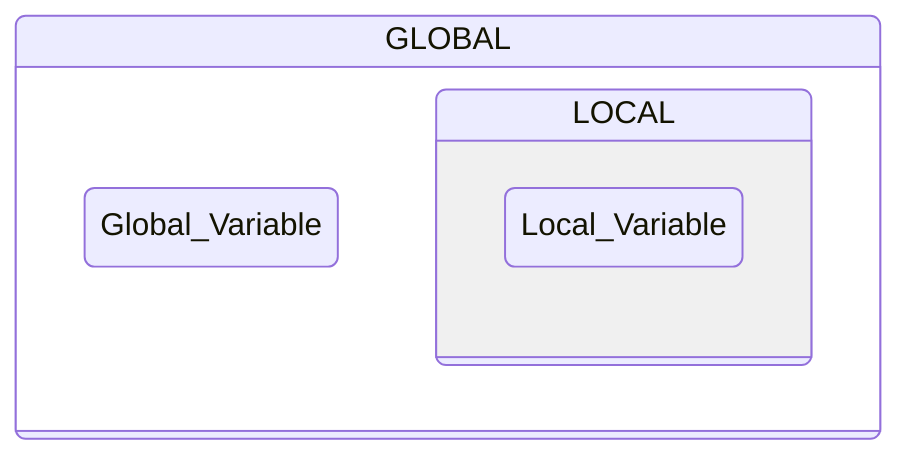
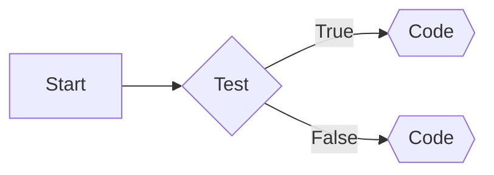
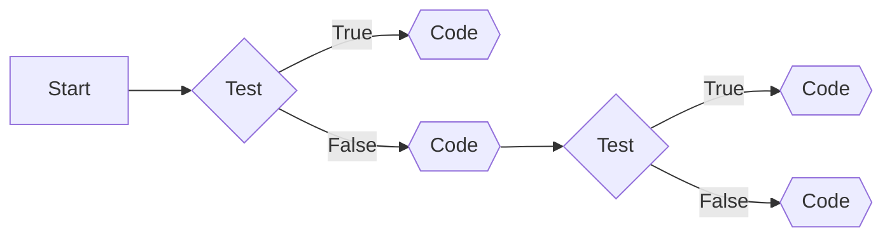
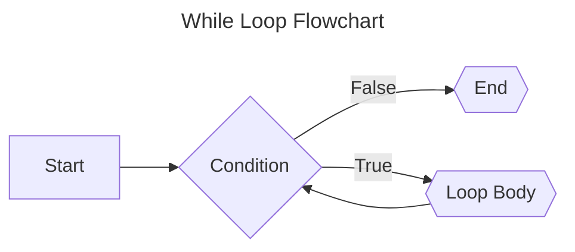
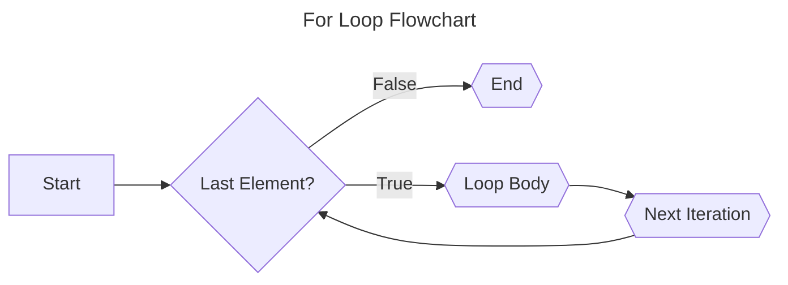

## Introduction


## Variables

Variables in programming serve as symbolic containers, offering a means to hold and reference values within your code. The analogy of a named box is frequently employed to elucidate the concept of variables – envisioning them as storage units with unique identifiers that allow convenient access to the information they contain.

Within the Python programming language, variables are akin to labeled boxes, each housing specific pieces of information in the computer's memory. The name assigned to a variable acts as a reference, providing a convenient way to interact with and manipulate the associated value. 

The use of variables in Python is fundamental for two primary reasons:

**Accessibility of Values**  
Variables streamline the storage of values, allowing you to perform operations without repeatedly executing time-consuming tasks. For example, if a computation involves significant data processing, assigning the result to a variable ensures that the computation is executed only once. Subsequently, you can access the stored result whenever needed, optimizing the efficiency of your code.

**Example:** Calculate the area of a rectangle
```python
# The variables length and width store the dimensions of a rectangle
length = 5
width = 8

# The area variable holds the result of the multiplication.
area = length * width

# Now, the 'area' variable holds the calculated result
print(f"The area of the rectangle is: {area}")
```

> ***Note:** By utilizing variables, the code becomes more readable, and the result can be easily accessed and reused.*

**Contextualization of Values**  
The meaning of values can vary depending on the context. For instance, the numeric value 28 might represent the number of students in a class or the count of times a user has accessed a website. By assigning meaningful names like `num_students` to variables, you provide context and clarity about the significance of the associated value. This naming practice enhances the readability of your code, making it more comprehensible for others and facilitating a better understanding of the variable's purpose and content.

**Example:** Count of students in a class
```python
# The variables num_students and num_visits represent different quantities.
num_students = 28

# Count of website visits
num_visits = 1000

# Displaying the contextualized values
print(f"The number of students in the class: {num_students}")
print(f"The count of website visits: {num_visits}")
```

> ***Note:** Meaningful variable names provides clarity about the context, making the code more understandable for anyone reviewing it.*

###  Declaration and Initialization of Variables

The Python programming language follows a dynamic and strong typing system, distinguishing it from statically typed languages like C. In Python, you do not need to explicitly declare the data type of a variable. Instead, the interpreter dynamically determines the type of a variable during runtime.

Unlike C, Python is not concerned with the direct allocation of physical memory space, making it a more flexible and convenient language for developers. The absence of explicit type declarations allows for easier and quicker coding, as you can assign values to variables without specifying their types.

```python
# Example of dynamic typing in Python
variable_example = 42  # Python interpreter dynamically determines the type

# Reassigning the variable with a different type
variable_example = "Hello, Python!"  # No need for explicit type declaration
```

> ***Note:** The use of the assignment operator is employed to assign values to variables, similar to other programming languages.*

In the provided Python example, the variable `variable_example` is dynamically assigned an integer value and later reassigned a string value. This flexibility enhances code readability and simplifies the development process. So, what is the difference?

 **Declaring a Variable**  
In Python, the concepts of declaring and initializing variables are often intertwined due to the language's dynamic typing. Unlike statically typed languages such as C, where you explicitly declare a variable's data type before use, Python allows for a more fluid approach.

Declaring a variable doesn't involve a separate step for specifying its data type. Instead, the declaration and assignment of a value often occur simultaneously. When you first assign a value to a variable using the assignment operator (`=`), Python dynamically creates the variable.

```python
my_variable = 42  # Here, `my_variable` is declared and assigned the value 42 in one step.
```

#

**Initializing a Variable**  
Initialization is the process of providing a variable with its initial value. In Python, initialization frequently happens at the moment of declaration. You can assign a specific value to a variable when declaring it, but it's not mandatory. Alternatively, you can declare a variable first and assign a value to it later in the code.

```python
uninitialized_variable  # This is a declaration without initialization.

initialized_variable = "Hello, world!"  # Here, `initialized_variable` is declared and initialized.
```

In summary, Python's dynamic typing allows variables to be declared and initialized in a single step. The need for explicit data type declarations is eliminated, making the language more adaptable to changing values and reducing redundancy in the code.

#

### The Assignment Operator

In Python, values are assigned to variables using the assignment operator, represented by the symbol `=`. Operators in programming, such as `=` or `+`, perform specific operations on values. The `=` operator, unlike its appearance in mathematics, holds a distinct meaning in Python, where it is used for variable assignment.

Let's explore the assignment operator in action by modifying the **"Hello, world"** program from the previous section. This time, we'll introduce a variable to store some text before printing it to the screen:

```python
>>> phrase = "Hello, world"
>>> print(phrase)
Hello, world
```

In the first line, a variable named `phrase` is created and assigned the value "Hello, world" using the = operator. This variable is then used in the `print()` function instead of the original string. When executing `print(phrase)`, Python looks up the name `phrase` and finds it assigned the value "Hello, world."

It's crucial to note that variable names are case-sensitive in Python. For example, a variable named `phrase` is distinct from a variable named `Phrase` (with a capital P). If you attempt to use an undefined variable like `Phrase`, you will encounter a `NameError`.

```python
>>> phrase = "Hello, world"
>>> print(Phrase)
Traceback (most recent call last):
  File "<stdin>", line 1, in <module>
NameError: name 'Phrase' is not defined
```

Remember, whenever you encounter the `=` operator, it signifies that whatever is to the right of it is being assigned to the variable on the left. Paying attention to these details and ensuring precise syntax alignment is crucial in Python programming to avoid errors. Computers interpret code literally, and minor discrepancies can lead to unexpected outcomes.

#

### Rules for Valid Variable Names

When working with variables in Python, there are specific rules for creating valid variable names. While variable names can vary in length, they must adhere to the following rules:

1. Variable names can only contain uppercase and lowercase letters $(A–Z, a–z)$, digits $(0–9)$, and underscores ( _ ).
2. Variable names cannot begin with a digit.

For instance, the following examples demonstrate valid variable names: `phrase`, `string1`, `_a1p4a`, and `list_of_names`. On the other hand, `9lives` is not a valid variable name due to starting with a digit.

It's worth noting that Python allows variable names to contain a wide range of valid [Unicode](https://en.wikipedia.org/wiki/Unicode) characters. Unicode, a standard for representing text in various writing systems, permits the use of letters from non-English alphabets, special characters like é and ü, and symbols from languages such as Chinese, Japanese, and Arabic. However, it's advisable to avoid decorated characters if code sharing involves people from different regions, as not every system can display these characters.

While a variable name may be technically valid, choosing a good and meaningful name is essential. Naming variables appropriately enhances code readability and understanding. Keep these guidelines in mind when selecting variable names to improve the clarity and maintainability of your code.

> [!IMPORTANT]
> **Python’s support for Unicode is covered in the [official Python documentation](https://docs.python.org/3/howto/unicode.html#python-s-unicode-support).**

#

**Descriptive Names Are Better Than Short Names**  
Choosing descriptive variable names over short names is crucial, especially in the context of complex programs. When dealing with intricate code structures, opt for longer, more descriptive names, as they contribute significantly to code readability and comprehension.

Consider the example below, where the value $3600$ is assigned to the variable `s`:

```python
s = 3600
```

The name `s` lacks clarity and is ambiguous. Enhance understanding by using a more descriptive name:

```python
seconds = 3600
```

While `seconds` is an improvement, it still doesn't fully convey the purpose of the code. It leaves room for interpretation — is $3600$ the duration of a process or the length of a movie? To eliminate ambiguity, choose a name that explicitly communicates the meaning:

```python
seconds_per_hour = 3600
```

In this case, `seconds_per_hour` provides clear and unambiguous information about the code's intent. Despite the longer length compared to `s` or `seconds`, the improved clarity justifies the choice of a more descriptive name.

While embracing descriptive variable names is beneficial, it's essential to strike a balance. Avoid excessively long names that might hinder code readability. Although the definition of "excessively long" is subjective, a practical guideline is to limit variable names to fewer than three or four words. This ensures that your variable names remain informative without becoming unwieldy.

#

**Python Variable Naming Conventions**  
In various programming languages, the convention is to use **camelCase** for variable names. This naming style involves capitalizing the first letter of every word except the first, creating a camel-hump-like appearance with the juxtaposition of lowercase and uppercase letters, such as `numStudents`.

However, a different convention is more prevalent - **snake_case**. In snake_case, variable names like `num_students` are formed by making every letter lowercase and separating words with underscores. Although Python doesn't strictly enforce the use of snake_case, it is widely embraced and recommended in PEP 8, the official style guide for Python. 

By following [PEP 8 guidelines](https://peps.python.org/pep-0008/), you contribute to a standardized and consistent coding style, making it simpler for others to collaborate, share, and maintain code. This adherence to conventions fosters a cohesive coding environment and facilitates effective communication within the Python programming community.

### The Scope of a Variable

In Python, the scope of a variable refers to the region of code where the variable is accessible. There are two main types of variable scopes in Python: global scope and local scope.



**Local Scope** is where variables are confined to a specific function, accessible only within that function. Unlike global scope variables, they can't be directly modified or read from outside. If a local variable shares its name with a global one, it takes precedence within that function, ensuring isolated functionality and minimizing naming conflicts.
```python
def example_function():
    local_var = 5  # Local variable
    print(local_var)

example_function()  # Output: 5

# Attempting to access the local variable outside the function would result in an error.
```


**Global Scope** encompasses variables defined outside any function. These variables are accessible from anywhere in the code, including within functions. They can be modified and read from any function unless there's a local variable with the same name. 

```python
globvar = 0

def set_globvar_to_one():
    global globvar  # Needed to modify global copy of globvar
    globvar = 1

def print_globvar():
    print(globvar)  # No need for global declaration to read value of globvar

set_globvar_to_one()
print_globvar()  # Prints 1
```

Since it's unclear whether `globvar = 1` is creating a local variable or changing a global variable, Python defaults to creating a local variable, and makes you explicitly choose the other behavior with the `global` keyword.

Additionally, Python has block scope within conditional structures (if, else) and loops. The nonlocal statement is used to access and modify variables from an outer (non-global) scope within nested functions. An example would be:

```python
def outer_function():
    outer_var = 15

    def inner_function():
        nonlocal outer_var 
        outer_var = 10
        print(outer_var) # Output: 10

    inner_function()  
    print(outer_var)  # Output: 10

outer_function()
```

## Writing Comments in the Code

Programmers often revisit their code after several months and find themselves wondering, "What does this do?" Even with well-chosen variable names, it can be challenging to recall the reasoning behind certain code structures over time. To mitigate this issue, comments play a crucial role in documenting the intended functionality of the code.

In Python, comments are lines of text that do not impact the script's execution. They serve as documentation to explain what is supposed to happen in a particular section of the code. This section discusses three ways to include comments in Python code and provides conventions for formatting comments.

### How to Write a Comment

The most common method of writing a comment in Python is to begin a new line with the `#` character. When the code is executed, any lines starting with `#` are disregarded. Comments starting on a new line are referred to as block comments.

```python
# This is a block comment.
phrase = "Hello, world."
print(phrase)  # This is an in-line comment.
```

> ***Note:** The first line, starting with #, does not execute any code, and the print(phrase) line is executed, but everything after # is ignored.*

While it's advisable to keep comments concise, there are scenarios where more extended explanations are necessary. In such cases, you can continue the comment on a new line starting with `#`.

```python
# This is my first script.
# It prints the phrase "Hello, world."
# The comments are longer than the script!
phrase = "Hello, world."
print(phrase)
```

Comments are not only useful for providing context but also serve during code testing. By adding `#` at the beginning of a line, you can effectively comment out code, allowing you to run the program as if that specific line did not exist, without the need to delete any code. This flexibility facilitates testing and debugging processes.

### Conventions and Pet Peeves

According to PEP 8, comments should always be written in complete sentences with a single space between the `#` and the first word of the comment:

```python
# This comment is formatted to PEP 8.
#Avoid this
```

For in-line comments, PEP 8 recommends having at least two spaces between the code and the `#` symbol.

```python
phrase = "Hello, world"  # This comment is PEP 8 compliant.
print(phrase)# This comment isn't.
```

While comments are essential for code documentation, they can become pet peeves for programmers when they describe the obvious. For instance, comments that duplicate the functionality of the code:

```python
# Print "Hello, world"
print("Hello, world")
```

In this example, the comment is redundant because the code itself clearly states its purpose. The best use of comments is to provide insights into complex or non-intuitive sections of code, explaining the reasoning behind a specific approach.

PEP 8 emphasizes the judicious use of comments, suggesting that they should add value by enhancing code comprehension. In cases where descriptive variable names suffice to convey the purpose of the code, comments describing the functionality may be deemed unnecessary. Following these conventions ensures that comments contribute positively to code clarity and understanding.

## Data Types in Python

Python is a dynamic, high-level programming language that offers a variety of data types to handle different kinds of information. Data types in Python can be classified into main categories, including numeric, sequential, sets, and mappings. Let's explore some of these categories and their corresponding data types:

**Numeric Data Types**

Numeric data types in Python play a crucial role in representing various forms of numerical values within the language. These data types include **integers**, **floating-point numbers**, and **complex numbers**, each belonging to the **int**, **float**, and **complex** classes, respectively.

- **Integers:** Integers, represented by the int class, cover positive or negative whole numbers without fractions or decimals. An intriguing aspect of Python is the absence of a limit on the length of an integer value, allowing for flexibility in handling large numbers seamlessly.

- **Float:** The float class represents real numbers with a floating-point representation. These numbers include a decimal point, and optionally, scientific notation can be employed by appending the character $e$ or $E$ followed by a positive or negative integer. This flexibility allows for precise representation of a wide range of numerical values.

- **Complex Numbers:** Complex numbers, belonging to the complex class, are expressed in the form (real part) + (imaginary part)j. An example of a complex number is $2+3j$, where $2$ is the real part, $3$ is the imaginary part, and $j$ signifies the imaginary unit. Python's support for complex numbers enhances its capability to handle advanced mathematical computations.

> ***Note:** The type() function serves as a valuable tool to determine the data type of a variable.*

**Example:** This code demonstrates how to determine the data type of variables in Python using the `type()` function. It prints the data types of three variables: `a` (**integer**), `b` (**float**), and `c` (**complex**). The output shows the respective data types for each variable.

```python
a = 10
b = 3.14
c = 2 + 5j

print(type(a))  # Output: <class 'int'>
print(type(b))  # Output: <class 'float'>
print(type(c))  # Output: <class 'complex'>
```

#

**Sequential Data Types**

Sequential data types in Python are fundamental for managing ordered collections of elements. These types include `strings`, `lists`, and `tuples`, each tailored to address specific requirements in data organization and manipulation.

- **Strings:** Represented by the `str` `class`, are utilized for handling textual information. They consist of sequences of characters and support various operations such as **concatenation**, **slicing**, and **indexing**. Strings play a vital role in text processing and are an integral part of any Python program dealing with human-readable data.

- **Lists:** Belonging to the `list` `class`, provide a versatile data structure for storing mutable sequences of elements. Unlike strings, lists can be modified, allowing for the **addition**, **removal**, and **modification** of elements. The flexibility of lists makes them invaluable for dynamic data storage and manipulation. Lists are defined by enclosing elements within brackets, such as `list_names = ["Ana", "John", "Helena"]`

- **Tuples:** Represented by the `tuple` `class`, are similar to lists but with a key distinction – they are **immutable**. Once a tuple is created, its elements cannot be changed. This immutability provides data integrity in situations where the sequence of elements should remain constant throughout the program's execution. Tuples are defined by enclosing elements within parenthesis, such as `tuple_numbers = (1,3,4)`

> ***Note:** The len() function is often employed to determine the length of a sequential data type and sets.*

**Example:** The following code demonstrates the utilization of the `len()` function to ascertain the length of different sequential data types in Python. It showcases a string 'text', a list 'numbers', and a tuple 'values'. By using `len()`, the code reveals the number of elements in each sequential data type, aiding in effective data management.

```python
text = "Python is amazing!"
numbers = [1, 2, 3, 4, 5] 
values = (10, 20, 30)  

print(len(text))     # Output: 18
print(len(numbers))  # Output: 5
print(len(values))   # Output: 3
```

#

**Set Data Type**

The set data type in Python is a powerful tool for handling unordered collections of unique elements. Represented by the set class, sets offer efficient methods for performing operations like **intersection**, **union**, and **difference**, making them invaluable for scenarios where distinct and unordered elements are a priority.

- **Sets:** Belonging to the `set` `class`, are characterized by their unordered nature, ensuring that each element is unique within the collection. This uniqueness property is particularly useful when eliminating duplicate values and performing set operations. Sets are defined by enclosing elements within curly braces, such as `set_colors = {"red", "green", "blue"}`.

> ***Note:** The set() constructor can be employed to create an empty set.*

**Example:**
The following code exemplifies the utilization of set operations and the len() function to showcase the functionality of sets in Python. It defines two sets, 'set1' and 'set2', performs set operations (union and intersection), and determines the length of each set. This demonstrates the effectiveness of sets in managing unique and unordered collections of elements.

```python
set1 = {1, 2, 3, 4, 5}
set2 = {4, 5, 6, 7, 8}

union_set = set1.union(set2)
intersection_set = set1.intersection(set2)

print(union_set)         # Output: {1, 2, 3, 4, 5, 6, 7, 8}
print(intersection_set)  # Output: {4, 5}
print(len(set1))         # Output: 5
print(len(set2))         # Output: 5
```

#

**Mapping Data Type**

Mapping data types in Python are essential for associating keys with corresponding values. The primary mapping type in Python is the dictionary, represented by the dict class. Dictionaries allow developers to create flexible and efficient data structures for storing and retrieving information based on unique identifiers.

- **Dictionaries:** Dictionaries, belonging to the dict class, consist of `key-value` pairs. Each key within a dictionary must be **unique**, and it is mapped to a specific value. This mapping allows for quick and direct access to values, making dictionaries efficient for scenarios where fast data retrieval is crucial. Dictionaries are defined using curly braces, with key-value pairs separated by colons, such as `dictionary_people = {"name": "John", "age": 25, "city": "São Paulo"}`.

> ***Note:** The keys() and values() functions are often employed to retrieve the keys and values from a dictionary, respectively.*

**Example:** The following code exemplifies the usage of dictionaries in Python. It defines a dictionary 'person_info' with keys representing different aspects of a person and their corresponding values. The code demonstrates how to access specific values using keys and how to retrieve all keys and values from the dictionary.

```python
person_info = {"name": "Alice", "age": 30, "city": "New York"}

print(person_info["name"])    # Output: Alice
print(person_info["age"])     # Output: 30
print(person_info["city"])    # Output: New York

all_keys = person_info.keys()
all_values = person_info.values()

print(all_keys)               # Output: dict_keys(['name', 'age', 'city'])
print(all_values)             # Output: dict_values(['Alice', 30, 'New York'])
```

## Operators in Python

Python, renowned for its versatility and readability, incorporates a diverse set of operators that play a pivotal role in manipulating data and facilitating decision-making in programs. Let's delve into four primary categories of operators in Python: arithmetic operators, augmented assignments, logical operators, and relational operators.

**Arithmetic Operators**  
Arithmetic operators are fundamental for performing basic mathematical operations. They enable programmers to conduct various calculations efficiently. The key arithmetic operators in Python include:

- `+` **Addition.**
- `-` **Subtraction.**
- `*` **Multiplication.**
- `/` **Division.**
- `%` **Modulus, determining the remainder of a division.**
- `**` **Exponentiation.**
- `//` **Floor division, division rounding down to the nearest whole number.**

```python
# Initializing variables
a = 10
b = 3

# Performing addition and storing the result
sum_result = a + b

# Calculating the remainder of division
remainder = a % b
```

**Reduced Expressions**  
Reduced expressions are a distinctive feature in Python that allows for concise assignment of values using arithmetic operators. These expressions combine an operation and assignment in a single statement.

```python
                  # REDUCED EXPRESSION                                        # NORMAL EXPRESSION
                        A += 5                                                      A = A + 5
                        A -= 5                                                      A = A - 5
                        A *= 5                                                      A = A * 5
                        A /= 5                                                      A = A / 5
                        A %= 5                                                      A = A % 5
```

#

**Relational Operators**  
Relational operators are essential for comparing values and expressing relationships between them. They are instrumental in creating decision structures based on the comparison of variables. The primary relational operators in Python include:

- `==`  Equal To
- `!=`  Not Equal To
- `<`   Less Than
- `>`   Greater Than
- `<=`  Less Than or Equal To
- `>=`  Greater Than or Equal To

> *When using any relational operator, there is always a return value that can either be true or false, otherwsie knokn as a Boolean value.*


#

**Logical Operators**  
Logical operators are indispensable for expressing complex conditions in programs. They are pivotal for decision-making based on multiple criteria. The principal logical operators in Python are:

- `and` Logical **AND**
- `or`  Logical **OR**
- `not` Logical **NOT**

```python
# Defining variables
age = 25
salary = 50000

# Checking if both age is greater than 18 and salary is greater than 30000
if age > 18 and salary > 30000:
    print("Eligible for a loan.")
```


#

### Ternary Operator 

The ternary operator, is a concise way to express conditional statements in a single line. It provides a more compact alternative to traditional *if-else* statements when dealing with simple conditions.

```julia
variable = expression1 if condition1 else expression2 if condition2 (...)
```

The ternary operator allows you to express conditional logic in a compact and readable manner, especially when the resulting code would be simple. It is particularly useful for inline conditionals where you need to assign a value based on a condition without the need for multiple lines of code.

In a scenario where you want to determine if a given number is even or odd and print a corresponding message. Using the ternary operator, you can achieve this in a single line:

```python
number = 15
result = "even" if number % 2 == 0 else "odd"
print(f"The number {number} is {result}.")
```

While the ternary operator can enhance code readability for simple conditions, it's important to use it judiciously. For more complex conditions or multiple statements, traditional *if-else* structures might be more appropriate.

#

### Walrus Operator

The walrus operator, denoted by `:=`, is a unique addition to Python syntax introduced in version 3.8. It provides a concise way to assign a value to a variable as part of an expression. The operator is affectionately named the "walrus" due to its visual resemblance to the eyes and tusks of a walrus.

The walrus operator allows you to perform assignments within expressions. This can result in more compact and readable code, especially in situations where you would otherwise need to repeat a calculation. With the walrus operator, you can assign a value to a variable and use that variable in the same expression, avoiding redundant computations.

Consider a scenario where you want to read lines from a file and print those lines along with their line numbers, but only if the line contains the word "python". Without the walrus operator, the code might look like this:

```python
with open("example.txt", "r") as file:
    lines = file.readlines()
    for i, line in enumerate(lines):
        if "python" in line:
            print(f"Line {i + 1}: {line.strip()}")
```

With the walrus operator, you can achieve the same result more succinctly:

```python
with open("example.txt", "r") as file:
    for i, line in enumerate(lines := file.readlines()):
        if "python" in line:
            print(f"Line {i + 1}: {line.strip()}")
```

In this example, the walrus operator is used to both assign the lines from the file to the `lines` variable and iterate over them in a single line.

While the walrus operator can enhance code readability in certain situations, it's essential to use it judiciously. Overuse may lead to code that is harder to understand, so it's important to strike a balance between conciseness and clarity.

## Lambda Expressions

Lambda expressions are a powerful feature in the Python language, allowing the creation of anonymous functions in a single line. Lambda expressions are often used in situations where simple functions are needed temporarily.

```python
lambda arguments: expression
```

Lambda expressions provide a concise way to create inline functions without the need to define a complete function using the `def` statement. They are particularly useful in contexts where small and specific functions are required, such as in **mapping** and **filtering** operations.

For instance, it is possible to create a lambda function to convert temperatures from Celsius to Fahrenheit:

```python
celsius_to_fahrenheit = lambda celsius: (celsius * 9/5) + 32
temperature_celsius = 25
temperature_fahrenheit = celsius_to_fahrenheit(temperature_celsius)

print(f"{temperature_celsius} degrees Celsius is equal to {temperature_fahrenheit} degrees Fahrenheit.")
```

> ***Note:** The lambda expression creates a function that converts temperatures from Celsius to Fahrenheit.*

Another practical example would be using lambda expressions in **filtering** operations:

```python
numbers = [1, 2, 3, 4, 5, 6, 7, 8, 9, 10]
even_numbers = list(filter(lambda x: x % 2 == 0, numbers))

print(f"Even numbers in the list: {even_numbers}")
```

> ***Note:** The lambda expression is used with the `filter` function to create a list containing only the even numbers from the original list.*

While lambda expressions are useful for simple functions, it's important to note that their excessive use can impact code readability. For more complex functions, it's advisable to use the `def` statement to define functions with a more extensive body.


## Casting Data Types

When an expression combines variables of different data types in Python, the interpreter checks whether conversions between these types are possible. If they are not, the runtime process encounters a TypeError, and an error message is displayed. Otherwise, the interpreter performs all necessary type conversions automatically during runtime.

### **Implicit Type Conversion**  

In Python, when expressions involve variables of different data types, the interpreter automatically performs implicit type conversions to ensure compatibility. If these conversions are not possible, a TypeError will be raised, and the programmer needs to handle it explicitly.

Python follows the following rules for implicit type conversions:

- **Conversion to a Common Type:**  
When combining values of different types, Python automatically converts them to a common type. For example, if the expression involves a combination of int and float, the result is automatically promoted to float.

- **Specific Type Promotion:**  
For pairs of operands with different types, the result takes the type that has higher capacity. For instance, if one operand is of type float and the other is of type int, the result will be of type float.

```python
a = 7
print(type(a))  # <class 'int'>

b = 3.0
print(type(b))  # <class 'float'>

c = a + b  
print(type(c))  # <class 'float'>
```

### **Explicit Type Conversion**  
While Python handles implicit type conversions seamlessly, programmers may sometimes want to explicitly cast the result to a specific type. This can be achieved using cast operators, known as type casting. Here's the syntax:

```python
variable = datatype(expression)
```

Keep in mind that explicit type casting should be used judiciously, considering potential data loss or unexpected behavior. Understanding Python's dynamic typing and implicit conversions is crucial for writing robust and flexible code.

## Input and Output Commands

In Python, data input and output are fundamental processes for user interaction and information manipulation. Let's explore how these operations are performed in the language.

### Data Input

To receive data from the user, you can use the `input()` function. This versatile function reads a line from the standard input, typically the keyboard, and returns it as a string. Here's a simple example:

```python
# Input for an integer
age = int(input("Enter your age: "))

# Input for a string
name = input("Enter your name: ")

print("Hello, " + name + "! You are " + str(age) + " years old.")
```

In the example above, the user is prompted to enter their age and name. The `input()` function returns these values as strings, and the use of `int()` is employed to convert the age into an integer.


### Data Output

Consider having a string `name = "Zaphod"` and two integers `heads = 2` and `arms = 3`. The objective is to construct a sentence like "Zaphod has 2 heads and 3 arms." This process is known as **string interpolation**, a technique where variables are inserted into specific locations within a string.

You've already encountered two methods for achieving this. The first method involves using commas to insert spaces between each part of the string within a `print()` function:

```python
print(name, "has", str(heads), "heads and", str(arms), "arms")
```

Another approach is to concatenate the strings using the `+` operator:

```python
print(name + " has " + str(heads) + " heads and " + str(arms) + " arms")
```

Both techniques produce code that can be hard to read. Trying to keep track of what goes inside or outside of the quotes can be tough. Fortunately, there’s a third way of combining strings: [formatted string literals](https://docs.python.org/3/reference/lexical_analysis.html#formatted-string-literals), more commonly known as **f-strings**.

The easiest way to understand f-strings is to see them in action. Here’s what the above string looks like when written as an f-string:

```python
>>> f"{name} has {heads} heads and {arms} arms"
'Zaphod has 2 heads and 3 arms'
```

There are two important things to notice about the above examples:

1. The string literal starts with the letter $f$ before the opening quotation mark
2. Variable names surrounded by curly braces (${ \\: \\: }$) are replaced with their corresponding values without using `str()`.

You can also insert Python expressions in between the curly braces. The expressions are replaced with their result in the string:

```python
>>> n = 3
>>> m = 4
>>> f"{n} times {m} is {n*m}"
'3 times 4 is 12'
```

> ***Note:** It is a good idea to keep any expressions used in an f-string as simple as possible.*

> [!IMPORTANT]
> **For an in-depth guide to f-strings and comparisons to other string formatting techniques, check out the Python 3’s f-Strings: [An Improved String Formatting Syntax (Guide)](https://realpython.com/python-f-strings/) on [realpython.com](https://realpython.com).**

## Strings and String Methods

In Python, collections of text are referred to as strings. To manipulate strings, specific functions known as string methods are employed. These methods serve various purposes, including transforming a string from lowercase to uppercase, eliminating whitespace from the beginning or end of a string, substituting portions of a string with different text, and more.

### The String Data Type

Strings represent a fundamental data type in Python, denoting values that signify text. The term "data type" pertains to the kind of data a particular value represents. Strings are classified as a fundamental data type due to their inability to be decomposed into smaller values of a different type. However, not all data types share this fundamental characteristic. 

The string data type in Python is succinctly represented as `str`. For instance:

```python
>>> type("Hello, world")
<class 'str'>
```

> ***Note:** The output `<class 'str'>` signifies that the value "Hello, world" is an instance of the str data type, meaning it is a string.*

It's worth noting that `class` is currently synonymous with `data type` for conceptual purposes at the moment.

The `type()` function is applicable to values assigned to variables as well:

```python
>>> phrase = "Hello, world"
>>> type(phrase)
<class 'str'>
```

Moving forward, the exploration of strings will cover three key properties:

1. **Characters:** Strings consist of characters, which can be individual letters or symbols.
2. **Length:** The length of a string refers to the count of characters it contains.
3. **Sequence:** Characters in a string follow a specific sequence, indicating each character's numbered position within the string.

#

### String Literals

Creating strings in Python involves enclosing text within quotation marks, whether single or double. For instance:

```python
string1 = 'Hello, world'
string2 = "1234"
```

> ***Note:** Either single quotes or double quotes can be used to create a string, as long as both quotation marks are the same type.*

Such text-surrounded strings are referred to as string literals, indicating their literal representation in the code. It's crucial to note that not every string qualifies as a string literal; for instance, user-inputted strings differ as they are not explicitly coded within the program.

The quotes used to surround a string are termed **delimiters**, marking the string's start and end. When one type of quotes is used as the delimiter, the other type of quote can be used inside of the string:

```python
string3 = "We're #1!"
string4 = 'I said, "Put it over by the llama."'
```

> ***Note:** Python recognizes the first delimiter and considers all characters until the matching second delimiter is encountered.*

Attempting to use double quotes within a double-quoted string, however, results in a `SyntaxError`:

```python
>>> text = "She said, "What time is it?""
File "<stdin>", line 1
text = "She said, "What time is it?""
^
SyntaxError: invalid syntax
```

This error occurs because Python interprets the string to end after the second double quote, leading to confusion regarding the rest of the line.

It's important to note that Python strings can encompass any valid [Unicode character](https://home.unicode.org/technical-quick-start-guide/). For instance, the string `"We're #1!"` includes the **pound sign** (`#`), `"1234"` contains numbers, and `"×Pýŧħøŋ×"` is a valid Python string showcasing Unicode characters.

> [!IMPORTANT]
> **A recommended practice is consistency in using either single or double quotes as delimiters throughout a project.**

#

### Determine the Length of a String

The length of a string, encompassing spaces, is referred to as the string's length. For instance, the string `"abc"` has a length of 3, while the string `"Don't Panic"` has a length of 11.

 For a practical demonstration, enter the following into IDLE's interactive window:

```python
>>> len("abc")
3
```

> ***Note:** To determine the length of a string in Python, you can utilize the built-in len() function.*

Moreover, the `len()` function can be employed with strings assigned to variables:

```python
>>> letters = "abc"
>>> num_letters = len(letters)
>>> num_letters
3
```

Here, the string `"abc"` is assigned to the variable `letters`. Subsequently, the `len()` function calculates the length of `letters`, and this result is assigned to the variable `num_letters`. Ultimately, the value of `num_letters` is 3, confirming the string's length, and is displayed.

#

### Multiline Strings


The PEP 8 style guide recommends maintaining a line length of no more than 79 characters, including spaces. While this guideline aids in reading files side by side, it can sometimes be perceived as limiting readability.

When faced with the need for string literals exceeding the chosen limit, the solution lies in creating multiline strings. For instance, consider the following paragraph:

```python
paragraph = "This planet has - or rather had - a problem, which was \
this: most of the people living on it were unhappy for pretty much \
of the time. Many solutions were suggested for this problem, but \
most of these were largely concerned with the movements of small \
green pieces of paper, which is odd because on the whole it wasn't \
the small green pieces of paper that were unhappy."
```

By using a backslash at the end of each line, adhering to PEP 8, the total length of each line, including the backslash, must be 79 characters or less.

Alternatively, multiline strings can be created using triple quotes (`"""` or `'''`). This approach preserves whitespace, displaying the string on multiple lines:

```python
paragraph = """This planet has - or rather had - a problem, which was
this: most of the people living on it were unhappy for pretty much
of the time. Many solutions were suggested for this problem, but
most of these were largely concerned with the movements of small
green pieces of paper, which is odd because on the whole it wasn't
the small green pieces of paper that were unhappy."""
```

Triple-quoted strings serve a special purpose in Python, often used for documenting code, providing descriptions at the top of a `.py` file or documenting custom functions. When printed, triple-quoted strings preserve whitespace, allowing for clear and structured output.

## Concatenation, Indexing, and Slicing

Now that you know what a string is and how to declare string literals in your code, let’s explore some of the things you can do with strings.

### String Concatenation

Strings in Python can be combined, or concatenated, using the `+` operator. For example:

```python
>>> string1 = "abra"
>>> string2 = "cadabra"
>>> magic_string = string1 + string2
>>> magic_string
'abracadabra'
```

> ***Note:** Notice that the two strings are joined without any whitespace between them.*

String concatenation proves useful for combining related strings, such as merging a first and last name to create a full name:

```python
>>> first_name = "Arthur"
>>> last_name = "Dent"
>>> full_name = first_name + " " + last_name
>>> full_name
'Arthur Dent'
```

Here, string concatenation occurs twice on the same line. Firstly, `first_name` is concatenated with a space (`" "`) to create the string "Arthur ". Subsequently, this result is further concatenated with `last_name`, producing the full name "Arthur Dent".

### String Indexing

In a string, each character is assigned a numbered position known as an **index**. To access the character at the $Nth$ position, you can place the number $N$ between two square brackets ($[\\: \\:]$) immediately after the string. For example:

```python
>>> flavor = "apple pie"
>>> flavor[1]
'p'
```

> ***Note:** In this instance, flavor[1] retrieves the character at position 1 in "apple pie," which is 'p'.*

It's important to note that in Python, and most other programming languages, counting starts at zero. Therefore, to obtain the character at the beginning of a string, you need to access the character at position 0:

```python
>>> flavor[0]
'a'
```

A common pitfall is forgetting that counting begins with zero. Attempting to access the first character in a string with the index 1 leads to an off-by-one error. Off-by-one errors are a frequent source of frustration for programmers, both novice and experienced alike.

The following figure shows the index for each character of the string "apple pie":

<table align = "center">
  <tr>
    <td>0</td>
    <td>1</td>
    <td>2</td>
    <td>3</td>
    <td>4</td>
    <td>5</td>
    <td>6</td>
    <td>7</td>
    <td>8</td>
  </tr>
  <tr>
    <td>a</td>
    <td>p</td>
    <td>p</td>
    <td>l</td>
    <td>e</td>
    <td> </td>
    <td>p</td>
    <td>i</td>
    <td>e</td>
  </tr>
</table>

Attempting to access an index beyond the end of a string in Python results in an `IndexError`. For example:

```python
>>> flavor[9]
Traceback (most recent call last):
  File "<pyshell#4>", line 1, in <module>
    flavor[9]
IndexError: string index out of range
```

> ***Note:** The largest valid index in a string is always one less than the string's length.*

Strings also support negative indices, where the last character in a string has index -1. For instance:

```python
>>> flavor[-1]
'e'
```

In this case, `flavor[-1]` retrieves the last character in "apple pie," which is the letter 'e'. The second-to-last character 'i' has index -2, and so on. Negative indices provide a convenient way to access characters from the end of the string.

The following figure shows the negative index for each character in the string "apple pie":

<table align = "center">
  <tr>
    <td>-9</td>
    <td>-8</td>
    <td>-7</td>
    <td>-6</td>
    <td>-5</td>
    <td>-4</td>
    <td>-3</td>
    <td>-2</td>
    <td>-1</td>
  </tr>
  <tr>
    <td>a</td>
    <td>p</td>
    <td>p</td>
    <td>l</td>
    <td>e</td>
    <td> </td>
    <td>p</td>
    <td>i</td>
    <td>e</td>
  </tr>
</table>

Just like positive indices, attempting to access a negative index less than the index of the first character in the string raises an `IndexError` in Python:

```python
>>> flavor[-10]
Traceback (most recent call last):
  File "<pyshell#5>", line 1, in <module>
    flavor[-10]
IndexError: string index out of range
```

While negative indices might not seem immediately useful, there are situations where they offer a more convenient solution than positive indices. For instance, consider a scenario where a string input by a user is assigned to the variable `user_input`. If you need to retrieve the last character of the string, determining the correct positive index can be cumbersome.

One approach to get the last character is to calculate the final index using `len()`:

```python
final_index = len(user_input) - 1
last_character = user_input[final_index]
```

However, utilizing a negative index simplifies the process and eliminates the need for an intermediate step:

```python
last_character = user_input[-1]
```

> ***Note:** This method is more concise and avoids the additional step of calculating the final index.*

### String Slicing

If you need to obtain the string containing just the first three letters of the string "apple pie," individually accessing each character by index and concatenating them can be done, albeit in a cumbersome manner:

```python
>>> first_three_letters = flavor[0] + flavor[1] + flavor[2]
>>> first_three_letters
'app'
```

However, when dealing with a larger substring, this method becomes impractical. Fortunately, Python provides a more efficient way to achieve this with less code. 

You can extract a portion of a string, known as a **substring**, by inserting a colon between two index numbers inside square brackets:

```python
>>> flavor = "apple pie"
>>> flavor[0:3]
'app'
```

> ***Note:** The [0:3] part of flavor[0:3] is called a slice, which in this case, returns a slice of "apple pie."*

In this example, `flavor[0:3]` returns the first three characters of the string assigned to `flavor`. It starts with the character at index 0 and goes up to, but does not include, the character at index 3. 

String slices may be initially confusing because the substring includes the character at the index of the first number but excludes the character at the index of the second number. To understand slicing, envision a string as a sequence of square slots, each numbered from zero up to the length of the string, and each filled with a character.

Here’s what this looks like for the string "apple pie":

<table align = "center">
  <tr>
    <td>0</td>
    <td>1</td>
    <td>2</td>
    <td>3</td>
    <td>4</td>
    <td>5</td>
    <td>6</td>
    <td>7</td>
    <td>8</td>
  </tr>
  <tr>
    <td>a</td>
    <td>p</td>
    <td>p</td>
    <td>l</td>
    <td>e</td>
    <td> </td>
    <td>p</td>
    <td>i</td>
    <td>e</td>
  </tr>
</table>

The slice `[x:y]` in Python returns the substring between the boundaries x and y. For example, for the string "apple pie," the slice `[0:3]` returns the string "app," and the slice `[3:9]` returns the string "le pie."

If you omit the first index in a slice, Python assumes you want to start at index 0:

```python
>>> flavor[:5]
'apple'
```

The slice `[:5]` is equivalent to the slice `[0:5]`, so `flavor[:5]` returns the first five characters in the string "apple pie."

Similarly, if you omit the second index in the slice, Python assumes you want to return the substring that begins with the character whose index is the first number in the slice and ends with the last character in the string:

```python
>>> flavor[5:]
' pie'
```

> ***Note:** The slice [5:] is equivalent to the slice [5:9].*

If you omit both the first and second numbers in a slice, you get a string that starts with the character with index 0 and ends with the last character. In other words, omitting both numbers in a slice returns the entire string:

```python
>>> flavor[:]
'apple pie'
```

Unlike string indexing, Python won’t raise an `IndexError` when you try to slice between boundaries before or after the beginning and ending boundaries of a string:

```python
>>> flavor[:14]
'apple pie'
>>> flavor[13:15]
''
```

In the first example, the slice gets characters from the beginning of the string up to but not including the fourteenth character. Although the string assigned to `flavor` has a length of nine, any non-existent indices are ignored, and the entire string "apple pie" is returned. In the second example, attempting to get a slice where the entire range is out of bounds (`flavor[13:15]`) returns the empty string "".

You can use negative numbers in slices. The rules for slices with negative numbers are exactly the same as slices with positive numbers. It helps to visualize the string as slots with the boundaries labeled by negative numbers:

<table align = "center">
  <tr>
    <td>-9</td>
    <td>-8</td>
    <td>-7</td>
    <td>-6</td>
    <td>-5</td>
    <td>-4</td>
    <td>-3</td>
    <td>-2</td>
    <td>-1</td>
  </tr>
  <tr>
    <td>a</td>
    <td>p</td>
    <td>p</td>
    <td>l</td>
    <td>e</td>
    <td> </td>
    <td>p</td>
    <td>i</td>
    <td>e</td>
  </tr>
</table>

Just like before, the slice `[x:y]` returns the substring between the boundaries x and y. For instance, the slice `[-9:-6]` returns the first three letters of the string "apple pie":

```python
>>> flavor[-9:-6]
'app'
```

It's important to note, however, that the right-most boundary in a slice does not have a negative index. While the logical choice might seem to be the number 0, it doesn't work:

```python
>>> flavor[-9:0]
''
```

In this example, `flavor[-9:0]` returns an empty string because the slicing operation assumes that the range includes the character at the index of the left boundary but excludes the character at the index of the right boundary. The right boundary, in this case, is specified as 0, and since 0 is not included, an empty string is returned.

Slicing with three indices, follows a similar principle as slicing with two indices. The third index introduces a step value, indicating the interval between characters to be included in the slice.

<table align = "center">
  <tr>
    <td>0</td>
    <td>1</td>
    <td>2</td>
    <td>3</td>
    <td>4</td>
    <td>5</td>
    <td>6</td>
    <td>7</td>
    <td>8</td>
  </tr>
  <tr>
    <td>a</td>
    <td>p</td>
    <td>p</td>
    <td>l</td>
    <td>e</td>
    <td> </td>
    <td>p</td>
    <td>i</td>
    <td>e</td>
  </tr>
</table>

For instance, if we want to slice the word `"pepe"` from the word "apple pie", the resulting slice would be:

```python
>>> flavor[2:9:2]
'pepe'
```

> ***Note:** This slicing starts at index 2, includes the character at that position, and moves forward with a step of 2.*

### Strings Are Immutable

To conclude this section, it's essential to highlight a crucial property of string objects: **immutability**. Strings in Python are immutable, which means that you can’t change them once you’ve created them. For instance, attempting to change a specific character of a string results in an error:

```python
>>> word = "goal"
>>> word[0] = "f"
Traceback (most recent call last):
  File "<pyshell#16>", line 1, in <module>
    word[0] = "f"
TypeError: 'str' object does not support item assignment
```

> ***Note:** The term str is Python’s internal name for the string data type.*

Python raises a `TypeError` and indicates that string objects do not support item assignment.

To modify a string, you need to create an entirely new string. For example, to change the string `"goal"` to `"foal"`, you can use a string slice to concatenate the letter `"f"` with everything but the first letter of the word `"goal"`:

```python
>>> word = "goal"
>>> word = "f" + word[1:]
>>> word
'foal'
```


## Manipulate Strings With Methods

Strings come bundled with special functions called string methods that can be used to work with and manipulate strings. There are numerous string methods available, but we’ll focus on some of the most commonly used ones.

### Converting String Case

In Python, strings are objects, and they come with a variety of built-in methods that you can use to manipulate them. The `.lower()` , `.upper()` and `.capitalize()` methods are three examples of such string methods.

- The `.lower()` method converts all characters in a string to **lowercase**.
- The `.upper()` method converts all characters in a string to **uppercase**.
- The `.capitalize()` method converts the first letter of each word in a string to **uppercase**.

> ***Note:** The dot (.) signifies to Python that what follows is the name of a method - in this case, the lower() method.*

```python
name = "Jean-luc picard"
upper_case_name = name.upper()
capitalize_name = name.capitalize()

print(upper_case_name)  # 'JEAN-LUC PICARD'
print(capitalize_name)  # 'Jean-luc picard'
```

String methods don’t just work on string literals. You can also use the `.lower()` method on a string assigned to a variable:

```python
>>> name = "Jean-luc Picard"
>>> name.lower()
'jean-luc picard'
```

When referring to string methods, we'll use a `dot` at the beginning of their names. For example, the `.lower()` method is written with a dot instead of just `lower()`. This convention helps distinguish string methods from built-in functions like `print()` and `type()`.

On the other hand, `.upper()` and `.lower()` must be used in conjunction with a string. They do not exist independently.

**Detecting Whitespace Strings**  
When you need to determine whether a string consists solely of whitespaces, the `.isspace()` method proves to be quite useful.

```python
>>> name = " "
>>> name.isspace()
True
```

It's important to note that if a string contains any non-whitespace characters, the method will return False.

```python
>>> name = " j"
>>> name.isspace()
False
```

### Removing Whitespace From a String

Whitespace is any character that is printed as blank space. This includes things like spaces and line feeds, which are special characters that move output to a new line.

Removing whitespace from the beginning or end of a string is essential, particularly when handling strings from user input where inadvertent introduction of extra whitespace characters may occur.

Three string methods are available for removing whitespace:

1. `.rstrip()` : Removes whitespace from the **right side** of a string.
2. `.lstrip()` : Removes whitespace from the **left side** of a string.
3. `.strip()`  : Removes whitespace from both the **left and right sides** of a string.

For example, using `.rstrip()` to remove trailing spaces from the right side of a string:

```python
>>> name = "Jean-luc Picard     "
>>> name.rstrip()
'Jean-luc Picard'
```

In this instance, the string "Jean-luc Picard " has five trailing spaces. Python does not automatically remove these trailing spaces when the string is assigned to a variable. The `.rstrip()` method rectifies this by removing trailing spaces from the right side of the string, resulting in a **new string**, "Jean-luc Picard," without the spaces.

Similarly, `.lstrip()` functions like `.rstrip()`, but it removes whitespace from the left side of the string:

```python
>>> name = "     Jean-luc Picard"
>>> name.lstrip()
'Jean-luc Picard'
```

To remove whitespace from both the left and right sides simultaneously, use the `.strip()` method:

```python
>>> name = "     Jean-luc Picard     "
>>> name.strip()
'Jean-luc Picard'
```

It is important to note that none of the `.rstrip()`, `.lstrip()`, or `.strip()` methods remove whitespace from the middle of the string. In each example, the space between "Jean-luc" and "Picard" is preserved.

### Determine if a String Starts or Ends With a Particular String

When working with text, it's often necessary to ascertain whether a given string starts or ends with specific characters. Two string methods, `.startswith()` and `.endswith()`, are employed for this purpose.

Consider the example with the string "Enterprise." Using `.startswith()` to check if the string starts with the letters 'e' and 'n':

```python
>>> starship = "Enterprise"
>>> starship.startswith("en")
False
```

> ***Note:** The method returns False because "Enterprise" begins with a capital E, and .startswith() is case-sensitive.*

To make it return `True`, you need to provide the method with the correct case:

```python
>>> starship.startswith("En")
True
```

Similarly, the `.endswith()` method is utilized to determine if a string ends with specific characters:

```python
>>> starship.endswith("rise")
True
```

> ***Note:** Like .startswith(), .endswith() is also case-sensitive.*

> [!IMPORTANT]
> **The True and False values are not strings. They are a special kind of data type called a Boolean value.**

## String Methods and Immutability

As mentioned in the previous section, strings in Python are immutable, meaning they cannot be altered once created. 

Many string methods, such as `.upper()` and `.lower()`, do not modify the original string but instead return copies with the desired modifications. It's important to be cautious, as overlooking this fact can lead to subtle bugs in your program. For instance:

```python
>>> name = "Picard"
>>> name.upper()
'PICARD'
>>> name
'Picard'
```

In this example, calling `name.upper()` does not change the original string stored in the `name` variable. To retain the modified result, you must assign it to a variable:

```python
>>> name = "Picard"
>>> name = name.upper()
>>> name
'PICARD'
```

Now, `name.upper()` returns a new string, "PICARD," which is then assigned to the `name` variable, effectively replacing the original string "Picard."

## Working With Strings and Numbers

When obtaining user input using the `input()` function, the result is always a string. Similarly, in various scenarios, input to a program is provided as a string, even when it represents numerical values. This section focuses on handling strings containing numbers, exploring how arithmetic operations behave on strings and the potential for unexpected outcomes. 

### Strings and Arithmetic Operators


Strings in Python can hold various types of characters, including numbers. However, it's crucial not to confuse numerals in a string with actual numbers. Consider the following code:
```python
>>> num = "2"
>>> num + num
'22'
```

> ***Note:** The + operator concatenates two strings together, so the result of 2 + 2 is 22, not 4.*

Strings can be "multiplied" by a number if that number is an integer. For instance:

```python
>>> num = "12"
>>> num * 3
'121212'
```

The expression `num * 3` concatenates the string " $12$ " with itself three times, resulting in the string " $121212$ ". This operation is akin to arithmetic with numbers, where " $12$ " $* \\: 3$ is equivalent to " $12$ " $+$ " $12$ " $+$" $12$ ".

However, attempting to use the $*$ operator between two strings raises a `TypeError`:

```python
>>> "12" * "3"
Traceback (most recent call last):
  File "<stdin>", line 1, in <module>
TypeError: can't multiply sequence by non-int of type 'str'
```

Python raises a `TypeError`, indicating that you can't multiply a sequence by a non-integer. When the $*$ operator is used with a string on either the left or the right side, it always expects an integer on the other side.

What happens when you try to add a string and a number?

```python
>>> "3" + 3
Traceback (most recent call last):
  File "<stdin>", line 1, in <module>
TypeError: can only concatenate str (not "int") to str
```

Python throws a `TypeError` because the `+` operator expects both things on either side of it to be of the same type. If any one of the objects on either side of `+` is a string, Python tries to perform string concatenation. Addition will only be performed if both objects are numbers. So, to add `"3" + 3` and get `6`, you must first convert the string `"3"` to a number.

### Converting Strings to Numbers

The `TypeError` errors mentioned in the previous section highlight a common challenge when dealing with user input: type mismatches when attempting operations that require a number and not a string.

Consider the following example:

```python
num = input("Enter a number to be doubled: ")
doubled_num = num * 2
print(doubled_num)
```

If you input a number, say $2$, you might expect the output to be $4$. However, the result is $22$. Since `input()` always returns a string, when you input $2$, `num` is assigned the string " $2$ ", not the integer $2$. 

Consequently, the expression `num * 2` concatenates the string " $2$ " with itself, resulting in " $22$ ".

To perform arithmetic on numbers within a string, conversion from string type to a number type is necessary. Two functions, `int()` and `float()`, can be used for this purpose. 
- The `int()` function converts objects into whole numbers.
- The `float()` function converts objects into numbers with decimal points.

```python
>>> num = int(input("Enter a number to be doubled:  "))
>>> doubled_num = num * 2
>>> print(doubled_num)
4
```

> ***Note:** float() adds a decimal point to the number, providing at least one decimal place of precision.*

However, attempting to convert a string resembling a floating-point number into an integer raises a `ValueError`:

```python
>>> int("12.0")
Traceback (most recent call last):
  File "<stdin>", line 1, in <module>
ValueError: invalid literal for int() with base 10: '12.0'
```

> ***Note:** This happens because converting 12.0 to 12 would result in the loss of precision.*

### Converting Numbers to Strings

Sometimes you need to convert a number to a string. You might do this, for example, if you need to build a string from some pre-existing variables that are assigned to numeric values.

As demonstrated earlier, attempting to concatenate a number with a string directly results in a `TypeError`:

```python
>>> num_pancakes = 10
>>> "I am going to eat " + num_pancakes + " pancakes."
Traceback (most recent call last):
File "<stdin>", line 1, in <module>
TypeError: can only concatenate str (not "int") to str
```

Since `num_pancakes` is a number, Python cannot concatenate it with the string "I am going to eat." To create the desired string, it's essential to convert `num_pancakes` to a string using `str()`:

```python
>>> num_pancakes = 10
>>> "I am going to eat " + str(num_pancakes) + " pancakes."
'I am going to eat 10 pancakes.'
```

Alternatively, you can directly call `str()` on a number literal or handling arithmetic expressions:

```python
>>> "I am going to eat " + str(10) + " pancakes."
'I am going to eat 10 pancakes.'

>>> total_pancakes = 10
>>> pancakes_eaten = 5
>>> "Only " + str(total_pancakes - pancakes_eaten) + " pancakes left."
'Only 5 pancakes left.'
```

## Find a String in a String

One of the most useful string methods is `.find()`. As its name implies, you can use this method to find the location of one string in another string - commonly referred to as a substring.

To use `.find()`, append it to the end of a variable or a string literal and pass the string you want to find between the parentheses:

```python
>>> phrase = "the surprise is in here somewhere"
>>> phrase.find("surprise")
4
```

The value that `.find()` returns is the index of the first occurrence of the string you pass to it. In this case, "surprise" starts at the fifth character of the string "the surprise is in here somewhere," which has an index of 4 since counting starts at 0.

If `.find()` doesn’t find the desired substring, it will return -1 instead:

```python
>>> phrase = "the surprise is in here somewhere"
>>> phrase.find("eyjafjallajökull")
-1
```

You can call string methods on a string literal directly, so in this case, you don’t need to create a new string:

```python
>>> "the surprise is in here somewhere".find("surprise")
4
```

Keep in mind that this matching is done exactly, character by character, and is case-sensitive. For example, if you try to find "SURPRISE", the `.find()` method returns -1:

```python
>>> "the surprise is in here somewhere".find("SURPRISE")
-1
```

If a substring appears more than once in a string, `.find()` only returns the index of the first appearance, starting from the beginning of the string:

```python
>>> "I put a string in your string".find("string")
8
```

There are two instances of "string" in "I put a string in your string." The first starts at index 8, and the second at index 23. `.find()` returns 8, which is the index of the first instance of "string."

The `.find()` method only accepts a string as its input. If you want to find an integer in a string, you need to pass the integer to `.find()` as a string. If you do pass something other than a string to `.find()`, Python raises a `TypeError`:

```python
>>> "My number is 555-555-5555".find(5)
Traceback (most recent call last):
File "<stdin>", line 1, in <module>
TypeError: must be str, not int
```

```python
>>> "My number is 555-555-5555".find("5")
13
```

Sometimes you need to find all occurrences of a particular substring and replace them with a different string. Since `.find()` only returns the index of the first occurrence of a substring, you can’t easily use it to perform this operation. Fortunately, string objects have a `.replace()` method that replaces each instance of a substring with another string.

Just like `.find()`, you append `.replace()` to the end of a variable or string literal. In this case, though, you need to put two strings inside the parentheses in `.replace()` and separate them with a comma. The first string is the substring to find, and the second string is the string to replace each occurrence of the substring with.

For example, the following code shows how to replace each occurrence of "the truth" in the string "I'm telling you the truth; nothing but the truth" with the string "lies":

```python
>>> my_story = "I'm telling you the truth; nothing but the truth!"
>>> my_story.replace("the truth", "lies")
"I'm telling you lies; nothing but lies!"
```

Since strings are immutable objects, `.replace()` doesn’t alter `my_story`. To change the value of `my_story`, you need to reassign to it the new value returned by `.replace()`:

```python
>>> my_story = my_story.replace("the truth", "lies")
>>> my_story
"I'm telling you lies; nothing but lies!"
```

`.replace()` can only replace one substring at a time, so if you want to replace multiple substrings in a string you need to use `.replace()` multiple times:

```python
>>> text = "some of the stuff"
>>> new_text = text.replace("some of", "all")
>>> new_text = new_text.replace("stuff", "things")
>>> new_text
'all the things'
```

## Numbers and Math

Python is a versatile programming language that provides robust support for mathematical operations and number manipulation. 

### Integers and Floating-Point Numbers

Python supports three built-in number data types: integers, floating-point numbers, and complex numbers. We will focus on integers and floating-point numbers, the two most commonly used number types.

**Integers**  
An integer is a whole number without any decimal places. For instance, $1$ is an integer, while $1.0$ is not. The data type for integers is called `int`, as shown by the `type()` function:

```python
>>> type(1)
<class 'int'>
```

> ***Note:** There is no limit to how large an integer can be, despite computers having finite memory.*

An integer literal is an explicitly written integer value in your code, similar to a string literal (e.g $1$, $100$). 

Integer literals can be written in two ways:

```python
>>> 1000000
1000000
>>> 1_000_000
1000000
```

Python allows the use of underscores (_) to separate digits and expresses them in a more readable manner.

**Floating-Point Numbers**  
A floating-point number, or `float`, contains a decimal place. The data type for floating-point numbers is `float`:

```python
>>> type(1.0)
<class 'float'>
```

A floating-point literal is a floating-point value explicitly written in your code (e.g, $1.25$).

Floating-point literals can be created in three ways:

```python
>>> 1000000.0
1000000.0
>>> 1_000_000.0
1000000.0
>>> 1e6
1000000.0
```

The first two methods are similar to creating integer literals. For larger numbers, E-notation can be used:

```python
>>> 1e-4
0.0001
```

> ***Note:** E-notation represents a number as the product of a decimal number and $10$ raised to a power.*

Unlike integers, floats have a maximum size, but it is typically well beyond most machines' capabilities.

When exceeding the maximum floating-point number, Python returns a special float value `inf`:

```python
>>> 2e400
inf
```

`inf` stands for infinity and signifies that the number is beyond the maximum floating-point value allowed on your computer. Additionally, there is `-inf` for negative infinity.

#

### Arithmetic Operators and Expressions

In this section, you’ll learn how to do basic arithmetic with numbers in Python, such as addition, subtraction, multiplication, and division. 

**Addition**  
Addition is performed with the `+` operator:

```python
>>> 1 + 2
3
```

> ***Note:** Any time a float is added to a number, the result is another float.*

The two numbers on either side of the + operator are called operands. In the previous example, both operands are integers, but operands do not need to be the same type.

**Subtraction**  
To subtract two numbers, just put a `-` in between them:

```python
>>> 1 - 1
0
>>> 5.0 - 3
2.0
```

> ***Note:** The - operator is also used to denote negative numbers.*

Just like adding two integers, subtracting two integers always results in an `int`. Whenever one of the operands is a `float`, the result is also a `float`.

**Multiplication**  
To multiply two numbers, use the `*` operator:

```python
>>> 3 * 3
9
>>> 2 * 8.0
16.0
```

The type of number you get from multiplication follows the same rules as addition and subtraction. Multiplying two integers results in an `int`, and multiplying a number with a `float` results in a `float`.

**Division**  
The `/` operator is used to divide two numbers:

```python
>>> 9 / 3
3.0
>>> 5.0 / 2
2.5
```

Unlike addition, subtraction, and multiplication, division with the `/` operator always returns a `float`. If you want to make sure that you get an integer after dividing two numbers, you can use `int()` to convert the result:

```python
>>> int(9 / 3)
3
```

> ***Note:** Keep in mind that int() discards any fractional part of the number.*

**Integer Division**  
If writing `int(5.0 / 2)` seems a little long-winded to you, Python provides a second division operator, `//`, called the integer division operator:

```python
>>> 5.0 // 2
2.0
```

> ***Note:** Keep in mind that int() discards any fractional part of the number.*

The `//` operator first divides the number on the left by the number on the right and then rounds down to an integer. This might not give the value you expect when one of the numbers is negative.

For example, $-3$ // $2$ returns $-2$. First, $-3$ is divided by $2$ to get $-1.5$. Then $-1.5$ is rounded down to $-2$. On the other hand, $3$ // $2$ returns $1$.

**Exponents**  
You can raise a number to a power using the `**` operator:

```python
>>> 2 ** 4
16
```

> ***Note:** Exponents don’t have to be integers. They can also be floats.*

**The Modulus Operator**  
The `%` operator, or the modulus, returns the remainder of dividing the left operand by the right operand:

```python
>>> 5 % 3
2
```

One of the most common uses of `%` is to determine whether or not one number is divisible by another. For example, a number $n$ is even if and only if $n$ % $2$ is $0$.

#

### Arithmetic Expressions

In Python, you can create complex expressions by combining operators, numbers, and parentheses. An expression is a combination that Python can evaluate to produce a value. Here are some examples of arithmetic expressions:

```python
>>> 2 * 3 - 1
5
>>> 4 / 2 + 2**3
10.0
>>> -1 + (-3 * 2 + 4)
-3
```

The rules for evaluating expressions in Python follow the same principles as everyday arithmetic, often referred to as the "order of operations." 

| Operator | Description          | Precedence |
|----------|----------------------|------------|
| `**`     | Exponentiation       | High    |
| `*`, `/`, `//`, `%` | Multiplication, Division, Floor division, Modulus | Medium     |
| `+`, `-` | Addition, Subtraction | Low        |

In the example `2 * 3 - 1`, the `*` operator has higher precedence than `-`, so `2 * 3` is evaluated first, resulting in `6`. Then the subtraction is performed, giving the final result of `5`.

It's worth noting that the expressions in the examples may not always follow the rule of placing spaces on either side of all operators. According to [PEP 8](https://pep8.org/#other-recommendations) (Python Enhancement Proposal), which provides style guide recommendations for Python code.

#

### Math Functions and Number Methods

Python has a few built-in functions you can use to work with numbers. In this section, you’ll learn about three of the most common ones:

1. `round()`: Used for rounding numbers to a specified number of decimal places.
2. `abs()`: Gets the absolute value of a number, representing the distance of the number from zero.
3. `pow()`: Raises a number to a specified power.
4. `sqrt()`: Gets the square root of a number.

**The round() function**  

You can use `round()` to round a number to the nearest integer:

```python
>>> round(2.3)
2
```

You can round a number to a given number of decimal places by passing a second argument to `round()`:

```python
>>> round(3.14159, 3)
3.142
```

> ***Note:** The second argument of round() must be an integer. If it isn’t, Python raises a TypeError*

#

**The abs() Function**  

The absolute value of a number $n$ is just $n$ if $n$ is positive, and $-n$ if $n$ is negative. 

To get the absolute value of a number in Python, you use the `abs()` function:

```python
>>> abs(3)
3
>>> abs(-5.0)
5.0
```

The absolute function always returns a positive number of the same type as its argument. 

#

**The pow() Function**  

The `pow()` function takes two arguments. The first is the base, that is the number to be raised to a power, and the second argument is the exponent.

For example, the following uses `pow()` to raise $2$ to the exponent $3$:

```python
>>> pow(2, 3)
8

>>> pow(2, -2)
0.25
```

So, what’s the difference between ** and `pow()`? The pow() function accepts an optional third argument that computes the first number raised to the power of the second number and then takes the modulo with respect to the third number.

In other words, `pow(x, y, z)` is equivalent to ($x ** y$) % $z$. Here’s an example with $x = 2$, $y = 3$, and $z = 2$:

```python
>>> pow(2, 3, 2)
0
```

First, $2$ is raised to the power $3$ to get $8$. Then $8$ % $2$ is calculated, which is $0$.

#

**The sqrt() Method**

The `sqrt()` function in Python is used to calculate the square root of a given number. It is part of the `math` module, so you need to import the module before using it.

Here's an example of using the `sqrt()` function:

```python
>>> import math
>>> math.sqrt(25)
5.0

>>> math.sqrt(2)
1.4142135623730951
```

> [!IMPORTANT]
> **To learn all of python's built-in methods, check the [Mathematical Functions](https://docs.python.org/3/library/math.html) page.**

## Conditional Statements

Conditional Statements in programming enable the program to make decisions and execute specific code blocks based on certain conditions, enhancing its flexibility and adaptability.

### Conditional Statements and Truth Tables

Conditional Statements in programming enable diverse execution paths based on logical conditions using `if`, `elif` and `else` statements. Utilizing truth tables to evaluate conditions, they systematically ensure precise decision-making, enhancing program functionality and reliability.

```python
number = 10;    

if ( number > 0 ):   
  print(f"It's a positive number")
```

When a conditional statement is executed, two possible outcomes are provided: `True` and `False`. In the previous case, the compiler substitutes the variable `number` with its stored value, resulting in the following evaluation: *is 10 greater than 0?*. 

In this instance, the answer is `True`. As a result, the compiler returns a value other than $0$ to the `if()` function, permitting the execution of the subsequent command line.

Boolean expressions are essential in programming, denoting true/false conditions. They employ logical operators (`AND`, `OR`, `NOT`) to combine or negate conditions, enabling intricate decision-making in code. Evaluating these expressions empowers programs to execute tailored actions based on outcomes, optimizing efficiency and functionality.


<table>
<tr><th>&nbsp;&nbsp;&nbsp;TRUTH TABLE FOR AND &nbsp;&nbsp;&nbsp;
</th><th>&nbsp;&nbsp;&nbsp;TRUTH TABLE FOR OR&nbsp;&nbsp;&nbsp;</th>
<th>&nbsp;&nbsp;&nbsp;TRUTH TABLE FOR NOT &nbsp;&nbsp;&nbsp;</th>
</tr>
<tr>
  <td>
  
|  OPERAND 1    |  OPERAND 2  | RESULT |
|:-----------:|:-----------:|:-------------:|
|   **`false`**   |   **`false`**   |    **`false`**    |
|   **`false`**   |   **`true`**   |    **`false`**    |
|   **`true`**   |   **`false`**   |    **`false`**    |
|   **`true`**   |   **`true`**   |    **`true`**    |

</td>
<td>

|  OPERAND 1    |  OPERAND 2  | RESULT |
|:-----------:|:-----------:|:-------------:|
|   **`false`**   |   **`false`**   |    **`false`**    |
|   **`false`**   |   **`true`**    |     **`true`**    |
|   **`true`**    |   **`false`**   |     **`true`**    |
|   **`true`**    |   **`true`**    |     **`true`**    |

</td>

<td>

| &nbsp;OPERAND &nbsp;|  &nbsp; RESULT &nbsp;&nbsp;|
|:-----------:|:-----------:|
|   **`not true`**   |      **`false`**    |
|   **`not false`**   |      **`true`**    |

</td>
</tr> 
</table>
</td><td>
  
> *Any result from a comparison that is a non-zero value is treated as true, whereas 0 is interpreted as false.*

#

### The if Statement

An `if` statement instructs Python to execute a specific portion of code only when a certain condition is satisfied. 

For instance, the check following `if` statement:

```python
if 2 + 2 == 4:
    print("2 and 2 is 4")

print("Try another operation !")
```

> ***Note:** Omitting the colon (:) after the test condition in an if / elif / else statement results in a SyntaxError.*

You can interpret this as: "if $2 + 2$ equals $4$, then print the string ' $2$ and $2$ is $4$ '.”

An `if` statement consists of three components:

1. The `if` keyword.
2. A test condition, followed by a colon.
3. An indented block of code that executes if the test condition is True.

In the given example, the test condition is $2 + 2 == 4$. Since this expression is `True`, executing the `if` statement in IDLE displays the text " $2$ and $2$ is $4$ ". If the test condition is `False` (for instance, $2 + 2 == 5$), Python skips over the indented block of code and continues execution on the next non-indented line.

#

### The else Keyword

The `else` keyword is used after an `if` statement in order to execute some code only if the `if` statement’s condition is `False`.



The following script uses else to shorten the code in the previous script for displaying whether or not a student passed a class:

```python
grade = 40

if grade >= 70:
  print("You passed the class!")
else:
  print("You did not pass the class")

print("Thank you for attending.")
```

> ***Note:** The line that prints "Thank you for attending." still runs, even if the indented block of code after else is executed.*

In English, the if and else statements together read as: *If the grade is at least* $70$, *then print the string* " $You \\:\\:  passed \\:\\:  the \\:\\:  class!$ "; o*therwise, print the string* " $You \\: \\: did \\:\\:  not \\:\\:  pass \\:\\:  the \\:\\:  class!$ ".


Notice that the `else` keyword has no test condition, and is followed by a colon. No condition is needed, because it executes for any condition that fails the `if` statement’s test condition.

#

### The elif Keyword

The `elif` keyword is short for "else if" and can be used to add additional conditions after an `if` statement.

Just like if statements, elif statements have three parts:
1. The `elif` keyword.
2. A test condition, followed by a colon.
3. An indented code block that is executed if the test condition evaluates to `True`.


The following script combines `if`, `elif`, and `else` to print the letter grade a student earned in a class:

```python
1.   grade = 85
2. 
3.   if grade >= 90:
4.     print("You passed the class with a A.")
5.   elif grade >= 80: 
6.     print("You passed the class with a B.")
7.   elif grade >= 70: 
8.     print("You passed the class with a C.")
9.   else: 
10.    print("You did not pass the class :(")
11.
12.   print("Thanks for attending.")
```

Analyzing the code above, we can observe that the condition for the `if` statements is checked on both lines $5$ and $7$.

However, only the block associated with the first `True` test condition, which is the condition on line 5, is executed. All remaining `elif` and `else` blocks are skipped, so executing the script has the following output:

```
You passed the class with a B.
Thanks for attending.
```

Let’s break down the execution of the script step-by-step:

1. `grade` is assigned the value $85$ in the line $1$.
2. `grade` >= $90$ is `False`, so the `if` statement in the line $3$ is skipped.
3. `grade` >= $80$ is `True`, so the block under the `elif` statement in line $5$ is executed.
4. The `elif` and `else` statements in lines $7$ and $9$ are skipped, since the condition for the `elif` statement on line $5$ was met.
5. Finally, line $6$ is executed and "Thanks for attending." is printed.

The `if`, `elif`, and `else` keywords are some of the most commonly used keywords in the Python language. They allow you to write code that responds to different conditions with different behavior.

You can even nest an `if` statement inside another one to write code that handles tremendously complex logic!

#

### Nested if Statements

A `nested if` statement involves placing an if statement within another if statement. In cases where the execution desires a `True` statement after an `else` statement has failed, the utilization of nested if statements becomes crucial to maintain the overall code flow in a semantically ordered structure.

The complexity that results from using deeply `nested if` statements may make it difficult to predict how your program will behave under given conditions. For this reason, this kind of statement must be used with caution.



> ***Note:** Flowchart of a nested if statement.*

Consider a scenario where a business offers discounts based on the age and student status of its customers. The following Python code implements a discount eligibility system with nested if statements and logical conditions.

```python
age = int(input("Enter an Age: "))
is_student = True if input("It is a Student? (y/n)").lower() == "y" else False

# Nested if statements with and/or conditions to determine discount eligibility
if is_student:
  if age <= 18:
      discount = "50%"
  elif age <= 25:
      discount = "20%"
  else:
      discount = "10%"
else:
    discount = "No discount"

# Display the result
print(f"For a {age}-year-old {'student' if is_student else 'non-student'}, the discount is: {discount}")
```

Let's break down the execution of the script step-by-step:

1. `age` is assigned the value entered by the user in the line marked $1$.
2. The user is prompted to input whether they are a student (yes/no), and `is_student` is assigned `True` or `False` accordingly.
3. If `is_student` is `True`, the nested `if` statements in lines $5$ - $11$ are evaluated:
   - If `age` is $18$ or below, `discount` is assigned $50$%.
   - If `age` is $25$ or below, `discount` is assigned $20$%.
   - If neither condition is met, `discount` is assigned $10$%.
4. If `is_student` is `False`, `discount` is assigned "No discount" in line $13$ .
5. The result is displayed in the last line, indicating the age, student status, and the corresponding discount.

Using nested if statements can become complex and potentially make the code harder to understand. If you notice that you have multiple layers of nested if statements, it's advisable to reconsider your approach and explore ways to simplify the code for better readability and maintainability.

## Loop Structures

A loop is a block of code that gets repeated over and over again either a specified number of times or until some condition is met. There are two kinds of loops in Python: `while` loops and `for` loops. These structures provide efficiency and flexibility in implementing repetitive logic.

### The while Loop

While loops repeat a section of code as long as a certain condition is `True`. The structure consists of two main parts:

1. **The While Statement:** It begins with the `while` keyword, followed by a test condition, and ends with a colon `:`.

2. **The Loop Body:** This section contains the code that gets repeated at each iteration of the loop.

When a `while` loop is executed, Python evaluates the test condition. If the condition is `True`, the code in the loop body is executed. If the condition is `False`, the code in the body is skipped, and the program proceeds to the next section.

After executing the loop body, Python returns to the `while` statement, re-evaluates the test condition, and repeats the process. This cycle continues until the test condition becomes `False`. If the test condition is initially `False`, the body is skipped entirely.

This process repeats until the test condition fails, causing Python to loop over the code in the body of the `while` loop.




Let’s look at an example:

```python
n = 1
while n < 5:
  print(n)
  n = n + 1
```

Let's break down the code script step-by-step:

1. The variable `n` is initially assigned the value $1$.
2. A `while` loop is initiated with the condition $n < 5$. The loop's body executes as long as the condition $n < 5$ is `True`.
    - Inside the loop body:
      - The current value of `n` is printed to the screen.
      - `n` is incremented by $1$.
3. The loop continues executing until the condition $n < 5$ becomes `False`.

This process repeats until the test condition $n < 5$ becomes `False`. The table below summarizes the steps:


| Step   | Value of `n` | Test Condition | Action Taken                           |
| :------: | :------------: | :---------------: | -------------------------------------- |
| 1      | 1            | 1 < 5 `True`    | Print 1; Increment `n` to 2            |
| 2      | 2            | 2 < 5 `True`     | Print 2; Increment `n` to 3            |
| 3      | 3            | 3 < 5 `True`     | Print 3; Increment `n` to 4            |
| 4      | 4            | 4 < 5 `True`    | Print 4; Increment `n` to 5            |
| 5      | 5            | 5 < 5 `False`   | Loop ends; Nothing printed, loop ends |


In summary, the `while` loop iterates over the code block as long as the condition $n < 5$ remains true. The loop prints the current value of $n$ and increments it until the condition becomes `False`.

If you're not careful, you can unintentionally create an infinite loop, which occurs when the test condition always evaluates to true. In an infinite loop, the loop body keeps executing endlessly.

Consider the following example of an infinite loop:

```python
n = 1
while n < 5:
    print(n)
```

The key distinction between this `while` loop and the previous one is that $n$ is never incremented within the loop body. In each iteration of the loop, $n$ remains equal to $1$. Consequently, the test condition $n < 5$ is always `True`, leading to the continuous printing of the number $1$. This loop persists indefinitely, resulting in an infinite loop.

Infinite loops aren’t inherently bad. Sometimes they are exactly the kind of loop you need. For instance, code interacting with hardware might use an infinite loop to continually check if a button or switch has been activated.

If your program enters an infinite loop, you can force Python to quit by pressing Ctrl+C when using a Terminal:

```python
Traceback (most recent call last):
  File "<pyshell#8>", line 2, in <module>
    print(n)
KeyboardInterrupt
```

> ***Note:** Python will stop the program and raise a KeyboardInterrupt error.*

Now, let's look into a practical example of a `while` loop. One common use of a while loop is to validate user input continuously. The program keeps prompting the user until valid input is provided. 

Consider the following example, where a user is repeatedly asked for a positive number:

```python
num = float(input("Enter a positive number: "))
while num <= 0:
    print("That's not a positive number!")
    num = float(input("Enter a positive number: "))
```

Here, the test condition $num <= 0$ checks if the user entered a positive number. If the input is positive, the loop ends; otherwise, the user is notified of the mistake, and the loop continues until valid input is received.

While loops are ideal for repeating a code section as long as a certain condition is met. However, they are not designed for iterating a fixed number of times.

#

### The for Loop

In Python, a `for` loop is a control flow statement that iterates over a sequence of elements, executing a specified block of code for each element in the sequence. The loop allows you to process each item in a collection (such as a list, tuple, or string) one at a time, making it convenient for tasks like iterating through the characters of a string or processing elements in a list. The loop continues until it has processed all the elements in the collection.



Similar to the `while` loop, the `for` loop consists of two primary components:
1. **The for statement:** Begins with the `for` keyword, followed by a membership expression, and ends in a colon `(:)`.
2. **The loop body:** Encompasses the code segment to be executed in each iteration of the loop.


Let's examine an example where the following `for` loop prints each letter of the string "Python" individually:

```python
for letter in "Python":
  print(letter)
```

In this instance, the `for` statement is `for letter in "Python"`, and the membership expression is `letter in "Python"`. In each iteration, the variable `letter` is assigned the next letter in the string "Python," followed by printing the value of `letter`.

The loop iterates once for each character in the string "Python". The table below summarizes the execution of this `for` loop:

<table align = "center">
  <th>Step</th>
  <th>Value of letter</th>
  <th>Action</th>
  <body>
    <tr align = "center">
      <td>1</td>
      <td>P</td>
      <td>P is printed</td>
    </tr>
    <tr align = "center">
      <td>2</td>
      <td>y</td>
      <td>y is printed</td>
    </tr>
    <tr align = "center">
      <td>3</td>
      <td>t</td>
      <td>t is printed</td>
    </tr>
    <tr align = "center">
      <td>4</td>
      <td>h</td>
      <td>h is printed</td>
    </tr>
    <tr align = "center">
      <td>5</td>
      <td>o</td>
      <td>o is printed</td>
    </tr>
    <tr align = "center">
      <td>6</td>
      <td>n</td>
      <td>n is printed</td>
    </tr>
  </body>
</table>

To illustrate the advantage of `for` loops in iterating over collections, let's transform the previous example, originally implemented with a `for` loop, into an equivalent `while` loop. In this case, we'll introduce a variable to keep track of the index representing the next character in the string. At each iteration, we'll print the character at the current index and then increment the index.

The loop will terminate when the value of the index variable is equal to the length of the string. It's important to note that indices start at $0$, and for the string "Python," the last index is $5$.

Here's how you might implement the same logic using a while loop:

```python
word = "Python"
index = 0
while index < len(word):
  print(word[index])
  index = index + 1
```

Comparatively, this `while` loop version is noticeably more complex than the original `for` loop. Not only is the for loop less intricate, but the code itself also appears more natural and intuitive.


Sometimes, it's beneficial to iterate over a range of numbers, and Python offers a convenient built-in function called `range()` for precisely that purpose. The `range()` function generates a sequence of numbers.

For instance, `range(3)` produces the range of integers starting from $0$ up to, but not including, $3$ – namely, $0, 1,$ and $2$. Using `range(n)`, where n is any positive number, allows you to execute a loop exactly n times. Consider the following example where a `for` loop prints the string "Python" three times:

```python
for _ in range(3):
  print("Python")
```

> ***Note:** The use of _ in this context is to indicate that the variable is not relevant to the code inside the loop.* 

Additionally, you can specify a starting point for the range. For example, `range(1, 5)` creates the range of numbers 1, 2, 3, and 4. The first argument is the starting number, and the second argument is the endpoint, which is not included in the range.

Using the two-argument version of `range()`, the subsequent for loop prints the square of every number from $10$ up to, but not including, $20$:

```python
for n in range(10, 20):
  print(n * n)
```

Now, let's explore a practical example. The following program prompts the user to input an amount and then displays how to split that amount between $2, 3, 4,$ and $5$ people:

```python
amount = float(input("Enter an amount: "))
for num_people in range(2, 6):
    print(f"{num_people} people: ${amount / num_people:,.2f} each")
```

> ***Note:** The formatting specifier , .2f is used to format the amount as a fixed-point number rounded to two decimal places.*

The for loop iterates over the numbers $2, 3, 4$ and $5$, printing the number of people and the amount each person should pay. 

Executing the program with an input of $10$ produces the following output:

```
Enter an amount: 10
2 people: $5.00 each
3 people: $3.33 each
4 people: $2.50 each
5 people: $2.00 each
```

In Python, for loops are generally used more frequently than while loops. Most of the time, a for loop is more concise and easier to read than an equivalent while loop.

#

### Nested Loops

As long as you indent the code correctly, you can even put loops inside of other loops.

Peço desculpas pela confusão. Vamos corrigir e melhorar o texto sem alterar o código:

```python
for n in range(1, 4):
  for j in range(1, 4):
    print(f"n = {n} e j = {j}")
```

When Python enters the body of the first for loop, the variable n is assigned the value $1$. Then the body of the second for loop is executed, and $j$ is assigned values from $1$ to $3$ (inclusive). The first thing printed is $n = 1$ and $j = 1$.

After executing the `print()` function, Python continues within the inner for loop, assigns to $j$ the next value in the range, and then prints $n = 1$ and the updated $j$ value. This process repeats until all values in the inner loop are exhausted. 

Next, the outer for loop increments $n$ to $2$, and the inner for loop executes again, printing $n = 2$ and the values of $j$ in the range $1$ to $3$. This pattern continues until the outer for loop completes its iterations.

The two loops continue to execute in this fashion, and the final output looks like this:

```
n = 1 and j = 1
n = 1 and j = 2
n = 1 and j = 3
n = 2 and j = 1
n = 2 and j = 2
n = 2 and j = 3
n = 3 and j = 1
n = 3 and j = 2
n = 3 and j = 3
```

A loop inside of another loop is called a nested loop, and they come up more often than you might expect. You can nest while loops inside of for loops, and vice versa, and even nest loops more than two levels deep!

Important: Nesting loops inherently increases the complexity of your code, as you can see by the dramatic increase in the number of steps run in the previous example compared to examples with a single for loop. Using nested loops is sometimes the only way to get something done, but too many nested loops can have a negative effect on a program’s performance.


## Jump Statements

Jump Statements are used to control the execution flow of a program. They allow the program to skip to a specific part of the code, exit a loop prematurely, or return from a function. Some examples of jump statements include break, continue, pass and return. These commands are powerful but should be used with caution to maintain code readability and structure.

Sometimes, it's convenient to control the output of a looping structure (`for` and `while`), in a way other than the conditional tests at the beginning or end of it. For this purpose, you can use certain commands that allow you to divert the normal execution of a program.

#

### Jump Statements - Break Command

The `break` command is used to abruptly exit from a loop - `for` and `while`. It helps control the flow by immediately ending the current loop, allowing the program to proceed with the next instructions outside of the loop.

```python
break
```

The `break` command is a powerful tool for controlling program flow, providing enhanced control over how your code behaves in specific situations, including:

- **Loop Termination:** The `break` command is employed to exit a loop prematurely, based on certain conditions. This enables efficient loop control, allowing you to halt iterations when specific criteria are met.
- **Switch Statement Control:** Within switch statements, `break` is used to terminate the current case and prevent fall-through behavior. This ensures that only the intended case is executed, enhancing the predictability of your code.
- **Emergency Exit:** In scenarios where unexpected conditions or errors arise, the `break` command can be utilized to perform an emergency exit from a loop, preventing the program from getting stuck in an infinite loop or erroneous processing.

These applications of the *break* command exemplify its significance in managing program execution and ensuring logical and structured code.

```python
# Prompting user for input
while True:
  user_input = input("Enter a number (or 'exit' to end): ")

  # Check if the user wants to exit
  if user_input.lower() == 'exit':
    print("Exiting the loop.")
    break  # Exit the loop if the user enters 'exit'
  
  # Check if the input is a positive number
  if user_input.isdigit() and int(user_input) > 0:
    print(f"Square of {user_input}: {int(user_input) ** 2}")
  else:
    print("Invalid input. Please enter a positive number or 'exit'.")

```

> ***Note:** When executed within a nested loop, the break command interrupts the innermost loop, allowing the program to continue processing in the next iteration of the immediate outer loop.*

#

### Jump Statements - Return Command

The `return` command plays a crucial role in Python functions. When included within a function, it concludes the function's execution and conveys a value back to the calling code. This not only provides a means to terminate the function but also supplies essential data for further processing.

```python
return return_expression
```

By providing a method for functions to deliver results, the `return` command contributes to enhanced modularity and efficient data flow within programs. Now, let's delve into its three key applications:

- **Function Output:** Use `return` to provide meaningful output from functions. It allows functions to generate results that can be utilized in other parts of the program.
- **Function Termination:** The `return` command acts as an exit point for a function. Once encountered, the function's execution terminates, and control returns to the calling code.
- **Error Handling:** `return` can also be used to handle errors. By returning specific error codes or values, functions can indicate failures and allow the calling code to respond appropriately.

Effectively utilizing the `return` command is essential for producing modular and organized code structures.

```python
def add(a, b):
    sum_result = a + b
    return sum_result

# Call the add function and store the returned value in result
num1, num2 = 5, 3
result = add(num1, num2)
print(f"The sum of {num1} and {num2} is: {result}")
```

> ***Note:** The return command in the add function calculates the sum of its two integer arguments and returns the result, allowing the calculated value to be used in the calling code.*

#

### Jump Statements - Pass Command

The `pass` command in Python serves as a minimalist placeholder, functioning as a no-operation statement. Essentially, it acts as a syntactic filler, enabling the creation of empty code blocks without triggering syntax errors. While it doesn't execute any specific tasks, it provides a means to preserve the structural integrity of your code when a block requires no action.

```python
pass
```

The `pass` command proves useful in various scenarios:

- **Code Skeletons:** During the initial stages of code development, when creating a rough outline, you can utilize `pass` as a temporary placeholder to define the structure before implementing the actual logic.
- **Conditional Blocks:** In situations where conditional statements or loops have branches that require no action, `pass` can be employed to avoid syntax errors and maintain syntactical correctness.
- **Class Definitions:** When defining a class that is currently empty or not yet implemented, *pass* prevents errors until the class methods are implemented.

While seemingly minimal, the *pass* command is a valuable tool for preserving code readability and structure during different stages of development.

```python
# Placeholder class for database connection (to be implemented later)
class DatabaseConnection:
    def connect(self):
        pass  # Placeholder for connection logic

    def query(self, sql):
        pass  # Placeholder for query logic

# Usage of the functions and class
numbers_to_process = [1, 2, 3, 4, 5, 6, 7, 8, 9]
process_even_numbers(numbers_to_process)

# Creating a database connection (to be implemented later)
db_connection = DatabaseConnection()
db_connection.connect()
```

> ***Note:** In this example, the pass command it is employed in a class definition as a placeholder until the class methods are implemented.*

#

### Jump Statements - Continue Command

The `continue` command is a powerful tool that allows precise control over loop flow in Python. When encountered within a loop, it instantly jumps to the next iteration, bypassing the remaining code for the current iteration. This is especially useful when you want to skip certain iterations based on specific conditions, without prematurely exiting the loop.

```python
continue
```

By elegantly sidestepping the remaining code within the current iteration, it proves invaluable for selectively bypassing iterations influenced by distinct conditions. This adept maneuver fortifies loop efficiency and pliability, a testament to the versatile capabilities of the *continue* command. Now, let's delve into its three key applications:

- **Selective Skipping:** Use `continue` when you need to skip specific iterations of a loop based on certain conditions while continuing the loop's execution. This can help avoid unnecessary calculations or processing.
- **Loop Efficiency:** By skipping certain iterations using `continue` you can optimize your loops for better performance, especially when dealing with large datasets or complex conditions.
- **Avoid Infinite Loops:** Be cautious not to create infinite loops inadvertently by using *continue* without proper logic. Make sure your loop's exit conditions are still achievable despite using the *continue* statement.

These applications of the `continue` command allow you to harness finer control over your code, leading to more efficient and concise programming.

```python
# Example: Using continue to skip iterations in a loop
for i in range(1, 6):
    if i == 3:
        print(f"Skipping iteration {i}")
        continue  # Skip the remaining code for this iteration
    print(f"Iteration: {i}")
```

> ***Note:** In this example, the program uses a for loop to iterate from 1 to 5. When i is equal to 3, the continue statement is encountered. This skips the remaining code inside the loop for that iteration and proceeds to the next iteration.*


## Recover From Errors

Encountering errors in your code might be frustrating, but it’s entirely normal! Even the best programmers face such challenges.

Errors aren’t always a negative thing. For instance, attempting to divide $1$ by $0$ results in a `ZeroDivisionError`. If the divisor is entered by a user, you have no way of knowing ahead of time whether or not the user will input a $0$!

To create robust programs, it's crucial to handle errors caused by invalid user input or any other unpredictable sources. 

### A Zoo of Exceptions

When encountering an exception in Python, understanding the nature of the error is crucial. Python provides a variety of built-in exception types, each describing different kinds of errors. Throughout this book, you've come across various errors, and here we'll compile some, along with introducing a few new ones to the list.

**ValueError**  
A `ValueError` occurs when an operation encounters an invalid value. 

For instance, attempting to convert the string "not a number" to an integer results in a `ValueError`:

```python
>>> int("not a number")
Traceback (most recent call last):
  File "<pyshell#1>", line 1, in <module>
    int("not a number")
ValueError: invalid literal for int() with base 10: 'not a number'
```

> ***Note:** The exception name is displayed on the last line, followed by a description of the specific problem.*

**TypeError**  
A `TypeError` occurs when an operation is performed on a value of the wrong type. 

For example, attempting to add a string and an integer will result in a `TypeError`:

```python
>>> "1" + 2
Traceback (most recent call last):
  File "<pyshell#1>", line 1, in <module>
    "1" + 2
TypeError: can only concatenate str (not "int") to str
```

**NameError**  
A `NameError` occurs when attempting to use a variable name that hasn't been defined yet:

```python
>>> print(does_not_exist)
Traceback (most recent call last):
  File "<pyshell#3>", line 1, in <module>
    print(does_not_exist)
NameError: name 'does_not_exist' is not defined
```

**ZeroDivisionError**   
A `ZeroDivisionError` occurs when the divisor in a division operation is $0$:

```python
>>> 1 / 0
Traceback (most recent call last):
  File "<pyshell#4>", line 1, in <module>
    1 / 0
ZeroDivisionError: division by zero
```

**OverflowError**  
An `OverflowError` occurs when the result of an arithmetic operation is too large, typically with floating-point numbers:

```python
>>> pow(2.0, 1_000_000)
Traceback (most recent call last):
  File "<pyshell#6>", line 1, in <module>
    pow(2.0, 1_000_000)
OverflowError: (34, 'Result too large')
```

> ***Note:** Note that OverflowErrors can only occur with floating-point numbers due to Python's integers having unlimited precision.*

For a comprehensive list of Python's built-in exceptions, you can refer to the [official documentation](https://docs.python.org/3/library/exceptions.html).

#

### Handling Exceptions with try and except

Encountering exceptions is a common aspect of programming, but rather than letting the program crash, you can use the `try` and `except` keywords to catch errors and handle them appropriately. 

For instance, if you expect a user to input an integer and want to handle the case where they provide a non-integer value, you can utilize these keywords.

Let's look at an example:

```python
try:
  number = int(input("Enter an integer: "))
except ValueError:
  print("That was not an integer")
```

Let's break down the code step-by-step:
- The `try` block contains the code that might raise an exception.
- In this case, the user is prompted to input an integer. The `int()` function is used to convert the input to an integer.
- If the user inputs a non-integer value, a `ValueError` will be raised.
- The `except` block is executed when a `ValueError` occurs, preventing the program from crashing. Instead, it prints the message "That was not an integer."

Handling multiple exception types is possible by listing them in parentheses after `except`:

```python
def divide(num1, num2):
  try:
    print(num1 / num2)
  except (TypeError, ZeroDivisionError):
    print("encountered a problem")
```

Let's break down the code step-by-step:
- The function `divide()` attempts to perform the division operation on `num1` and `num2`.
- If a `TypeError` or `ZeroDivisionError` occurs, the `except` block is executed, displaying the message "Encountered a problem".

For more detailed and user-friendly error messages, you can handle each exception individually:

```python
def divide(num1, num2):
  try:
    result = num1 / num2
    print("Result of division:", result)
  except ZeroDivisionError:
    print("num2 must not be 0")
  except TypeError:
    print("An unexpected error occurred")
```

Let's break down the code step-by-step:
- In this example, a `TypeError` and a `ZeroDivisionError` are handled separately.
- If `num1` or `num2` is not a number, a `TypeError` is raised, and the message "Both arguments must be numbers" is displayed.
- If `num2` is 0, a `ZeroDivisionError` is raised, and the message "num2 must not be 0" is displayed.

#

### The "Bare" except Clause

It's possible to use the `except` keyword without specifying a particular exception, creating what's known as a "bare" `except` clause:

```python
try:
  # Do lots of hazardous things that might break
except:
  print("Something bad happened!")
```

If any exception is raised during the execution of the code within the `try` block, the associated `except` block will run, and the message "Something bad happened!" will be displayed.

While this might seem like a way to ensure your program never crashes, it's generally considered a bad practice and is frowned upon. There are several reasons for this, with the primary one being that catching every exception could potentially hide bugs in your code. Relying on a broad `except` clause may give you a false sense of confidence that your code works as expected.

For new programmers, it's crucial to note that if you only catch specific exceptions, Python will print the traceback and error information when unexpected errors occur. This provides more information for debugging, allowing you to identify and address issues in your code effectively.


<!--
aq e os collections
!-->


## Functions

Functions serve as the fundamental building blocks of nearly every Python program, where the real action unfolds! You've already encountered various built-in functions like `print()`, `len()`, and `round()`. These functions are inherent to the Python language.

Functions play a pivotal role in breaking down code into smaller, manageable chunks, especially for tasks that a program needs to perform repeatedly. Instead of duplicating the same code each time the task arises, you can encapsulate the functionality within a function and call it when needed. This not only enhances code organization but also promotes reusability and maintainability.

```python
def function_name(#parameters):
  # function_body
  return value 
```

> ***Note:** The return command is only required for functions that have a non-void return type.*

Each variable declared in the parameter list is treated as a local variable within the function. When a function has no input arguments, the parameter list remains empty. However, the parentheses in the function declaration are mandatory.

Upon encountering a return statement, the function immediately terminates. If any data is provided after the return keyword, its value is returned by the function. While a function can have multiple return statements, only one will be executed per function call. It's essential to understand that the function concludes as soon as the program reaches the first return statement.


### How Python Executes Functions

One crucial aspect to note is that you can't execute a function by merely typing its name; you must call the function to instruct Python to execute it. Let's explore this concept using the `len()` function as an example:

```python
# Typing just the name doesn't execute the function.
# IDLE inspects the variable as usual.
>>> len
<built-in function len>

# Use parentheses to call the function.
>>> len()
Traceback (most recent call last):
  File "<pyshell#3>", line 1, in <module>
    len()
TypeError: len() takes exactly one argument (0 given)
```

In this example, a `TypeError` is raised when `len()` is called because the function expects an argument. An argument is a value passed to the function as input. While some functions can be called without arguments, others can take as many arguments as needed. In the case of `len()`, it requires exactly one argument.

Once a function completes its execution, it returns a value as output. The return value typically, but not always, depends on the values of any arguments passed to the function.

The process of executing a function can be summarized in three steps:

1. **Function Call:** The function is called, and any arguments are passed to the function as input.
2. **Execution:** The function executes, performing some action with the provided arguments.
3. **Return:** The function returns, and the original function call is replaced with the return value.

Let's observe this in practice and understand how Python executes the following line of code:

```python
>>> num_letters = len("four")
```

Firstly, `len()` is called with the argument "four". The length of the string is calculated, resulting in the number $4$. Then, `len()` returns the number 4, replacing the function call with this value.

After the function executes, the line of code transforms to:

```python
>>> num_letters = 4
```

Subsequently, Python assigns the value $4$ to `num_letters` and proceeds to execute any remaining lines of code in the program. This process illustrates how functions contribute to the flow of code by performing specific actions and providing values that can be utilized in subsequent parts of the program.


### Functions Can Have Side Effects

You've learned how to call a function and that they return a value upon completion. However, functions can do more than just return a value; they can have side effects. A side effect occurs when a function changes or influences something external to the function itself. One example of a function with a side effect is `print()`.

When you call `print()` with a string argument, the string is displayed in the Python shell as text. Yet, `print()` doesn't return any text as a value. To demonstrate what `print()` returns, you can assign its return value to a variable:

```python
>>> return_value = print("What do I return?")
What do I return?
>>> return_value
None
```

Here, when you assign `print("What do I return?")` to `return_value`, the string "What do I return?" is displayed. However, when you inspect the value of `return_value`, it is `None`, indicating the absence of data.

`print()` returns a special value called `None`, indicating the absence of data. `None` has a type called `NoneType`:

```python
>>> type(return_value)
<class 'NoneType'>
>>> print(return_value)
None
```

> ***Note:** When you call print(), the displayed text is not the return value; it is a side effect of print().*

### Write Your Own Functions

As your programs grow in length and complexity, you may find the need to reuse the same few lines of code multiple times or calculate the same formula with different values. While copying and pasting similar code might be tempting, it's generally a bad idea as repetitive code can become challenging to maintain. Fixing a mistake in duplicated code requires changes in every instance, which can be error-prone.

**The Anatomy of a Function**  
Every function consists of two essential parts:

1. **Function Signature:** Defines the name of the function and any inputs it expects.
2. **Function Body:** Contains the code that runs each time the function is used.

Let's start by creating a simple function that takes two numbers as input and returns their product. The function will be named `multiply`, and here's what it looks like with comments identifying the signature, body, and return statement:

```python
def multiply(x, y):  # Function signature
  # Function body
  product = x * y
  return product
```

While creating a function for the multiplication operator might seem unnecessary, this example serves as a fundamental illustration of how functions are defined.

**The Function Signature**  
The first line of a function, known as the function signature, always starts with the `def` keyword (short for "define"). Let's break down the signature of the `multiply` function:

```python
def multiply(x, y):
```

> ***Note:** A function name can only contain numbers, letters, and underscores, and must not begin with a number.*

The function signature consists of four parts:

1. The `def` keyword.
2. The function name, which is `multiply` in this case.
3. The parameter list, `(x, y)`.
4. A colon `:` at the end of the line.

When Python encounters a line beginning with the `def` keyword, it creates a new function and assigns it to a variable with the same name as the function.

**The Parameter List**  
The parameter list in a function is a set of parameter names enclosed within parentheses. It defines the expected inputs for the function. For example, in the `multiply` function:

```python
def multiply(x, y):
```

The parameter list `(x, y)` signifies that the function `multiply` takes two parameters, `x` and `y`. These parameters act as placeholders for actual values provided when the function is called with arguments. While parameters resemble variables, they don't have values; they serve as templates for values to be supplied during execution.

The function body can utilize these parameters as if they were real variables. For instance, the expression `x * y` in the function body is a template, and Python fills in the actual values when the function is executed. It's important to note that a function can have any number of parameters, including none at all.

**The Function Body**  
The function body contains the code that executes whenever the function is called in your program. Taking the `multiply` function as an example:

```python
def multiply(x, y):
  # Function body
  product = x * y
  return product
```

This simple function has a two-line body. The first line creates a variable `product` and assigns to it the value `x * y`. Since `x` and `y` are placeholders at this point, this line serves as a template for the actual value assigned during execution.

The second line is a `return` statement, starting with the `return` keyword followed by the variable `product`. When Python encounters this statement, it stops running the function and returns the value of `product`.

It's crucial to maintain proper indentation in the function body. Every line indented below the function signature is considered part of the function body. For example:

```python
def multiply(x, y):
  product = x * y
  return product
  print("Where am I?")  # Not in the function body.
```

In this case, the `print()` function is not part of the function body because it lacks the required indentation. However, if `print()` were indented, even with a blank line between it and the previous line, it would be considered part of the function body.

One essential rule for code indentation in a function's body is that every line must be indented by the same number of spaces.

### Writing Your Own Functions: Indentation Rules

When writing Python functions, it's crucial to adhere to proper indentation rules. Incorrect indentation can lead to errors, as illustrated in the following examples:

**Example 1: Unexpected Indent**  
If the `return` statement is indented differently than the line before it, Python raises an "unexpected indent" error. Modify the `multiply.py` file to look like this:

```python
def multiply(x, y):
    product = x * y
     return product  # Indented with one extra space.
```

Attempting to run this code in IDLE will result in an error dialog with the message "unexpected indent."

**Example 2: Unmatched Indentation**  
If a line of code is indented less than the line above it, and the indentation doesn't match any previous lines, Python raises an "unindent does not match any outer indentation level" error. Modify the `multiply.py` file to look like this:

```python
def multiply(x, y):
    product = x * y
  return product  # Indented less than the previous line.
```

Running this modified code in IDLE will lead to an error with the message "unindent does not match any outer indentation level."

### Function Behavior with Incorrect Indentation

Once a `return` statement is executed, the function stops running and returns the value. If there is any code below the `return` statement that is indented to be part of the function body, it will never run. For example:

```python
def multiply(x, y):
    product = x * y
    return product
    print("You can't see me!")
```

Calling this version of `multiply()` will not display the string "You can't see me!" because it is below the `return` statement and, due to indentation, is not considered part of the function body.

Ensuring consistent and correct indentation is essential for proper Python code execution.

### Calling a User-Defined Function

When calling a user-defined function in Python, it's essential to follow best practices for proper execution. Here are key points to remember:

**Syntax for Calling Functions**  
To call a user-defined function, use the function name followed by a list of arguments enclosed in parentheses. For example, to call `multiply()` with arguments 2 and 4:

```python
multiply(2, 4)
```

**Function Definition Placement**  
Unlike built-in functions, user-defined functions must be defined with the `def` keyword before they are called. Ensure that the function is defined in your script or module before making any function calls.

Consider the following script:

```python
num = multiply(2, 4)
print(num)

def multiply(x, y):
    product = x * y
    return product
```

When Python reads the line `num = multiply(2, 4)`, it doesn’t recognize the name multiply and raises a `NameError`:

```python
Traceback (most recent call last):
  File "C:Usersdaveamultiply.py", line 1, in <module>
    num = multiply(2, 4)
NameError: name 'multiply' is not defined
```

To resolve this, ensure that the function definition is placed before any function calls:

```python
def multiply(x, y):
    product = x * y
    return product

num = multiply(2, 4)
print(num)
```

It is a best practice to organize your script with function definitions at the beginning, creating a clear structure. This helps in avoiding `NameError` and makes your code more readable.

### Functions Without a Return Statement

In Python, all functions return a value, even if that value is `None`. However, not every function requires a `return` statement. Consider the following example:

```python
def greet(name):
    print(f"Hello, {name}!")
```

The `greet` function has no explicit `return` statement, yet it works perfectly:

```python
greet("Dave")
# Output: Hello, Dave!
```

Even though `greet` has no `return` statement, it implicitly returns `None`. If you assign the result to a variable, you'll notice that the variable holds `None`:

```python
return_value = greet("Dave")
# Output: Hello, Dave!
print(return_value)
# Output: None
```

It's important to note that the string "Hello, Dave!" is printed due to the `print()` statement inside the `greet` function, showcasing a side effect.

When creating your own functions, especially those without explicit `return` statements, it's crucial to document their behavior. Proper documentation helps other developers understand how to use the function and what to expect when calling it. This practice enhances code readability and collaboration.

### Python Function Mastery: Args, Kwargs, and Defaults

In Python functions, we encounter indispensable tools that include *args, catering to variable positional arguments, **kwargs, adept at managing keyword arguments, and default parameters, offering heightened adaptability. These elements are instrumental in the art of crafting functions that transcend rigidity, ensuring versatility and the ability to seamlessly adjust to a myriad of scenarios. 

**Positional Arguments**  
Positional Arguments are crucial when working with functions in Python. They refer to the values passed to a function's parameters in the order they are defined. The order of these arguments directly affects the function's output. For instance, consider the function `person(name, age)`:

```python
def person(name, age):
    print(f"{name} {age}")

person("nicholas", 22)  # Output: nicholas 22
person(22, "nicholas")  # Output: 22 nicholas
```

When calling the `person` function, the order of the arguments "nicholas" and 22 affects how they are assigned to the `name` and `age` parameters.


**Keyword Arguments**   
In contrast, Keyword Arguments allow values to be directly assigned to function parameters, regardless of their order. Here's an example using the same `person` function:

```python
def person(name, age):
    print(f"{name} {age}")

person(age="22", name="nicholas")  # Output: nicholas 22
```

Using Keyword Arguments provides more flexibility, especially in functions with many parameters where the order can become confusing.


**Default Parameters**   
In some situations, it is useful to set default values for function parameters. This is accomplished through Default Parameters. Consider the following example:

```python
def person(name="Jojo", age=22):
    print(f"{name} {age}")

person()               # Output: Jojo 22
person("nicholas", 30)  # Output: nicholas 30
```

Default Parameters enable the function to be called without providing values for all parameters, using pre-defined values when necessary.


**Handling Variable Sets of Elements in a Function**  
In addressing a dynamic assortment of elements, Python provides robust mechanisms through *args and **kwargs, particularly beneficial when dealing with collections such as lists, dictionaries, and more. These features enhance a function's adaptability and versatility.

*args, designated by an asterisk, allows a function to accept a variable number of positional arguments. In the following example, the function `process_data(*args)` demonstrates how to iterate through a list and calculate the sum:

```python
def process_data(*args):
    return sum(args)

data_list = [1, 2, 3, 4, 5]
result = process_data(*data_list)  # Output: 15
```

On the other hand, **kwargs, denoted with a double asterisk, enables the acceptance of keyword arguments. The subsequent example illustrates a function, `process_info(**kwargs)`, which extracts and sums the values associated with the provided keys in a dictionary:

```python
def process_info(**kwargs):
    total = sum(kwargs.values())
    return total

data_dict = {'num1': 2, 'num2': 1}
result = process_info(**data_dict)  # Output: 3
```

The true potency arises when *args and **kwargs are combined in a function, providing unparalleled flexibility. This allows the function to gracefully handle diverse data structures, making it applicable to a myriad of scenarios.

It's imperative to maintain awareness of the specified order when using these elements in conjunction: parameters, *args, default parameters, and **kwargs. By embracing these concepts, developers can craft Python functions that seamlessly adapt to different types and quantities of data, from lists to dictionaries and beyond.

### Documenting Your Functions

Proper documentation enhances code understanding and usability. To provide helpful information about a function in IDLE's interactive window, you can use the `help()` function. For instance:

```python
help(len)
# Output:
# Help on built-in function len in module builtins:
# len(obj, /)
# Return the number of items in a container.
```

This information reveals that `len` is a built-in function returning the number of items in a container - a container is a special name for an object that contains other
objects. A string is a container because it contains characters.

However, when you use `help()` on a user-defined function without a docstring, you might not get the details you need:

```python
help(multiply)
# Output:
# Help on function multiply in module __main__:
# multiply(x, y)
```

In this case, there's no information about what the function does. To address this, add a **docstring** - a triple-quoted string placed at the top of the function body. The docstring should describe the function's purpose and the types of parameters it expects. For example:

```python
def multiply(x, y):
    """Return the product of two numbers x and y."""
    product = x * y
    return product
```

Now, when you use `help()` on `multiply`, you'll get a more informative output:

```python
help(multiply)
# Output:
# Help on function multiply in module __main__:
# multiply(x, y)
# Return the product of two numbers x and y.
```

There are a number of standardized docstring formats, but we won’t get into them here. Some general guidelines for writing docstrings can be found in [PEP 257](https://www.python.org/dev/peps/pep-0257/).


--- 

<!-- 


#

List Unpacking
a,b,c *other, d = [1,2,3,4,5,6,7,8,9]

#

Truthy e Falsy
Quando precisarmos apenas chegar se uma variável não está vazia ou com um valor padrão designada para vazio, como é o casos dos tipos de dados numéricos (0, 0.0), podemos simplesmente verificar se o valor é True ou False.

idade = 22

if idade:
	print(f"Sua idade e: {îdade}")
else:
	print("Digite sua idade")
Casos Falsy
None
False

Numbers that are numerically equal to zero, including:
	0
	0.0
	0j
	decimal.Decimal(0)
	fraction.Fraction(0, 1)
	
Empty sequences and collections, including:
	[] - an empty list
	{} - an empty dict
	() - an empty tuple
	set() - an empty set
	'' - an empty str
	b'' - an empty bytes
	bytearray(b'') - an empty bytearray
	memoryview(b'') - an empty memoryview
	an empty range, like range(0)
	
objects for which
	obj.__bool__() returns False
	obj.__len__() returns 0, given that obj.__bool__ is undefined


#

Iterables
Iterables são objetos ou coleções que podem ser verificados um por um.

Iterabale -> list, dictionary, tuple, set, string
Iterate -> verificação um por um de cada item de uma coleção
Para dicionários eu preciso informar quais itens serão percorridos: keys, values ou items

for key in dictionary.keys():
for values in dictionary.values();
for key, values in dictonary.items()
Range
Range é um tipo especial de objeto em python que cria uma objeto com um intervalo.

range(start, end, step)

list(range(start, end, step)) 
Cria uma lista com valores inteiros em um intervalo determinado.
Enumerate
Se precisar o indíce de um iterable object, podemos utilizar a função enumerate.

for index, value in enumerate(iterable_object)
for index, value in enumerate([1,2,3,4,5])

 

#


# --- colocar map, zip, filter, reduce depois de lambda

print(imposto(preco))

##map pega uma lista de valores e aplica uma funcao em cada valor
precos = [1000, 500, 100, 10]
imposto2 = list(map(imposto, precos))
#imposto2 = list(map(lambda preco: preco * 0.3, precos))
print(imposto2)
