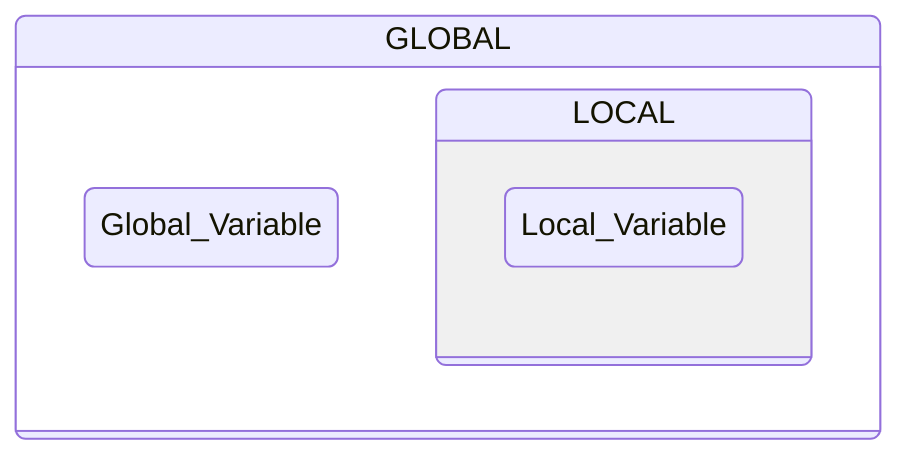
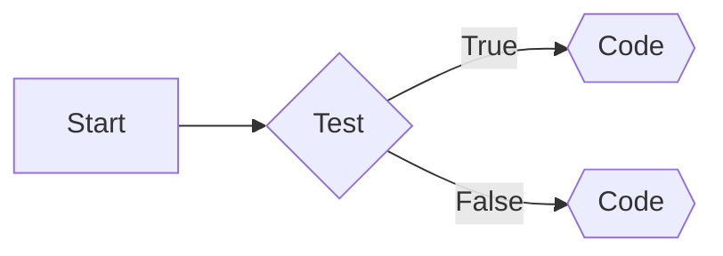
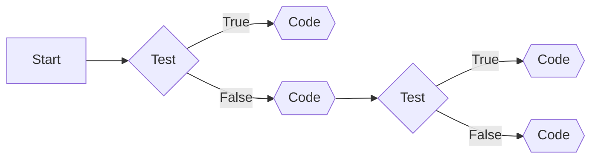
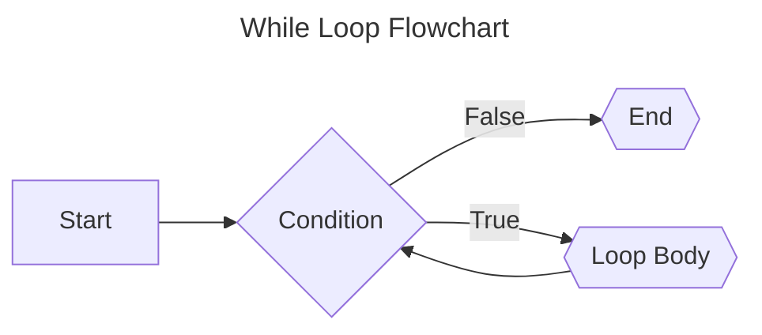
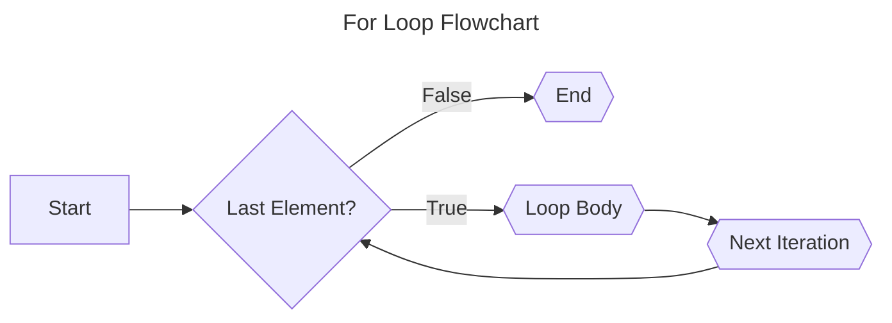

## Introduction

Python's allure lies not only in its simplicity but also in its adaptability to a diverse range of projects spanning different domains. As we navigate through the intricacies of Python, we aim to provide you with a solid grasp of its core concepts and commands, enabling you to harness the language's potential for various applications.

Consider this guide an open invitation to the vast landscape of programming, designed to empower you regardless of your proficiency level. Whether you're a beginner taking your initial steps into Python or a seasoned coder aiming to refine your skills, our exploration will cater to your needs, fostering confidence and proficiency in Python programming.

In the forthcoming sections, we will delve into specific features, best coding practices, and real-world applications, offering you a comprehensive understanding of Python's functionalities. Stay tuned for an enriching exploration that will equip you to navigate the programming landscape with finesse and expertise.

## Installing Packages With pip

Up to this point, you have been working within the bounds of the **Python standard library**. In the remaining half of this course, you will work with various **packages** that are not included with Python by default.

Many programming languages offer a **package manager** that automates the process of installing, upgrading, and removing third-party packages. Python is no exception.

The de facto package manager for Python is called pip. Historically, `pip` had to be downloaded and installed separately from Python. As of [Python 3.4](https://www.python.org/downloads/release/python-340/), it is now included with most distributions of the language.

### Installing Third-Party Packages With pip

Python’s package manager pip is used to install and manage third party packages. It is a separate program from Python, although it’s likely that pip was installed on your computer whenever you downloaded and installed Python.

>  ***Note:** pip is a command line tool. That means you must run it from a command line or terminal program.*

Installing third-party packages with Pip is a fundamental and efficient way to extend the functionality of your Python projects. Pip, which stands for "Pip Installs Packages," is a package management system that simplifies the process of acquiring and installing external libraries or modules.

The concept of a package manager might be familiar to you if you’re coming from another programming language. [JavaScript](https://developer.mozilla.org/en-US/docs/Web/JavaScript) uses [npm](https://www.npmjs.com/) for package management, Ruby uses [gem](https://rubygems.org), and the [.NET platform](https://dotnet.microsoft.com/languages) uses [NuGet](https://www.nuget.org/). In Python, pip has become the standard package manager.

**Windows**  
Press the Windows key and type `cmd` and press `Enter` to open the **Command Prompt** application. 


**macOS**  
Press `Cmd` + `Spacebar` to open the **Spotlight** search window. Type `terminal` and press `Enter` to open the Terminal app. 


**Ubuntu Linux**  
Click on the **Show Applications** button at the bottom of your toolbar and search for `terminal`. 


To determine if `pip` is installed on your system, use the following command in your terminal:

```bash
python3 -m pip --version
```

Upon successful installation, you should observe output similar to the following:

```
pip 19.3.1 from c:\users\David\appdata\local\programs\python\python38-32\lib\site-packages\pip (python 3.8)
```

This output signifies that pip version 19.3.1 is installed and associated with the Python 3.8 installation.

Note that the displayed version and linked Python installation may differ on your computer, which is acceptable as long as it reflects any Python 3 version.

If your operating system reports that `pip3` is an unrecognized command, it indicates that pip was not included with your Python distribution.

> [!IMPORTANT]
> **macOS and Ubuntu Linux:**  
> Ensure the use of the `python3` command for pip commands, not `python`, to utilize the Python 3 version of pip.
> 
> **Windows:**  
> If `python3` does not work, try using `python`. If successful, replace all instances of `python3` commands with `python`.


### Running Pip as a Module

When using your system's `pip` directly, the command itself might not indicate the associated Python version. This ambiguity could lead to installing packages into the site-packages of an unintended Python version. To avoid this, it's recommended to run `pip` as a Python module using the following command:

```bash
python3 -m pip
```

Notice that you use `python3 -m` to run pip. The `-m` switch tells Python to run a module as an executable of the python3 interpreter. This way, you can ensure that your system default Python 3 version runs the pip command. If you want to learn more about this way of running pip, then you can read Brett Cannon’s insightful article about [the advantages of using python3 -m pip](https://snarky.ca/why-you-should-use-python-m-pip/).

Sometimes you may want to be more explicit and limit packages to a specific project. In situations like this, you should run pip inside a **virtual environment**.


### Using Pip in a Python Virtual Environment

To prevent direct installations into your system Python installation and maintain project independence, it's advisable to use a virtual environment. A virtual environment provides an isolated Python interpreter for your project. Any packages that you use inside this environment will be independent of your system interpreter. This means that you can keep your project’s dependencies separate from other projects and the system at large.

Utilizing `pip` within a virtual environment offers several advantages:

1. Ensures the correct Python version for your project.
2. Provides confidence in referencing the correct `pip` instance.
3. Allows the use of specific package versions without affecting other projects.

Python 3 has the built-in [venv](https://docs.python.org/3/library/venv.html) module for creating virtual environments. This module helps you create virtual environments with an isolated Python installation. Once you’ve activated the virtual environment, then you can install packages into this environment. The packages that you install into one virtual environment are isolated from all other environments on your system.

You can follow these steps to create a virtual environment and verify that you’re using the pip module inside the newly created environment:

**Windows:**
```bash
python3 -m venv venv
.\venv\Scripts\activate
(venv) pip --version
```

**Linux + macOS:**
```bash
python3 -m venv venv
source venv/bin/activate
(venv) pip3 --version
```

Here, a virtual environment named venv is created using Python's built-in `venv` module. Activation is done with the `activate` command, indicated by the `(venv)` in the shell prompt.

Finally, check the versions of `pip3` and `pip` within the activated virtual environment. Both point to the same pip module, allowing the use of either pip or pip3 once the virtual environment is activated.

### Upgrading Pip to the Latest Version

Before proceeding, ensure you have the latest version of pip installed by executing the following command in your terminal:

```bash
$ python3 -m pip install --upgrade pip
```

Press `Enter` to run the command. If a newer version is available, it will be downloaded and installed. If you already have the latest version, a message similar to "Requirement already satisfied" will be displayed.


### Listing All Installed Packages

To view a list of all the packages installed, use the following command in your terminal:

```bash
python3 -m pip list
```

If you haven't installed any additional packages, you should see output similar to the following:

```
Package    Version
---------- -------
pip        19.3.1
setuptools 41.2.0
```

In this example, both `pip` and `setuptools` are listed. `pip` is a package itself, and `setuptools` is used by `pip` for setting up and installing other packages.

This command is useful for checking which packages and their versions are currently installed on your system.

### Using the Python Package Index (PyPI)

One of the many packages that PyPI hosts is called requests. The requests library helps you to interact with web services by abstracting the complexities of [HTTP](https://en.wikipedia.org/wiki/Hypertext_Transfer_Protocol) requests. You can learn all about requests on its official [documentation site](https://en.wikipedia.org/wiki/Hypertext_Transfer_Protocol).

When you want to use the requests package in your project, you must first install it into your environment. If you don’t want to install it in your system Python site-packages, then you can create a virtual environment first, as shown above.

Once you’ve created the virtual environment and activated it, then your command-line prompt shows the name of the virtual environment inside the parentheses. Any pip commands that you perform from now on will happen inside your virtual environment.

To install packages, pip provides an install command. You can run it to install the requests package:

```bash
python3 -m pip install requests
```

During the installation process, you'll see output similar to the following:

```bash
Collecting requests
  Downloading https://.../requests-2.22.0-py2.py3-none-any.whl (57kB)
  |................................| 61kB 2.0MB/s
Collecting urllib3!=1.25.0,!=1.25.1,<1.26,>=1.21.1
  Downloading https://...urllib3-1.25.7-py2.py3-none-any.whl (125kB)
  |................................| 133kB 3.3MB/s
Collecting certifi>=2017.4.17
  Downloading https://...certifi-2019.11.28.py3-none-any.whl (156kB)
  |................................| 163kB ...
Collecting chardet<3.1.0,>=3.0.2
  Downloading https://...chardet-3.0.4-py2.py3-none-any.whl (133kB)
  |................................| 143kB 6.8MB/s
Collecting idna<2.9,>=2.5
  Downloading https://...idna-2.8-py2.py3-none-any.whl (58kB)
  |................................| 61kB 3.8MB/s
Installing collected packages: urllib3, certifi, chardet, idna, requests
Successfully installed certifi-2019.11.28 chardet-3.0.4 idna-2.8 requests-2.22.0 urllib3-1.25.7
```

In this example, you run pip with the install command followed by the name of the package that you want to install. The pip command looks for the package in PyPI, resolves its dependencies, and installs everything in your current Python environment to ensure that requests will work.

The pip install <package> command always looks for the latest version of the package and installs it. It also searches for dependencies listed in the package metadata and installs them to ensure that the package has all the requirements that it needs.

You should now see `requests` and its dependencies listed among the installed packages. The version numbers may vary depending on the latest available releases.

### Using a Custom Package Index
By default, pip uses PyPI to look for packages. But pip also gives you the option to define a custom package index.

Using pip with a custom index can be helpful when the PyPI domain is blocked on your network or if you want to work with packages that aren’t publicly available. Sometimes system administrators also create their own internal package index to better control which package versions are available to pip users on the company’s network.

A custom package index must comply with [PEP 503 – Simple Repository API](https://peps.python.org/pep-0503/) to work with pip. You can get an impression of how such an [API (Application Programming Interface)](https://en.wikipedia.org/wiki/API) looks by visiting the [PyPI Simple Index](https://pypi.org/simple/) — but be aware that this is a large page with a lot of hard-to-parse content. Any custom index that follows the same API can be targeted with the --index-url option. Instead of typing --index-url, you can also use the -i shorthand.

For example, to install the rptree tool from the [TestPyPI](https://test.pypi.org) package index, you can run the following command:

```bash
(venv) C:\> python -m pip install -i https://test.pypi.org/simple/ rptree
```

With the `-i` option, you tell pip to look at a different package index instead of PyPI, the default one. Here, you’re installing rptree from TestPyPI rather than from PyPI. You can use TestPyPI to fine-tune the publishing process for your Python packages without cluttering the production package index on PyPI.

If you need to use an alternative index permanently, then you can set the index-url option in the pip [configuration file](https://pip.pypa.io/en/stable/topics/configuration/). This file is called pip.conf, and you can find its location by running the following command:

```bash
(venv) C:\> python -m pip config list -vv
```

With the pip config list command, you can list the active configuration. This command only outputs something when you have custom configurations set. Otherwise, the output is empty. That’s when the additive --verbose, or -vv, option can be helpful. When you add -vv, pip shows you where it looks for the different configuration levels.

If you want to add a pip.conf file, then you can choose one of the locations that pip config list -vv listed. A pip.conf file with a custom package index looks like this:

```
# pip.conf

[global]
index-url = https://test.pypi.org/simple/
```

When you have a pip.conf file like this, pip will use the defined index-url to look for packages. With this configuration, you don’t need to use the --index-url option in your pip install command to specify that you only want packages that can be found in the Simple API of TestPyPI.

**Installing Packages From Your GitHub Repositories**

You’re not limited to packages hosted on PyPI or other package indexes. pip also provides the option to install packages from a GitHub repository. But even when a package is hosted on PyPI, like the [Real Python directory tree generator](https://pypi.org/project/rptree/), you can opt to install it from its Git repository:

```bash
(venv) C:\> python -m pip install git+https://github.com/realpython/rptree
```

With the git+https scheme, you can point to a Git repository that contains an installable package. You can verify that you installed the package correctly by running an interactive Python interpreter and importing rptree:

```python
>>> import rptree
>>> rptree.__version__
"x.y.z"
```

After starting the interactive Python interpreter, you import the rptree module. By calling rptree.__version__, you verify that you’re using the rptree module that’s based in your virtual environment.

Installing packages from a Git repository can be helpful if the package isn’t hosted on PyPI but has a remote Git repository. The remote repository you point pip to can even be hosted on an internal Git server on your company’s intranet. This can be useful when you’re behind a firewall or have other restrictions for your Python projects.

**Installing Packages in Editable Mode to Ease Development**

When working on your own package, installing it in an editable mode can make sense. By doing this, you can work on the source code while still using your command line like you would in any other package. A typical workflow is to first clone the repository and then use pip to install it as an editable package in your environment:

```bash
C:\> git clone https://github.com/realpython/rptree
C:\> cd rptree
C:\rptree> python3 -m venv venv
C:\rptree> venv\Scripts\activate.bat
(venv) C:\rptree> python -m pip install -e .
```

With the commands above, you installed the rptree package as an editable module. Here’s a step-by-step breakdown of the actions you just performed:

1. **Line 1** cloned the Git repository of the rptree package.
2. **Line 2** changed the working directory to rptree/.
3. **Lines 3** and 4 created and activated a virtual environment.
4. **Line 5** installed the content of the current directory as an editable package.

The -e option is shorthand for the --editable option. When you use the -e option with pip install, you tell pip that you want to install the package in editable mode. Instead of using a package name, you use a dot (.) to point pip to the current directory.

If you hadn’t used the `-e` flag, pip would’ve installed the package normally into your environment’s site-packages/ folder. When you install a package in editable mode, you’re creating a link in the site-packages to the local project path:

```
 ~/rptree/venv/lib/python3.10/site-packages/rptree.egg-link
```

Using the pip install command with the `-e` flag is just one of many options that pip install offers. You can check out [pip install examples](https://pip.pypa.io/en/stable/cli/pip_install/#examples) in the pip documentation. There you’ll learn how to install specific versions of a package or point pip to a different index that’s not PyPI.


**Installing Specific Package Versions With Version Specifiers**

When it comes to installing Python packages, you have several options for controlling the version you want:

1. **Install the Latest Version Greater Than or Equal to Some Version Number:**
   ```bash
   $ python3 -m pip install requests>=2.0
   ```

2. **Install the Latest Version Less Than or Equal to Some Version Number:**
   ```bash
   $ python3 -m pip install requests<=3.0
   ```

3. **Install a Specific Version Number:**
   ```bash
   $ python3 -m pip install requests==3.0
   ```

**Version Specifiers:**

- `<=, >=`: Inclusive less than and greater than specifiers.
- `<, >`: Exclusive less than and greater than specifiers.
- `==`: Exactly equal to specifier.

Understanding and utilizing these version specifiers will help you precisely manage the versions of packages in your Python projects.

### Package Details for "requests"

Now that you've successfully installed the `requests` package, you can utilize pip to retrieve detailed information about it. Run the following command in your terminal:

```bash
$ python3 -m pip show requests
```

This command will provide you with information such as the package's name, version, summary, author, author's email, license, location on your system, and the dependencies it requires. For example:

```plaintext
Name: requests
Version: 2.22.0
Summary: Python HTTP for Humans.
Home-page: http://python-requests.org
Author: Kenneth Reitz
Author-email: me@kennethreitz.org
License: Apache 2.0
Location: c:\users\David\...\python\python38-32\lib\site-packages
Requires: chardet, idna, certifi, urllib3
Required-by:
```

This information can be valuable in understanding the functionality of the package and exploring further details about its usage. The `requests` package, in particular, is widely used for making HTTP requests in Python applications and serves as a foundation for many other Python packages.

### Uninstalling Packages With pip

Once in a while, you’ll have to uninstall a package. Either you found a better library to replace it, or it’s something that you don’t need. Uninstalling packages can be a bit tricky.

Notice that when you installed requests, you got pip to install other dependencies too. The more packages you install, the bigger the chance that multiple packages depend on the same dependency. This is where the show command in pip comes in handy.

Before you uninstall a package, make sure to run the show command for that package:

```bash
(venv) $ python3 -m pip show requests

Name: requests
Version: 2.26.0
Summary: Python HTTP for Humans.
Home-page: https://requests.readthedocs.io
Author: Kenneth Reitz
Author-email: me@kennethreitz.org
License: Apache 2.0
Location: .../python3.9/site-packages
Requires: certifi, idna, charset-normalizer, urllib3
Required-by:
```

Notice the last two fields, Requires and Required-by. The show command tells you that requests requires certifi, idna, charset-normalizer, and `urllib3`. You probably want to uninstall those too. Notice that requests isn’t required by any other package. So it’s safe to uninstall it.

You should run the show command against all of the requests dependencies to ensure that no other libraries also depend on them. Once you understand the dependency order of the packages that you want to uninstall, then you can remove them using the uninstall command:

```bash
python3 -m pip uninstall certifi
```

The uninstall command shows you the files that will be removed and asks for confirmation. If you’re sure that you want to remove the package because you’ve checked its dependencies and know that nothing else is using it, then you can pass a `-y` switch to suppress the file list and confirmation dialog:

```bash
(venv) $ python3 -m pip uninstall urllib3 -y
```

Here you uninstall urllib3. Using the -y switch, you suppress the confirmation dialog asking you if you want to uninstall this package.

In a single call, you can specify all the packages that you want to uninstall:

```bash
(venv) $ python3 -m pip uninstall -y charset-normalizer idna requests
```

You can pass in multiple packages to the pip uninstall command. If you didn’t add any additional switches, then you’d need to confirm uninstalling each package. By passing the -y switch, you can uninstall them all without any confirmation dialog.

You can also uninstall all the packages listed in a requirements file by providing the -r <requirements file> option. This command will prompt a confirmation request for each package, but you can suppress it with the `-y` switch:

```bash
(venv) $ python3 -m pip uninstall -r requirements.txt -y
```

Remember to always check the dependencies of packages that you want to uninstall. You probably want to uninstall all dependencies, but uninstalling a package used by others will break your working environment. In consequence, your project may not work correctly anymore.

If you’re working in a virtual environment, it can be less work to just create a new virtual environment. Then you can install the packages that you need instead of trying to uninstall the packages that you don’t need. However, pip uninstall can be really helpful when you need to uninstall a package from your system Python installation. Using pip uninstall is a good way to declutter your system if you accidentally install a package system-wide.


### Exploring Alternatives to pip
The Python community provides excellent tools and libraries for you to use beyond pip. These include alternatives to pip that try to simplify and improve package management.

Here are some other package management tools that are available for Python:

| Tool    | Description             |
|---------------------------------------------|-------------------------------------------------------------------------------------------------------------------------------------------------------------|
| [Conda](https://conda.io/en/latest/)        | **Conda** is a package, dependency, and environment manager for many languages, including Python. It comes from [Anaconda](https://www.anaconda.com/), which started as a data science package for Python. Consequently, it’s widely used for data science and [machine learning applications](https://realpython.com/python-windows-machine-learning-setup/). Conda operates its own [index](https://repo.continuum.io/) to host compatible packages.                                                                                                                           |
| [Poetry](https://python-poetry.org/)        | **Poetry** will look very familiar to you if you’re coming from [JavaScript](https://developer.mozilla.org/en-US/docs/Web/JavaScript) and [npm](https://www.npmjs.com/). Poetry goes beyond [package management](https://realpython.com/dependency-management-python-poetry/), helping you build distributions for your applications and libraries and deploying them to PyPI.                                                                                                                                                                                     |
| [Pipenv](https://github.com/pypa/pipenv)    | **Pipenv** is another package management tool that merges virtual environment and package management in a single tool. [Pipenv: A Guide to the New Python Packaging Tool](https://realpython.com/pipenv-guide/) is a great place to start learning about Pipenv and its approach to package management.                                                               |

Only pip comes bundled in the standard Python installation. If you want to use any alternatives listed above, then you have to follow the installation guides in their documentation. With so many options, you’re sure to find the right tools for your programming journey!

Many Python projects use the `pip` **package manager** to manage their dependencies. It’s included with the Python installer, and it’s an essential tool for dependency management in Python.

With pip, you can install and manage any additional packages that you find on [PyPI](https://pypi.org). You can use external packages from other developers as requirements and concentrate on the code that makes your project unique.


## Variables

Variables in programming serve as symbolic containers, offering a means to hold and reference values within your code. The analogy of a named box is frequently employed to elucidate the concept of variables – envisioning them as storage units with unique identifiers that allow convenient access to the information they contain.

Within the Python programming language, variables are akin to labeled boxes, each housing specific pieces of information in the computer's memory. The name assigned to a variable acts as a reference, providing a convenient way to interact with and manipulate the associated value. 

The use of variables in Python is fundamental for two primary reasons:

**Accessibility of Values**  
Variables streamline the storage of values, allowing you to perform operations without repeatedly executing time-consuming tasks. For example, if a computation involves significant data processing, assigning the result to a variable ensures that the computation is executed only once. Subsequently, you can access the stored result whenever needed, optimizing the efficiency of your code.

**Example:** Calculate the area of a rectangle
```python
# The variables length and width store the dimensions of a rectangle
length = 5
width = 8

# The area variable holds the result of the multiplication.
area = length * width

# Now, the 'area' variable holds the calculated result
print(f"The area of the rectangle is: {area}")
```

> ***Note:** By utilizing variables, the code becomes more readable, and the result can be easily accessed and reused.*

**Contextualization of Values**  
The meaning of values can vary depending on the context. For instance, the numeric value 28 might represent the number of students in a class or the count of times a user has accessed a website. By assigning meaningful names like `num_students` to variables, you provide context and clarity about the significance of the associated value. This naming practice enhances the readability of your code, making it more comprehensible for others and facilitating a better understanding of the variable's purpose and content.

**Example:** Count of students in a class
```python
# The variables num_students and num_visits represent different quantities.
num_students = 28

# Count of website visits
num_visits = 1000

# Displaying the contextualized values
print(f"The number of students in the class: {num_students}")
print(f"The count of website visits: {num_visits}")
```

> ***Note:** Meaningful variable names provides clarity about the context, making the code more understandable for anyone reviewing it.*

###  Declaration and Initialization of Variables

The Python programming language follows a dynamic and strong typing system, distinguishing it from statically typed languages like C. In Python, you do not need to explicitly declare the data type of a variable. Instead, the interpreter dynamically determines the type of a variable during runtime.

Unlike C, Python is not concerned with the direct allocation of physical memory space, making it a more flexible and convenient language for developers. The absence of explicit type declarations allows for easier and quicker coding, as you can assign values to variables without specifying their types.

```python
# Example of dynamic typing in Python
variable_example = 42  # Python interpreter dynamically determines the type

# Reassigning the variable with a different type
variable_example = "Hello, Python!"  # No need for explicit type declaration
```

> ***Note:** The use of the assignment operator is employed to assign values to variables, similar to other programming languages.*

In the provided Python example, the variable `variable_example` is dynamically assigned an integer value and later reassigned a string value. This flexibility enhances code readability and simplifies the development process. So, what is the difference?

 **Declaring a Variable**  
In Python, the concepts of declaring and initializing variables are often intertwined due to the language's dynamic typing. Unlike statically typed languages such as C, where you explicitly declare a variable's data type before use, Python allows for a more fluid approach.

Declaring a variable doesn't involve a separate step for specifying its data type. Instead, the declaration and assignment of a value often occur simultaneously. When you first assign a value to a variable using the assignment operator (`=`), Python dynamically creates the variable.

```python
my_variable = 42  # Here, `my_variable` is declared and assigned the value 42 in one step.
```

**Initializing a Variable**  
Initialization is the process of providing a variable with its initial value. In Python, initialization frequently happens at the moment of declaration. You can assign a specific value to a variable when declaring it, but it's not mandatory. Alternatively, you can declare a variable first and assign a value to it later in the code.

```python
uninitialized_variable  # This is a declaration without initialization.

initialized_variable = "Hello, world!"  # Here, `initialized_variable` is declared and initialized.
```

In summary, Python's dynamic typing allows variables to be declared and initialized in a single step. The need for explicit data type declarations is eliminated, making the language more adaptable to changing values and reducing redundancy in the code.

#

### The Assignment Operator

In Python, values are assigned to variables using the assignment operator, represented by the symbol `=`. Operators in programming, such as `=` or `+`, perform specific operations on values. The `=` operator, unlike its appearance in mathematics, holds a distinct meaning in Python, where it is used for variable assignment.

Let's explore the assignment operator in action by modifying the **"Hello, world"** program from the previous section. This time, we'll introduce a variable to store some text before printing it to the screen:

```python
>>> phrase = "Hello, world"
>>> print(phrase)
Hello, world
```

In the first line, a variable named `phrase` is created and assigned the value "Hello, world" using the = operator. This variable is then used in the `print()` function instead of the original string. When executing `print(phrase)`, Python looks up the name `phrase` and finds it assigned the value "Hello, world."

It's crucial to note that variable names are case-sensitive in Python. For example, a variable named `phrase` is distinct from a variable named `Phrase` (with a capital P). If you attempt to use an undefined variable like `Phrase`, you will encounter a `NameError`.

```python
>>> phrase = "Hello, world"
>>> print(Phrase)
Traceback (most recent call last):
  File "<stdin>", line 1, in <module>
NameError: name 'Phrase' is not defined
```

Remember, whenever you encounter the `=` operator, it signifies that whatever is to the right of it is being assigned to the variable on the left. Paying attention to these details and ensuring precise syntax alignment is crucial in Python programming to avoid errors. Computers interpret code literally, and minor discrepancies can lead to unexpected outcomes.

#

### Rules for Valid Variable Names

When working with variables in Python, there are specific rules for creating valid variable names. While variable names can vary in length, they must adhere to the following rules:

1. Variable names can only contain uppercase and lowercase letters $(A–Z, a–z)$, digits $(0–9)$, and underscores ( _ ).
2. Variable names cannot begin with a digit.

For instance, the following examples demonstrate valid variable names: `phrase`, `string1`, `_a1p4a`, and `list_of_names`. On the other hand, `9lives` is not a valid variable name due to starting with a digit.

It's worth noting that Python allows variable names to contain a wide range of valid [Unicode](https://en.wikipedia.org/wiki/Unicode) characters. Unicode, a standard for representing text in various writing systems, permits the use of letters from non-English alphabets, special characters like é and ü, and symbols from languages such as Chinese, Japanese, and Arabic. However, it's advisable to avoid decorated characters if code sharing involves people from different regions, as not every system can display these characters.

While a variable name may be technically valid, choosing a good and meaningful name is essential. Naming variables appropriately enhances code readability and understanding. Keep these guidelines in mind when selecting variable names to improve the clarity and maintainability of your code.

> [!IMPORTANT]
> **Python’s support for Unicode is covered in the [official Python documentation](https://docs.python.org/3/howto/unicode.html#python-s-unicode-support).**

**Descriptive Names Are Better Than Short Names**  
Choosing descriptive variable names over short names is crucial, especially in the context of complex programs. When dealing with intricate code structures, opt for longer, more descriptive names, as they contribute significantly to code readability and comprehension.

Consider the example below, where the value $3600$ is assigned to the variable `s`:

```python
# The name s lacks clarity and is ambiguous. Enhance understanding by using a more descriptive name
s = 3600

# While seconds is an improvement, it still doesn't fully convey the purpose of the code.
# It leaves room for interpretation. To eliminate ambiguity, choose a name that explicitly communicates the meaning
seconds = 3600

# In this case, seconds_per_hour provides clear and unambiguous information about the code's intent.
# Despite the longer length, the improved clarity justifies the choice of a more descriptive name.
seconds_per_hour = 3600
```


While embracing descriptive variable names is beneficial, it's essential to strike a balance. Avoid excessively long names that might hinder code readability. Although the definition of "excessively long" is subjective, a practical guideline is to limit variable names to fewer than three or four words. This ensures that your variable names remain informative without becoming unwieldy.

**Python Variable Naming Conventions**  
In various programming languages, the convention is to use **camelCase** for variable names. This naming style involves capitalizing the first letter of every word except the first, creating a camel-hump-like appearance with the juxtaposition of lowercase and uppercase letters, such as `numStudents`.

However, a different convention is more prevalent - **snake_case**. In snake_case, variable names like `num_students` are formed by making every letter lowercase and separating words with underscores. Although Python doesn't strictly enforce the use of snake_case, it is widely embraced and recommended in PEP 8, the official style guide for Python. 

By following [PEP 8 guidelines](https://peps.python.org/pep-0008/), you contribute to a standardized and consistent coding style, making it simpler for others to collaborate, share, and maintain code. This adherence to conventions fosters a cohesive coding environment and facilitates effective communication within the Python programming community.

### The Scope of a Variable

In Python, the scope of a variable refers to the region of code where the variable is accessible. There are two main types of variable scopes in Python: global scope and local scope.



**Local Scope** is where variables are confined to a specific function, accessible only within that function. Unlike global scope variables, they can't be directly modified or read from outside. If a local variable shares its name with a global one, it takes precedence within that function, ensuring isolated functionality and minimizing naming conflicts.
```python
def example_function():
    local_var = 5  # Local variable
    print(local_var)

example_function()  # Output: 5

# Attempting to access the local variable outside the function would result in an error.
```


**Global Scope** encompasses variables defined outside any function. These variables are accessible from anywhere in the code, including within functions. They can be modified and read from any function unless there's a local variable with the same name. 

```python
globvar = 0

def set_globvar_to_one():
    global globvar  # Needed to modify global copy of globvar
    globvar = 1

def print_globvar():
    print(globvar)  # No need for global declaration to read value of globvar

set_globvar_to_one()
print_globvar()  # Prints 1
```

Since it's unclear whether `globvar = 1` is creating a local variable or changing a global variable, Python defaults to creating a local variable, and makes you explicitly choose the other behavior with the `global` keyword.

Additionally, Python has block scope within conditional structures (if, else) and loops. The nonlocal statement is used to access and modify variables from an outer (non-global) scope within nested functions. An example would be:

```python
def outer_function():
    outer_var = 15

    def inner_function():
        nonlocal outer_var 
        outer_var = 10
        print(outer_var) # Output: 10

    inner_function()  
    print(outer_var)  # Output: 10

outer_function()
```

## Writing Comments in the Code

Programmers often revisit their code after several months and find themselves wondering, "What does this do?" Even with well-chosen variable names, it can be challenging to recall the reasoning behind certain code structures over time. To mitigate this issue, comments play a crucial role in documenting the intended functionality of the code.

In Python, comments are lines of text that do not impact the script's execution. They serve as documentation to explain what is supposed to happen in a particular section of the code. This section discusses three ways to include comments in Python code and provides conventions for formatting comments.

### How to Write a Comment

The most common method of writing a comment in Python is to begin a new line with the `#` character. When the code is executed, any lines starting with `#` are disregarded. Comments starting on a new line are referred to as block comments.

```python
# This is a block comment.
phrase = "Hello, world."
print(phrase)  # This is an in-line comment.
```

> ***Note:** The first line, starting with #, does not execute any code, and the print(phrase) line is executed, but everything after # is ignored.*

While it's advisable to keep comments concise, there are scenarios where more extended explanations are necessary. In such cases, you can continue the comment on a new line starting with `#`.

```python
# This is my first script.
# It prints the phrase "Hello, world."
# The comments are longer than the script!
phrase = "Hello, world."
print(phrase)
```

Comments are not only useful for providing context but also serve during code testing. By adding `#` at the beginning of a line, you can effectively comment out code, allowing you to run the program as if that specific line did not exist, without the need to delete any code. This flexibility facilitates testing and debugging processes.

### Conventions and Pet Peeves

According to PEP 8, comments should be written in complete sentences with a single space between the `#` and the first word of the comment:

```python
# This comment is formatted to PEP 8.
#Avoid this
```

For in-line comments, PEP 8 recommends having at least two spaces between the code and the `#` symbol.

```python
phrase = "Hello, world"  # This comment is PEP 8 compliant.
print(phrase)# This comment isn't.
```

While comments are essential for code documentation, they can become pet peeves for programmers when they describe the obvious. For instance, comments that duplicate the functionality of the code:

```python
# Print "Hello, world"
print("Hello, world")
```

In this example, the comment is redundant because the code itself clearly states its purpose. The best use of comments is to provide insights into complex or non-intuitive sections of code, explaining the reasoning behind a specific approach.

PEP 8 emphasizes the judicious use of comments, suggesting that they should add value by enhancing code comprehension. In cases where descriptive variable names suffice to convey the purpose of the code, comments describing the functionality may be deemed unnecessary. Following these conventions ensures that comments contribute positively to code clarity and understanding.

## Data Types in Python

Python is a dynamic, high-level programming language that offers a variety of data types to handle different kinds of information. Data types in Python can be classified into main categories, including numeric, sequential, sets, and mappings. Let's explore some of these categories and their corresponding data types:

**Numeric Data Types**

Numeric data types in Python play a crucial role in representing various forms of numerical values within the language. These data types include **integers**, **floating-point numbers**, and **complex numbers**, each belonging to the **int**, **float**, and **complex** classes, respectively.

- **Integers:** Integers, represented by the int class, cover positive or negative whole numbers without fractions or decimals. An intriguing aspect of Python is the absence of a limit on the length of an integer value, allowing for flexibility in handling large numbers seamlessly.

- **Float:** The float class represents real numbers with a floating-point representation. These numbers include a decimal point, and optionally, scientific notation can be employed by appending the character $e$ or $E$ followed by a positive or negative integer. This flexibility allows for precise representation of a wide range of numerical values.

- **Complex Numbers:** Complex numbers, belonging to the complex class, are expressed in the form (real part) + (imaginary part)j. An example of a complex number is $2+3j$, where $2$ is the real part, $3$ is the imaginary part, and $j$ signifies the imaginary unit. Python's support for complex numbers enhances its capability to handle advanced mathematical computations.

> ***Note:** The type() function serves as a valuable tool to determine the data type of a variable.*

**Example:** This code demonstrates how to determine the data type of variables in Python using the `type()` function. It prints the data types of three variables: `a` (**integer**), `b` (**float**), and `c` (**complex**). The output shows the respective data types for each variable.

```python
a = 10
b = 3.14
c = 2 + 5j

print(type(a))  # Output: <class 'int'>
print(type(b))  # Output: <class 'float'>
print(type(c))  # Output: <class 'complex'>
```

#

**Sequential Data Types**

Sequential data types in Python are fundamental for managing ordered collections of elements. These types include `strings`, `lists`, and `tuples`, each tailored to address specific requirements in data organization and manipulation.

- **Strings:** Represented by the `str` `class`, are utilized for handling textual information. They consist of sequences of characters and support various operations such as **concatenation**, **slicing**, and **indexing**. Strings play a vital role in text processing and are an integral part of any Python program dealing with human-readable data.

- **Lists:** Belonging to the `list` `class`, provide a versatile data structure for storing mutable sequences of elements. Unlike strings, lists can be modified, allowing for the **addition**, **removal**, and **modification** of elements. The flexibility of lists makes them invaluable for dynamic data storage and manipulation. Lists are defined by enclosing elements within brackets, such as `list_names = ["Ana", "John", "Helena"]`

- **Tuples:** Represented by the `tuple` `class`, are similar to lists but with a key distinction – they are **immutable**. Once a tuple is created, its elements cannot be changed. This immutability provides data integrity in situations where the sequence of elements should remain constant throughout the program's execution. Tuples are defined by enclosing elements within parenthesis, such as `tuple_numbers = (1,3,4)`

> ***Note:** The len() function is often employed to determine the length of a sequential data type and sets.*

**Example:** The following code demonstrates the utilization of the `len()` function to ascertain the length of different sequential data types in Python. It showcases a string 'text', a list 'numbers', and a tuple 'values'. By using `len()`, the code reveals the number of elements in each sequential data type, aiding in effective data management.

```python
text = "Python is amazing!"
numbers = [1, 2, 3, 4, 5] 
values = (10, 20, 30)  

print(len(text))     # Output: 18
print(len(numbers))  # Output: 5
print(len(values))   # Output: 3
```

#

**Set Data Type**

The set data type in Python is a powerful tool for handling unordered collections of unique elements. Represented by the set class, sets offer efficient methods for performing operations like **intersection**, **union**, and **difference**, making them invaluable for scenarios where distinct and unordered elements are a priority.

- **Sets:** Belonging to the `set` `class`, are characterized by their unordered nature, ensuring that each element is unique within the collection. This uniqueness property is particularly useful when eliminating duplicate values and performing set operations. Sets are defined by enclosing elements within curly braces, such as `set_colors = {"red", "green", "blue"}`.

> ***Note:** The set() constructor can be employed to create an empty set.*

**Example:**
The following code exemplifies the utilization of set operations and the len() function to showcase the functionality of sets in Python. It defines two sets, 'set1' and 'set2', performs set operations (union and intersection), and determines the length of each set. This demonstrates the effectiveness of sets in managing unique and unordered collections of elements.

```python
set1 = {1, 2, 3, 4, 5}
set2 = {4, 5, 6, 7, 8}

union_set = set1.union(set2)
intersection_set = set1.intersection(set2)

print(union_set)         # Output: {1, 2, 3, 4, 5, 6, 7, 8}
print(intersection_set)  # Output: {4, 5}
print(len(set1))         # Output: 5
print(len(set2))         # Output: 5
```

#

**Mapping Data Type**

Mapping data types in Python are essential for associating keys with corresponding values. The primary mapping type in Python is the dictionary, represented by the dict class. Dictionaries allow developers to create flexible and efficient data structures for storing and retrieving information based on unique identifiers.

- **Dictionaries:** Dictionaries, belonging to the dict class, consist of `key-value` pairs. Each key within a dictionary must be **unique**, and it is mapped to a specific value. This mapping allows for quick and direct access to values, making dictionaries efficient for scenarios where fast data retrieval is crucial. Dictionaries are defined using curly braces, with key-value pairs separated by colons, such as `dictionary_people = {"name": "John", "age": 25, "city": "São Paulo"}`.

> ***Note:** The keys() and values() functions are often employed to retrieve the keys and values from a dictionary, respectively.*

**Example:** The following code exemplifies the usage of dictionaries in Python. It defines a dictionary 'person_info' with keys representing different aspects of a person and their corresponding values. The code demonstrates how to access specific values using keys and how to retrieve all keys and values from the dictionary.

```python
person_info = {"name": "Alice", "age": 30, "city": "New York"}

print(person_info["name"])    # Output: Alice
print(person_info["age"])     # Output: 30
print(person_info["city"])    # Output: New York

all_keys = person_info.keys()
all_values = person_info.values()

print(all_keys)               # Output: dict_keys(['name', 'age', 'city'])
print(all_values)             # Output: dict_values(['Alice', 30, 'New York'])
```

## Operators in Python

Python, renowned for its versatility and readability, incorporates a diverse set of operators that play a pivotal role in manipulating data and facilitating decision-making in programs. Let's delve into four primary categories of operators in Python: arithmetic operators, augmented assignments, logical operators, and relational operators.

**Arithmetic Operators**  
Arithmetic operators are fundamental for performing basic mathematical operations. They enable programmers to conduct various calculations efficiently. The key arithmetic operators in Python include:

- `+` **Addition.**
- `-` **Subtraction.**
- `*` **Multiplication.**
- `/` **Division.**
- `%` **Modulus, determining the remainder of a division.**
- `**` **Exponentiation.**
- `//` **Floor division, division rounding down to the nearest whole number.**

```python
# Initializing variables
a = 10
b = 3

# Performing addition and storing the result
sum_result = a + b

# Calculating the remainder of division
remainder = a % b
```

**Reduced Expressions**  
Reduced expressions are a distinctive feature in Python that allows for concise assignment of values using arithmetic operators. These expressions combine an operation and assignment in a single statement.

```python
                  # REDUCED EXPRESSION                                        # NORMAL EXPRESSION
                        A += 5                                                      A = A + 5
                        A -= 5                                                      A = A - 5
                        A *= 5                                                      A = A * 5
                        A /= 5                                                      A = A / 5
                        A %= 5                                                      A = A % 5
```

#

**Relational Operators**  
Relational operators are essential for comparing values and expressing relationships between them. They are instrumental in creating decision structures based on the comparison of variables. The primary relational operators in Python include:

- `==`  Equal To
- `!=`  Not Equal To
- `<`   Less Than
- `>`   Greater Than
- `<=`  Less Than or Equal To
- `>=`  Greater Than or Equal To

> *When using any relational operator, there is always a return value that can either be true or false, otherwsie knokn as a Boolean value.*


#

**Logical Operators**  
Logical operators are indispensable for expressing complex conditions in programs. They are pivotal for decision-making based on multiple criteria. The principal logical operators in Python are:

- `and` Logical **AND**
- `or`  Logical **OR**
- `not` Logical **NOT**

```python
# Defining variables
age = 25
salary = 50000

# Checking if both age is greater than 18 and salary is greater than 30000
if age > 18 and salary > 30000:
    print("Eligible for a loan.")
```


#

### Ternary Operator 

The ternary operator, is a concise way to express conditional statements in a single line. It provides a more compact alternative to traditional *if-else* statements when dealing with simple conditions.

```julia
variable = expression1 if condition1 else expression2 if condition2 (...)
```

The ternary operator allows you to express conditional logic in a compact and readable manner, especially when the resulting code would be simple. It is particularly useful for inline conditionals where you need to assign a value based on a condition without the need for multiple lines of code.

In a scenario where you want to determine if a given number is even or odd and print a corresponding message. Using the ternary operator, you can achieve this in a single line:

```python
number = 15
result = "even" if number % 2 == 0 else "odd"
print(f"The number {number} is {result}.")
```

While the ternary operator can enhance code readability for simple conditions, it's important to use it judiciously. For more complex conditions or multiple statements, traditional *if-else* structures might be more appropriate.

#

### Walrus Operator

The walrus operator, denoted by `:=`, is a unique addition to Python syntax introduced in version 3.8. It provides a concise way to assign a value to a variable as part of an expression. The operator is affectionately named the "walrus" due to its visual resemblance to the eyes and tusks of a walrus.

The walrus operator allows you to perform assignments within expressions. This can result in more compact and readable code, especially in situations where you would otherwise need to repeat a calculation. With the walrus operator, you can assign a value to a variable and use that variable in the same expression, avoiding redundant computations.

Consider a scenario where you want to read lines from a file and print those lines along with their line numbers, but only if the line contains the word "python". Without the walrus operator, the code might look like this:

```python
with open("example.txt", "r") as file:
    lines = file.readlines()
    for i, line in enumerate(lines):
        if "python" in line:
            print(f"Line {i + 1}: {line.strip()}")
```

With the walrus operator, you can achieve the same result more succinctly:

```python
with open("example.txt", "r") as file:
    for i, line in enumerate(lines := file.readlines()):
        if "python" in line:
            print(f"Line {i + 1}: {line.strip()}")
```

In this example, the walrus operator is used to both assign the lines from the file to the `lines` variable and iterate over them in a single line.

While the walrus operator can enhance code readability in certain situations, it's essential to use it judiciously. Overuse may lead to code that is harder to understand, so it's important to strike a balance between conciseness and clarity.

## Lambda Expressions

Lambda expressions are a powerful feature in the Python language, allowing the creation of anonymous functions in a single line. Lambda expressions are often used in situations where simple functions are needed temporarily.

```python
lambda arguments: expression
```

Lambda expressions provide a concise way to create inline functions without the need to define a complete function using the `def` statement. They are particularly useful in contexts where small and specific functions are required, such as in **mapping** and **filtering** operations.

For instance, it is possible to create a lambda function to convert temperatures from Celsius to Fahrenheit:

```python
celsius_to_fahrenheit = lambda celsius: (celsius * 9/5) + 32
temperature_celsius = 25
temperature_fahrenheit = celsius_to_fahrenheit(temperature_celsius)

print(f"{temperature_celsius} degrees Celsius is equal to {temperature_fahrenheit} degrees Fahrenheit.")
```

> ***Note:** The lambda expression creates a function that converts temperatures from Celsius to Fahrenheit.*

Another practical example would be using lambda expressions in **filtering** operations:

```python
numbers = [1, 2, 3, 4, 5, 6, 7, 8, 9, 10]
even_numbers = list(filter(lambda x: x % 2 == 0, numbers))

print(f"Even numbers in the list: {even_numbers}")
```

> ***Note:** The lambda expression is used with the `filter` function to create a list containing only the even numbers from the original list.*

While lambda expressions are useful for simple functions, it's important to note that their excessive use can impact code readability. For more complex functions, it's advisable to use the `def` statement to define functions with a more extensive body.


## Casting Data Types

When an expression combines variables of different data types in Python, the interpreter checks whether conversions between these types are possible. If they are not, the runtime process encounters a TypeError, and an error message is displayed. Otherwise, the interpreter performs all necessary type conversions automatically during runtime.

### **Implicit Type Conversion**  

In Python, when expressions involve variables of different data types, the interpreter automatically performs implicit type conversions to ensure compatibility. If these conversions are not possible, a TypeError will be raised, and the programmer needs to handle it explicitly.

Python follows the following rules for implicit type conversions:

- **Conversion to a Common Type:**  
When combining values of different types, Python automatically converts them to a common type. For example, if the expression involves a combination of int and float, the result is automatically promoted to float.

- **Specific Type Promotion:**  
For pairs of operands with different types, the result takes the type that has higher capacity. For instance, if one operand is of type float and the other is of type int, the result will be of type float.

```python
a = 7
print(type(a))  # <class 'int'>

b = 3.0
print(type(b))  # <class 'float'>

c = a + b  
print(type(c))  # <class 'float'>
```

### **Explicit Type Conversion**  
While Python handles implicit type conversions seamlessly, programmers may sometimes want to explicitly cast the result to a specific type. This can be achieved using cast operators, known as type casting. Here's the syntax:

```python
variable = datatype(expression)
```

Keep in mind that explicit type casting should be used judiciously, considering potential data loss or unexpected behavior. Understanding Python's dynamic typing and implicit conversions is crucial for writing robust and flexible code.

## Input and Output Commands

In Python, data input and output are fundamental processes for user interaction and information manipulation. Let's explore how these operations are performed in the language.

### Data Input

To receive data from the user, you can use the `input()` function. This versatile function reads a line from the standard input, typically the keyboard, and returns it as a string. Here's a simple example:

```python
# Input for an integer
age = int(input("Enter your age: "))

# Input for a string
name = input("Enter your name: ")

print("Hello, " + name + "! You are " + str(age) + " years old.")
```

In the example above, the user is prompted to enter their age and name. The `input()` function returns these values as strings, and the use of `int()` is employed to convert the age into an integer.


### Data Output

Consider having a string `name = "Zaphod"` and two integers `heads = 2` and `arms = 3`. The objective is to construct a sentence like "Zaphod has 2 heads and 3 arms." This process is known as **string interpolation**, a technique where variables are inserted into specific locations within a string.

The first method involves using commas to insert spaces between each part of the string within a `print()` function:

```python
print(name, "has", str(heads), "heads and", str(arms), "arms")
```

Another approach is to concatenate the strings using the `+` operator:

```python
print(name + " has " + str(heads) + " heads and " + str(arms) + " arms")
```

Both techniques produce code that can be hard to read. Trying to keep track of what goes inside or outside of the quotes can be tough. Fortunately, there’s a third way of combining strings: [formatted string literals](https://docs.python.org/3/reference/lexical_analysis.html#formatted-string-literals), more commonly known as **f-strings**.

The easiest way to understand f-strings is to see them in action. Here’s what the above string looks like when written as an f-string:

```python
>>> f"{name} has {heads} heads and {arms} arms"
'Zaphod has 2 heads and 3 arms'
```

There are two important things to notice about the above examples:

1. The string literal starts with the letter $f$ before the opening quotation mark
2. Variable names surrounded by curly braces (${ \\: \\: }$) are replaced with their corresponding values without using `str()`.

You can also insert Python expressions in between the curly braces. The expressions are replaced with their result in the string:

```python
>>> n = 3
>>> m = 4
>>> f"{n} times {m} is {n*m}"
'3 times 4 is 12'
```

> ***Note:** It is a good idea to keep any expressions used in an f-string as simple as possible.*

> [!IMPORTANT]
> **For an in-depth guide to f-strings and comparisons to other string formatting techniques, check out the Python 3’s f-Strings: [An Improved String Formatting Syntax (Guide)](https://realpython.com/python-f-strings/) on [realpython.com](https://realpython.com).**

## Strings and String Methods

In Python, collections of text are referred to as strings. To manipulate strings, specific functions known as string methods are employed. These methods serve various purposes, including transforming a string from lowercase to uppercase, eliminating whitespace from the beginning or end of a string, substituting portions of a string with different text, and more.

### The String Data Type

Strings represent a fundamental data type in Python, denoting values that signify text. The term "data type" pertains to the kind of data a particular value represents. Strings are classified as a fundamental data type due to their inability to be decomposed into smaller values of a different type. However, not all data types share this fundamental characteristic. 

The string data type in Python is succinctly represented as `str`. For instance:

```python
>>> type("Hello, world")
<class 'str'>
```

> ***Note:** The output `<class 'str'>` signifies that the value "Hello, world" is an instance of the str data type, meaning it is a string.*

It's worth noting that `class` is currently synonymous with `data type` for conceptual purposes at the moment.

The `type()` function is applicable to values assigned to variables as well:

```python
>>> phrase = "Hello, world"
>>> type(phrase)
<class 'str'>
```

Moving forward, the exploration of strings will cover three key properties:

1. **Characters:** Strings consist of characters, which can be individual letters or symbols.
2. **Length:** The length of a string refers to the count of characters it contains.
3. **Sequence:** Characters in a string follow a specific sequence, indicating each character's numbered position within the string.

#

### String Literals

Creating strings in Python involves enclosing text within quotation marks, whether single or double. For instance:

```python
string1 = 'Hello, world'
string2 = "1234"
```

> ***Note:** Either single quotes or double quotes can be used to create a string, as long as both quotation marks are the same type.*

Such text-surrounded strings are referred to as string literals, indicating their literal representation in the code. It's crucial to note that not every string qualifies as a string literal; for instance, user-inputted strings differ as they are not explicitly coded within the program.

The quotes used to surround a string are termed **delimiters**, marking the string's start and end. When one type of quotes is used as the delimiter, the other type of quote can be used inside of the string:

```python
string3 = "We're #1!"
string4 = 'I said, "Put it over by the llama."'
```

> ***Note:** Python recognizes the first delimiter and considers all characters until the matching second delimiter is encountered.*

Attempting to use double quotes within a double-quoted string, however, results in a `SyntaxError`:

```python
>>> text = "She said, "What time is it?""
File "<stdin>", line 1
text = "She said, "What time is it?""
^
SyntaxError: invalid syntax
```

This error occurs because Python interprets the string to end after the second double quote, leading to confusion regarding the rest of the line.

It's important to note that Python strings can encompass any valid [Unicode character](https://home.unicode.org/technical-quick-start-guide/). For instance, the string `"We're #1!"` includes the **pound sign** (`#`), `"1234"` contains numbers, and `"×Pýŧħøŋ×"` is a valid Python string showcasing Unicode characters.

> [!IMPORTANT]
> **A recommended practice is consistency in using either single or double quotes as delimiters throughout a project.**

#

### Determine the Length of a String

The length of a string, encompassing spaces, is referred to as the string's length. For instance, the string `"abc"` has a length of 3, while the string `"Don't Panic"` has a length of 11.

 For a practical demonstration, enter the following into IDLE's interactive window:

```python
>>> len("abc")
3
```

> ***Note:** To determine the length of a string in Python, you can utilize the built-in len() function.*

Moreover, the `len()` function can be employed with strings assigned to variables:

```python
>>> letters = "abc"
>>> num_letters = len(letters)
>>> num_letters
3
```

Here, the string `"abc"` is assigned to the variable `letters`. Subsequently, the `len()` function calculates the length of `letters`, and this result is assigned to the variable `num_letters`. Ultimately, the value of `num_letters` is 3, confirming the string's length, and is displayed.

#

### Multiline Strings


The PEP 8 style guide recommends maintaining a line length of no more than 79 characters, including spaces. While this guideline aids in reading files side by side, it can sometimes be perceived as limiting readability.

When faced with the need for string literals exceeding the chosen limit, the solution lies in creating multiline strings. For instance, consider the following paragraph:

```python
paragraph = "This planet has - or rather had - a problem, which was \
this: most of the people living on it were unhappy for pretty much \
of the time. Many solutions were suggested for this problem, but \
most of these were largely concerned with the movements of small \
green pieces of paper, which is odd because on the whole it wasn't \
the small green pieces of paper that were unhappy."
```

By using a backslash at the end of each line, adhering to PEP 8, the total length of each line, including the backslash, must be 79 characters or less.

Alternatively, multiline strings can be created using triple quotes (`"""` or `'''`). This approach preserves whitespace, displaying the string on multiple lines:

```python
paragraph = """This planet has - or rather had - a problem, which was
this: most of the people living on it were unhappy for pretty much
of the time. Many solutions were suggested for this problem, but
most of these were largely concerned with the movements of small
green pieces of paper, which is odd because on the whole it wasn't
the small green pieces of paper that were unhappy."""
```

Triple-quoted strings serve a special purpose in Python, often used for documenting code, providing descriptions at the top of a `.py` file or documenting custom functions. When printed, triple-quoted strings preserve whitespace, allowing for clear and structured output.

## Concatenation, Indexing, and Slicing

Now that you know what a string is and how to declare string literals in your code, let’s explore some of the things you can do with strings.

### String Concatenation

Strings in Python can be combined, or concatenated, using the `+` operator. For example:

```python
>>> string1 = "abra"
>>> string2 = "cadabra"
>>> magic_string = string1 + string2
>>> magic_string
'abracadabra'
```

> ***Note:** Notice that the two strings are joined without any whitespace between them.*

String concatenation proves useful for combining related strings, such as merging a first and last name to create a full name:

```python
>>> first_name = "Arthur"
>>> last_name = "Dent"
>>> full_name = first_name + " " + last_name
>>> full_name
'Arthur Dent'
```

Here, string concatenation occurs twice on the same line. Firstly, `first_name` is concatenated with a space (`" "`) to create the string "Arthur ". Subsequently, this result is further concatenated with `last_name`, producing the full name "Arthur Dent".

### String Indexing

In a string, each character is assigned a numbered position known as an **index**. To access the character at the $Nth$ position, you can place the number $N$ between two square brackets ($[\\: \\:]$) immediately after the string. For example:

```python
>>> flavor = "apple pie"
>>> flavor[1]
'p'
```

> ***Note:** In this instance, flavor[1] retrieves the character at position 1 in "apple pie," which is 'p'.*

It's important to note that in Python, and most other programming languages, counting starts at zero. Therefore, to obtain the character at the beginning of a string, you need to access the character at position 0:

```python
>>> flavor[0]
'a'
```

A common pitfall is forgetting that counting begins with zero. Attempting to access the first character in a string with the index 1 leads to an off-by-one error. Off-by-one errors are a frequent source of frustration for programmers, both novice and experienced alike.

The following figure shows the index for each character of the string "apple pie":

<table align = "center">
  <tr>
    <td>0</td>
    <td>1</td>
    <td>2</td>
    <td>3</td>
    <td>4</td>
    <td>5</td>
    <td>6</td>
    <td>7</td>
    <td>8</td>
  </tr>
  <tr>
    <td>a</td>
    <td>p</td>
    <td>p</td>
    <td>l</td>
    <td>e</td>
    <td> </td>
    <td>p</td>
    <td>i</td>
    <td>e</td>
  </tr>
</table>

Attempting to access an index beyond the end of a string in Python results in an `IndexError`. For example:

```python
>>> flavor[9]
Traceback (most recent call last):
  File "<pyshell#4>", line 1, in <module>
    flavor[9]
IndexError: string index out of range
```

> ***Note:** The largest valid index in a string is always one less than the string's length.*

Strings also support negative indices, where the last character in a string has index -1. For instance:

```python
>>> flavor[-1]
'e'
```

In this case, `flavor[-1]` retrieves the last character in "apple pie," which is the letter 'e'. The second-to-last character 'i' has index -2, and so on. Negative indices provide a convenient way to access characters from the end of the string.

The following figure shows the negative index for each character in the string "apple pie":

<table align = "center">
  <tr>
    <td>-9</td>
    <td>-8</td>
    <td>-7</td>
    <td>-6</td>
    <td>-5</td>
    <td>-4</td>
    <td>-3</td>
    <td>-2</td>
    <td>-1</td>
  </tr>
  <tr>
    <td>a</td>
    <td>p</td>
    <td>p</td>
    <td>l</td>
    <td>e</td>
    <td> </td>
    <td>p</td>
    <td>i</td>
    <td>e</td>
  </tr>
</table>

Just like positive indices, attempting to access a negative index less than the index of the first character in the string raises an `IndexError` in Python:

```python
>>> flavor[-10]
Traceback (most recent call last):
  File "<pyshell#5>", line 1, in <module>
    flavor[-10]
IndexError: string index out of range
```

While negative indices might not seem immediately useful, there are situations where they offer a more convenient solution than positive indices. For instance, consider a scenario where a string input by a user is assigned to the variable `user_input`. If you need to retrieve the last character of the string, determining the correct positive index can be cumbersome.

One approach to get the last character is to calculate the final index using `len()`:

```python
final_index = len(user_input) - 1
last_character = user_input[final_index]
```

However, utilizing a negative index simplifies the process and eliminates the need for an intermediate step:

```python
last_character = user_input[-1]
```

> ***Note:** This method is more concise and avoids the additional step of calculating the final index.*

### String Slicing

If you need to obtain the string containing just the first three letters of the string "apple pie," individually accessing each character by index and concatenating them can be done, albeit in a cumbersome manner:

```python
>>> first_three_letters = flavor[0] + flavor[1] + flavor[2]
>>> first_three_letters
'app'
```

However, when dealing with a larger substring, this method becomes impractical. Fortunately, Python provides a more efficient way to achieve this with less code. 

You can extract a portion of a string, known as a **substring**, by inserting a colon between two index numbers inside square brackets:

```python
>>> flavor = "apple pie"
>>> flavor[0:3]
'app'
```

> ***Note:** The [0:3] part of flavor[0:3] is called a slice, which in this case, returns a slice of "apple pie."*

In this example, `flavor[0:3]` returns the first three characters of the string assigned to `flavor`. It starts with the character at index 0 and goes up to, but does not include, the character at index 3. 

String slices may be initially confusing because the substring includes the character at the index of the first number but excludes the character at the index of the second number. To understand slicing, envision a string as a sequence of square slots, each numbered from zero up to the length of the string, and each filled with a character.

Here’s what this looks like for the string "apple pie":

<table align = "center">
  <tr>
    <td>0</td>
    <td>1</td>
    <td>2</td>
    <td>3</td>
    <td>4</td>
    <td>5</td>
    <td>6</td>
    <td>7</td>
    <td>8</td>
  </tr>
  <tr>
    <td>a</td>
    <td>p</td>
    <td>p</td>
    <td>l</td>
    <td>e</td>
    <td> </td>
    <td>p</td>
    <td>i</td>
    <td>e</td>
  </tr>
</table>

The slice `[x:y]` in Python returns the substring between the boundaries x and y. For example, for the string "apple pie," the slice `[0:3]` returns the string "app," and the slice `[3:9]` returns the string "le pie."

If you omit the first index in a slice, Python assumes you want to start at index 0:

```python
>>> flavor[:5]
'apple'
```

The slice `[:5]` is equivalent to the slice `[0:5]`, so `flavor[:5]` returns the first five characters in the string "apple pie."

Similarly, if you omit the second index in the slice, Python assumes you want to return the substring that begins with the character whose index is the first number in the slice and ends with the last character in the string:

```python
>>> flavor[5:]
' pie'
```

> ***Note:** The slice [5:] is equivalent to the slice [5:9].*

If you omit both the first and second numbers in a slice, you get a string that starts with the character with index 0 and ends with the last character. In other words, omitting both numbers in a slice returns the entire string:

```python
>>> flavor[:]
'apple pie'
```

Unlike string indexing, Python won’t raise an `IndexError` when you try to slice between boundaries before or after the beginning and ending boundaries of a string:

```python
>>> flavor[:14]
'apple pie'
>>> flavor[13:15]
''
```

In the first example, the slice gets characters from the beginning of the string up to but not including the fourteenth character. Although the string assigned to `flavor` has a length of nine, any non-existent indices are ignored, and the entire string "apple pie" is returned. In the second example, attempting to get a slice where the entire range is out of bounds (`flavor[13:15]`) returns the empty string "".

You can use negative numbers in slices. The rules for slices with negative numbers are exactly the same as slices with positive numbers. It helps to visualize the string as slots with the boundaries labeled by negative numbers:

<table align = "center">
  <tr>
    <td>-9</td>
    <td>-8</td>
    <td>-7</td>
    <td>-6</td>
    <td>-5</td>
    <td>-4</td>
    <td>-3</td>
    <td>-2</td>
    <td>-1</td>
  </tr>
  <tr>
    <td>a</td>
    <td>p</td>
    <td>p</td>
    <td>l</td>
    <td>e</td>
    <td> </td>
    <td>p</td>
    <td>i</td>
    <td>e</td>
  </tr>
</table>

Just like before, the slice `[x:y]` returns the substring between the boundaries x and y. For instance, the slice `[-9:-6]` returns the first three letters of the string "apple pie":

```python
>>> flavor[-9:-6]
'app'
```

It's important to note, however, that the right-most boundary in a slice does not have a negative index. While the logical choice might seem to be the number 0, it doesn't work:

```python
>>> flavor[-9:0]
''
```

In this example, `flavor[-9:0]` returns an empty string because the slicing operation assumes that the range includes the character at the index of the left boundary but excludes the character at the index of the right boundary. The right boundary, in this case, is specified as 0, and since 0 is not included, an empty string is returned.

Slicing with three indices, follows a similar principle as slicing with two indices. The third index introduces a step value, indicating the interval between characters to be included in the slice.

<table align = "center">
  <tr>
    <td>0</td>
    <td>1</td>
    <td>2</td>
    <td>3</td>
    <td>4</td>
    <td>5</td>
    <td>6</td>
    <td>7</td>
    <td>8</td>
  </tr>
  <tr>
    <td>a</td>
    <td>p</td>
    <td>p</td>
    <td>l</td>
    <td>e</td>
    <td> </td>
    <td>p</td>
    <td>i</td>
    <td>e</td>
  </tr>
</table>

For instance, if we want to slice the word `"pepe"` from the word "apple pie", the resulting slice would be:

```python
>>> flavor[2:9:2]
'pepe'
```

> ***Note:** This slicing starts at index 2, includes the character at that position, and moves forward with a step of 2.*

### Strings Are Immutable

To conclude this section, it's essential to highlight a crucial property of string objects: **immutability**. Strings in Python are immutable, which means that you can’t change them once you’ve created them. For instance, attempting to change a specific character of a string results in an error:

```python
>>> word = "goal"
>>> word[0] = "f"
Traceback (most recent call last):
  File "<pyshell#16>", line 1, in <module>
    word[0] = "f"
TypeError: 'str' object does not support item assignment
```

> ***Note:** The term str is Python’s internal name for the string data type.*

Python raises a `TypeError` and indicates that string objects do not support item assignment.

To modify a string, you need to create an entirely new string. For example, to change the string `"goal"` to `"foal"`, you can use a string slice to concatenate the letter `"f"` with everything but the first letter of the word `"goal"`:

```python
>>> word = "goal"
>>> word = "f" + word[1:]
>>> word
'foal'
```


## Manipulate Strings With Methods

Strings come bundled with special functions called string methods that can be used to work with and manipulate strings. There are numerous string methods available, but we’ll focus on some of the most commonly used ones.

### Converting String Case

In Python, strings are objects, and they come with a variety of built-in methods that you can use to manipulate them. The `.lower()` , `.upper()` and `.capitalize()` methods are three examples of such string methods.

- The `.lower()` method converts all characters in a string to **lowercase**.
- The `.upper()` method converts all characters in a string to **uppercase**.
- The `.capitalize()` method converts the first letter of each word in a string to **uppercase**.

> ***Note:** The dot (.) signifies to Python that what follows is the name of a method - in this case, the lower() method.*

```python
name = "Jean-luc picard"
upper_case_name = name.upper()
capitalize_name = name.capitalize()

print(upper_case_name)  # 'JEAN-LUC PICARD'
print(capitalize_name)  # 'Jean-luc picard'
```

String methods don’t just work on string literals. You can also use the `.lower()` method on a string assigned to a variable:

```python
>>> name = "Jean-luc Picard"
>>> name.lower()
'jean-luc picard'
```

When referring to string methods, we'll use a `dot` at the beginning of their names. For example, the `.lower()` method is written with a dot instead of just `lower()`. This convention helps distinguish string methods from built-in functions like `print()` and `type()`.

On the other hand, `.upper()` and `.lower()` must be used in conjunction with a string. They do not exist independently.

**Detecting Whitespace Strings**  
When you need to determine whether a string consists solely of whitespaces, the `.isspace()` method proves to be quite useful.

```python
>>> name = " "
>>> name.isspace()
True
```

It's important to note that if a string contains any non-whitespace characters, the method will return False.

```python
>>> name = " j"
>>> name.isspace()
False
```

### Removing Whitespace From a String

Whitespace is any character that is printed as blank space. This includes things like spaces and line feeds, which are special characters that move output to a new line.

Removing whitespace from the beginning or end of a string is essential, particularly when handling strings from user input where inadvertent introduction of extra whitespace characters may occur.

Three string methods are available for removing whitespace:

1. `.rstrip()` : Removes whitespace from the **right side** of a string.
2. `.lstrip()` : Removes whitespace from the **left side** of a string.
3. `.strip()`  : Removes whitespace from both the **left and right sides** of a string.

For example, using `.rstrip()` to remove trailing spaces from the right side of a string:

```python
>>> name = "Jean-luc Picard     "
>>> name.rstrip()
'Jean-luc Picard'
```

In this instance, the string "Jean-luc Picard " has five trailing spaces. Python does not automatically remove these trailing spaces when the string is assigned to a variable. The `.rstrip()` method rectifies this by removing trailing spaces from the right side of the string, resulting in a **new string**, "Jean-luc Picard," without the spaces.

Similarly, `.lstrip()` functions like `.rstrip()`, but it removes whitespace from the left side of the string:

```python
>>> name = "     Jean-luc Picard"
>>> name.lstrip()
'Jean-luc Picard'
```

To remove whitespace from both the left and right sides simultaneously, use the `.strip()` method:

```python
>>> name = "     Jean-luc Picard     "
>>> name.strip()
'Jean-luc Picard'
```

It is important to note that none of the `.rstrip()`, `.lstrip()`, or `.strip()` methods remove whitespace from the middle of the string. In each example, the space between "Jean-luc" and "Picard" is preserved.

### Determine if a String Starts or Ends With a Particular String

When working with text, it's often necessary to ascertain whether a given string starts or ends with specific characters. Two string methods, `.startswith()` and `.endswith()`, are employed for this purpose.

Consider the example with the string "Enterprise." Using `.startswith()` to check if the string starts with the letters 'e' and 'n':

```python
>>> starship = "Enterprise"
>>> starship.startswith("en")
False
```

> ***Note:** The method returns False because "Enterprise" begins with a capital E, and .startswith() is case-sensitive.*

To make it return `True`, you need to provide the method with the correct case:

```python
>>> starship.startswith("En")
True
```

Similarly, the `.endswith()` method is utilized to determine if a string ends with specific characters:

```python
>>> starship.endswith("rise")
True
```

> ***Note:** Like .startswith(), .endswith() is also case-sensitive.*

> [!IMPORTANT]
> **The True and False values are not strings. They are a special kind of data type called a Boolean value.**

## String Methods and Immutability

As mentioned in the previous section, strings in Python are immutable, meaning they cannot be altered once created. 

Many string methods, such as `.upper()` and `.lower()`, do not modify the original string but instead return copies with the desired modifications. It's important to be cautious, as overlooking this fact can lead to subtle bugs in your program. For instance:

```python
>>> name = "Picard"
>>> name.upper()
'PICARD'
>>> name
'Picard'
```

In this example, calling `name.upper()` does not change the original string stored in the `name` variable. To retain the modified result, you must assign it to a variable:

```python
>>> name = "Picard"
>>> name = name.upper()
>>> name
'PICARD'
```

Now, `name.upper()` returns a new string, "PICARD," which is then assigned to the `name` variable, effectively replacing the original string "Picard."

## Working With Strings and Numbers

When obtaining user input using the `input()` function, the result is always a string. Similarly, in various scenarios, input to a program is provided as a string, even when it represents numerical values. This section focuses on handling strings containing numbers, exploring how arithmetic operations behave on strings and the potential for unexpected outcomes. 

### Strings and Arithmetic Operators


Strings in Python can hold various types of characters, including numbers. However, it's crucial not to confuse numerals in a string with actual numbers. Consider the following code:
```python
>>> num = "2"
>>> num + num
'22'
```

> ***Note:** The + operator concatenates two strings together, so the result of 2 + 2 is 22, not 4.*

Strings can be "multiplied" by a number if that number is an integer. For instance:

```python
>>> num = "12"
>>> num * 3
'121212'
```

The expression `num * 3` concatenates the string " $12$ " with itself three times, resulting in the string " $121212$ ". This operation is akin to arithmetic with numbers, where " $12$ " $* \\: 3$ is equivalent to " $12$ " $+$ " $12$ " $+$" $12$ ".

However, attempting to use the $*$ operator between two strings raises a `TypeError`:

```python
>>> "12" * "3"
Traceback (most recent call last):
  File "<stdin>", line 1, in <module>
TypeError: can't multiply sequence by non-int of type 'str'
```

Python raises a `TypeError`, indicating that you can't multiply a sequence by a non-integer. When the $*$ operator is used with a string on either the left or the right side, it always expects an integer on the other side.

What happens when you try to add a string and a number?

```python
>>> "3" + 3
Traceback (most recent call last):
  File "<stdin>", line 1, in <module>
TypeError: can only concatenate str (not "int") to str
```

Python throws a `TypeError` because the `+` operator expects both things on either side of it to be of the same type. If any one of the objects on either side of `+` is a string, Python tries to perform string concatenation. Addition will only be performed if both objects are numbers. So, to add `"3" + 3` and get `6`, you must first convert the string `"3"` to a number.

### Converting Strings to Numbers

The `TypeError` errors mentioned in the previous section highlight a common challenge when dealing with user input: type mismatches when attempting operations that require a number and not a string.

Consider the following example:

```python
num = input("Enter a number to be doubled: ")
doubled_num = num * 2
print(doubled_num)
```

If you input a number, say $2$, you might expect the output to be $4$. However, the result is $22$. Since `input()` always returns a string, when you input $2$, `num` is assigned the string " $2$ ", not the integer $2$. 

Consequently, the expression `num * 2` concatenates the string " $2$ " with itself, resulting in " $22$ ".

To perform arithmetic on numbers within a string, conversion from string type to a number type is necessary. Two functions, `int()` and `float()`, can be used for this purpose. 
- The `int()` function converts objects into whole numbers.
- The `float()` function converts objects into numbers with decimal points.

```python
>>> num = int(input("Enter a number to be doubled:  "))
>>> doubled_num = num * 2
>>> print(doubled_num)
4
```

> ***Note:** float() adds a decimal point to the number, providing at least one decimal place of precision.*

However, attempting to convert a string resembling a floating-point number into an integer raises a `ValueError`:

```python
>>> int("12.0")
Traceback (most recent call last):
  File "<stdin>", line 1, in <module>
ValueError: invalid literal for int() with base 10: '12.0'
```

> ***Note:** This happens because converting 12.0 to 12 would result in the loss of precision.*

### Converting Numbers to Strings

Sometimes you need to convert a number to a string. You might do this, for example, if you need to build a string from some pre-existing variables that are assigned to numeric values.

As demonstrated earlier, attempting to concatenate a number with a string directly results in a `TypeError`:

```python
>>> num_pancakes = 10
>>> "I am going to eat " + num_pancakes + " pancakes."
Traceback (most recent call last):
File "<stdin>", line 1, in <module>
TypeError: can only concatenate str (not "int") to str
```

Since `num_pancakes` is a number, Python cannot concatenate it with the string "I am going to eat." To create the desired string, it's essential to convert `num_pancakes` to a string using `str()`:

```python
>>> num_pancakes = 10
>>> "I am going to eat " + str(num_pancakes) + " pancakes."
'I am going to eat 10 pancakes.'
```

Alternatively, you can directly call `str()` on a number literal or handling arithmetic expressions:

```python
>>> "I am going to eat " + str(10) + " pancakes."
'I am going to eat 10 pancakes.'

>>> total_pancakes = 10
>>> pancakes_eaten = 5
>>> "Only " + str(total_pancakes - pancakes_eaten) + " pancakes left."
'Only 5 pancakes left.'
```

## Find a String in a String

One of the most useful string methods is `.find()`. As its name implies, you can use this method to find the location of one string in another string - commonly referred to as a substring.

To use `.find()`, append it to the end of a variable or a string literal and pass the string you want to find between the parentheses:

```python
>>> phrase = "the surprise is in here somewhere"
>>> phrase.find("surprise")
4
```

The value that `.find()` returns is the index of the first occurrence of the string you pass to it. In this case, "surprise" starts at the fifth character of the string "the surprise is in here somewhere," which has an index of 4 since counting starts at 0.

If `.find()` doesn’t find the desired substring, it will return -1 instead:

```python
>>> phrase = "the surprise is in here somewhere"
>>> phrase.find("eyjafjallajökull")
-1
```

You can call string methods on a string literal directly, so in this case, you don’t need to create a new string:

```python
>>> "the surprise is in here somewhere".find("surprise")
4
```

Keep in mind that this matching is done exactly, character by character, and is case-sensitive. For example, if you try to find "SURPRISE", the `.find()` method returns -1:

```python
>>> "the surprise is in here somewhere".find("SURPRISE")
-1
```

If a substring appears more than once in a string, `.find()` only returns the index of the first appearance, starting from the beginning of the string:

```python
>>> "I put a string in your string".find("string")
8
```

There are two instances of "string" in "I put a string in your string." The first starts at index 8, and the second at index 23. `.find()` returns 8, which is the index of the first instance of "string."

The `.find()` method only accepts a string as its input. If you want to find an integer in a string, you need to pass the integer to `.find()` as a string. If you do pass something other than a string to `.find()`, Python raises a `TypeError`:

```python
>>> "My number is 555-555-5555".find(5)
Traceback (most recent call last):
File "<stdin>", line 1, in <module>
TypeError: must be str, not int
```

```python
>>> "My number is 555-555-5555".find("5")
13
```

Sometimes you need to find all occurrences of a particular substring and replace them with a different string. Since `.find()` only returns the index of the first occurrence of a substring, you can’t easily use it to perform this operation. Fortunately, string objects have a `.replace()` method that replaces each instance of a substring with another string.

Just like `.find()`, you append `.replace()` to the end of a variable or string literal. In this case, though, you need to put two strings inside the parentheses in `.replace()` and separate them with a comma. The first string is the substring to find, and the second string is the string to replace each occurrence of the substring with.

For example, the following code shows how to replace each occurrence of "the truth" in the string "I'm telling you the truth; nothing but the truth" with the string "lies":

```python
>>> my_story = "I'm telling you the truth; nothing but the truth!"
>>> my_story.replace("the truth", "lies")
"I'm telling you lies; nothing but lies!"
```

Since strings are immutable objects, `.replace()` doesn’t alter `my_story`. To change the value of `my_story`, you need to reassign to it the new value returned by `.replace()`:

```python
>>> my_story = my_story.replace("the truth", "lies")
>>> my_story
"I'm telling you lies; nothing but lies!"
```

`.replace()` can only replace one substring at a time, so if you want to replace multiple substrings in a string you need to use `.replace()` multiple times:

```python
>>> text = "some of the stuff"
>>> new_text = text.replace("some of", "all")
>>> new_text = new_text.replace("stuff", "things")
>>> new_text
'all the things'
```

## Numbers and Math

Python is a versatile programming language that provides robust support for mathematical operations and number manipulation. 

### Integers and Floating-Point Numbers

Python supports three built-in number data types: integers, floating-point numbers, and complex numbers. We will focus on integers and floating-point numbers, the two most commonly used number types.

**Integers**  
An integer is a whole number without any decimal places. For instance, $1$ is an integer, while $1.0$ is not. The data type for integers is called `int`, as shown by the `type()` function:

```python
>>> type(1)
<class 'int'>
```

> ***Note:** There is no limit to how large an integer can be, despite computers having finite memory.*

An integer literal is an explicitly written integer value in your code, similar to a string literal (e.g $1$, $100$). 

Integer literals can be written in two ways:

```python
>>> 1000000
1000000
>>> 1_000_000
1000000
```

Python allows the use of underscores (_) to separate digits and expresses them in a more readable manner.

**Floating-Point Numbers**  
A floating-point number, or `float`, contains a decimal place. The data type for floating-point numbers is `float`:

```python
>>> type(1.0)
<class 'float'>
```

A floating-point literal is a floating-point value explicitly written in your code (e.g, $1.25$).

Floating-point literals can be created in three ways:

```python
>>> 1000000.0
1000000.0
>>> 1_000_000.0
1000000.0
>>> 1e6
1000000.0
```

The first two methods are similar to creating integer literals. For larger numbers, E-notation can be used:

```python
>>> 1e-4
0.0001
```

> ***Note:** E-notation represents a number as the product of a decimal number and $10$ raised to a power.*

Unlike integers, floats have a maximum size, but it is typically well beyond most machines' capabilities.

When exceeding the maximum floating-point number, Python returns a special float value `inf`:

```python
>>> 2e400
inf
```

`inf` stands for infinity and signifies that the number is beyond the maximum floating-point value allowed on your computer. Additionally, there is `-inf` for negative infinity.

#

### Arithmetic Operators and Expressions

In this section, you’ll learn how to do basic arithmetic with numbers in Python, such as addition, subtraction, multiplication, and division. 

**Addition**  
Addition is performed with the `+` operator:

```python
>>> 1 + 2
3
```

> ***Note:** Any time a float is added to a number, the result is another float.*

The two numbers on either side of the + operator are called operands. In the previous example, both operands are integers, but operands do not need to be the same type.

**Subtraction**  
To subtract two numbers, just put a `-` in between them:

```python
>>> 1 - 1
0
>>> 5.0 - 3
2.0
```

> ***Note:** The - operator is also used to denote negative numbers.*

Just like adding two integers, subtracting two integers always results in an `int`. Whenever one of the operands is a `float`, the result is also a `float`.

**Multiplication**  
To multiply two numbers, use the `*` operator:

```python
>>> 3 * 3
9
>>> 2 * 8.0
16.0
```

The type of number you get from multiplication follows the same rules as addition and subtraction. Multiplying two integers results in an `int`, and multiplying a number with a `float` results in a `float`.

**Division**  
The `/` operator is used to divide two numbers:

```python
>>> 9 / 3
3.0
>>> 5.0 / 2
2.5
```

Unlike addition, subtraction, and multiplication, division with the `/` operator always returns a `float`. If you want to make sure that you get an integer after dividing two numbers, you can use `int()` to convert the result:

```python
>>> int(9 / 3)
3
```

> ***Note:** Keep in mind that int() discards any fractional part of the number.*

**Integer Division**  
If writing `int(5.0 / 2)` seems a little long-winded to you, Python provides a second division operator, `//`, called the integer division operator:

```python
>>> 5.0 // 2
2.0
```

> ***Note:** Keep in mind that int() discards any fractional part of the number.*

The `//` operator first divides the number on the left by the number on the right and then rounds down to an integer. This might not give the value you expect when one of the numbers is negative.

For example, $-3$ // $2$ returns $-2$. First, $-3$ is divided by $2$ to get $-1.5$. Then $-1.5$ is rounded down to $-2$. On the other hand, $3$ // $2$ returns $1$.

**Exponents**  
You can raise a number to a power using the `**` operator:

```python
>>> 2 ** 4
16
```

> ***Note:** Exponents don’t have to be integers. They can also be floats.*

**The Modulus Operator**  
The `%` operator, or the modulus, returns the remainder of dividing the left operand by the right operand:

```python
>>> 5 % 3
2
```

One of the most common uses of `%` is to determine whether or not one number is divisible by another. For example, a number $n$ is even if and only if $n$ % $2$ is $0$.

#

### Arithmetic Expressions

In Python, you can create complex expressions by combining operators, numbers, and parentheses. An expression is a combination that Python can evaluate to produce a value. Here are some examples of arithmetic expressions:

```python
>>> 2 * 3 - 1
5
>>> 4 / 2 + 2**3
10.0
>>> -1 + (-3 * 2 + 4)
-3
```

The rules for evaluating expressions in Python follow the same principles as everyday arithmetic, often referred to as the "order of operations." 

| Operator | Description          | Precedence |
|----------|----------------------|------------|
| `**`     | Exponentiation       | High    |
| `*`, `/`, `//`, `%` | Multiplication, Division, Floor division, Modulus | Medium     |
| `+`, `-` | Addition, Subtraction | Low        |

In the example `2 * 3 - 1`, the `*` operator has higher precedence than `-`, so `2 * 3` is evaluated first, resulting in `6`. Then the subtraction is performed, giving the final result of `5`.

It's worth noting that the expressions in the examples may not always follow the rule of placing spaces on either side of all operators. According to [PEP 8](https://pep8.org/#other-recommendations) (Python Enhancement Proposal), which provides style guide recommendations for Python code.

#

### Math Functions and Number Methods

Python has a few built-in functions you can use to work with numbers. In this section, you’ll learn about three of the most common ones:

1. `round()`: Used for rounding numbers to a specified number of decimal places.
2. `abs()`: Gets the absolute value of a number, representing the distance of the number from zero.
3. `pow()`: Raises a number to a specified power.
4. `sqrt()`: Gets the square root of a number.

**The round() function**  

You can use `round()` to round a number to the nearest integer:

```python
>>> round(2.3)
2
```

You can round a number to a given number of decimal places by passing a second argument to `round()`:

```python
>>> round(3.14159, 3)
3.142
```

> ***Note:** The second argument of round() must be an integer. If it isn’t, Python raises a TypeError*

#

**The abs() Function**  

The absolute value of a number $n$ is just $n$ if $n$ is positive, and $-n$ if $n$ is negative. 

To get the absolute value of a number in Python, you use the `abs()` function:

```python
>>> abs(3)
3
>>> abs(-5.0)
5.0
```

The absolute function always returns a positive number of the same type as its argument. 

#

**The pow() Function**  

The `pow()` function takes two arguments. The first is the base, that is the number to be raised to a power, and the second argument is the exponent.

For example, the following uses `pow()` to raise $2$ to the exponent $3$:

```python
>>> pow(2, 3)
8

>>> pow(2, -2)
0.25
```

So, what’s the difference between ** and `pow()`? The pow() function accepts an optional third argument that computes the first number raised to the power of the second number and then takes the modulo with respect to the third number.

In other words, `pow(x, y, z)` is equivalent to ($x ** y$) % $z$. Here’s an example with $x = 2$, $y = 3$, and $z = 2$:

```python
>>> pow(2, 3, 2)
0
```

First, $2$ is raised to the power $3$ to get $8$. Then $8$ % $2$ is calculated, which is $0$.

#

**The sqrt() Method**

The `sqrt()` function in Python is used to calculate the square root of a given number. It is part of the `math` module, so you need to import the module before using it.

Here's an example of using the `sqrt()` function:

```python
>>> import math
>>> math.sqrt(25)
5.0

>>> math.sqrt(2)
1.4142135623730951
```

> [!IMPORTANT]
> **To learn all of python's built-in methods, check the [Mathematical Functions](https://docs.python.org/3/library/math.html) page.**

## Conditional Statements

Conditional Statements in programming enable the program to make decisions and execute specific code blocks based on certain conditions, enhancing its flexibility and adaptability.

### Conditional Statements and Truth Tables

Conditional Statements in programming enable diverse execution paths based on logical conditions using `if`, `elif` and `else` statements. Utilizing truth tables to evaluate conditions, they systematically ensure precise decision-making, enhancing program functionality and reliability.

```python
number = 10;    

if ( number > 0 ):   
  print(f"It's a positive number")
```

When a conditional statement is executed, two possible outcomes are provided: `True` and `False`. In the previous case, the compiler substitutes the variable `number` with its stored value, resulting in the following evaluation: *is 10 greater than 0?*. 

In this instance, the answer is `True`. As a result, the compiler returns a value other than $0$ to the `if()` function, permitting the execution of the subsequent command line.

Boolean expressions are essential in programming, denoting true/false conditions. They employ logical operators (`AND`, `OR`, `NOT`) to combine or negate conditions, enabling intricate decision-making in code. Evaluating these expressions empowers programs to execute tailored actions based on outcomes, optimizing efficiency and functionality.


<table>
<tr><th>&nbsp;&nbsp;&nbsp;TRUTH TABLE FOR AND &nbsp;&nbsp;&nbsp;
</th><th>&nbsp;&nbsp;&nbsp;TRUTH TABLE FOR OR&nbsp;&nbsp;&nbsp;</th>
<th>&nbsp;&nbsp;&nbsp;TRUTH TABLE FOR NOT &nbsp;&nbsp;&nbsp;</th>
</tr>
<tr>
  <td>
  
|  OPERAND 1    |  OPERAND 2  | RESULT |
|:-----------:|:-----------:|:-------------:|
|   **`false`**   |   **`false`**   |    **`false`**    |
|   **`false`**   |   **`true`**   |    **`false`**    |
|   **`true`**   |   **`false`**   |    **`false`**    |
|   **`true`**   |   **`true`**   |    **`true`**    |

</td>
<td>

|  OPERAND 1    |  OPERAND 2  | RESULT |
|:-----------:|:-----------:|:-------------:|
|   **`false`**   |   **`false`**   |    **`false`**    |
|   **`false`**   |   **`true`**    |     **`true`**    |
|   **`true`**    |   **`false`**   |     **`true`**    |
|   **`true`**    |   **`true`**    |     **`true`**    |

</td>

<td>

| &nbsp;OPERAND &nbsp;|  &nbsp; RESULT &nbsp;&nbsp;|
|:-----------:|:-----------:|
|   **`not true`**   |      **`false`**    |
|   **`not false`**   |      **`true`**    |

</td>
</tr> 
</table>
</td><td>
  
> *Any result from a comparison that is a non-zero value is treated as true, whereas 0 is interpreted as false.*

#

### The if Statement

An `if` statement instructs Python to execute a specific portion of code only when a certain condition is satisfied. 

For instance, the check following `if` statement:

```python
if 2 + 2 == 4:
    print("2 and 2 is 4")

print("Try another operation !")
```

> ***Note:** Omitting the colon (:) after the test condition in an if / elif / else statement results in a SyntaxError.*

You can interpret this as: "if $2 + 2$ equals $4$, then print the string ' $2$ and $2$ is $4$ '.”

An `if` statement consists of three components:

1. The `if` keyword.
2. A test condition, followed by a colon.
3. An indented block of code that executes if the test condition is True.

In the given example, the test condition is $2 + 2 == 4$. Since this expression is `True`, executing the `if` statement in IDLE displays the text " $2$ and $2$ is $4$ ". If the test condition is `False` (for instance, $2 + 2 == 5$), Python skips over the indented block of code and continues execution on the next non-indented line.

#

### The else Keyword

The `else` keyword is used after an `if` statement in order to execute some code only if the `if` statement’s condition is `False`.



The following script uses else to shorten the code in the previous script for displaying whether or not a student passed a class:

```python
grade = 40

if grade >= 70:
  print("You passed the class!")
else:
  print("You did not pass the class")

print("Thank you for attending.")
```

> ***Note:** The line that prints "Thank you for attending." still runs, even if the indented block of code after else is executed.*

In English, the if and else statements together read as: *If the grade is at least* $70$, *then print the string* " $You \\:\\:  passed \\:\\:  the \\:\\:  class!$ "; o*therwise, print the string* " $You \\: \\: did \\:\\:  not \\:\\:  pass \\:\\:  the \\:\\:  class!$ ".


Notice that the `else` keyword has no test condition, and is followed by a colon. No condition is needed, because it executes for any condition that fails the `if` statement’s test condition.

#

### The elif Keyword

The `elif` keyword is short for "else if" and can be used to add additional conditions after an `if` statement.

Just like if statements, elif statements have three parts:
1. The `elif` keyword.
2. A test condition, followed by a colon.
3. An indented code block that is executed if the test condition evaluates to `True`.


The following script combines `if`, `elif`, and `else` to print the letter grade a student earned in a class:

```python
1.   grade = 85
2. 
3.   if grade >= 90:
4.     print("You passed the class with a A.")
5.   elif grade >= 80: 
6.     print("You passed the class with a B.")
7.   elif grade >= 70: 
8.     print("You passed the class with a C.")
9.   else: 
10.    print("You did not pass the class :(")
11.
12.   print("Thanks for attending.")
```

Analyzing the code above, we can observe that the condition for the `if` statements is checked on both lines $5$ and $7$.

However, only the block associated with the first `True` test condition, which is the condition on line 5, is executed. All remaining `elif` and `else` blocks are skipped, so executing the script has the following output:

```
You passed the class with a B.
Thanks for attending.
```

Let’s break down the execution of the script step-by-step:

1. `grade` is assigned the value $85$ in the line $1$.
2. `grade` >= $90$ is `False`, so the `if` statement in the line $3$ is skipped.
3. `grade` >= $80$ is `True`, so the block under the `elif` statement in line $5$ is executed.
4. The `elif` and `else` statements in lines $7$ and $9$ are skipped, since the condition for the `elif` statement on line $5$ was met.
5. Finally, line $6$ is executed and "Thanks for attending." is printed.

The `if`, `elif`, and `else` keywords are some of the most commonly used keywords in the Python language. They allow you to write code that responds to different conditions with different behavior.

You can even nest an `if` statement inside another one to write code that handles tremendously complex logic!

#

### Nested if Statements

A `nested if` statement involves placing an if statement within another if statement. In cases where the execution desires a `True` statement after an `else` statement has failed, the utilization of nested if statements becomes crucial to maintain the overall code flow in a semantically ordered structure.

The complexity that results from using deeply `nested if` statements may make it difficult to predict how your program will behave under given conditions. For this reason, this kind of statement must be used with caution.



> ***Note:** Flowchart of a nested if statement.*

Consider a scenario where a business offers discounts based on the age and student status of its customers. The following Python code implements a discount eligibility system with nested if statements and logical conditions.

```python
age = int(input("Enter an Age: "))
is_student = True if input("It is a Student? (y/n)").lower() == "y" else False

# Nested if statements with and/or conditions to determine discount eligibility
if is_student:
  if age <= 18:
      discount = "50%"
  elif age <= 25:
      discount = "20%"
  else:
      discount = "10%"
else:
    discount = "No discount"

# Display the result
print(f"For a {age}-year-old {'student' if is_student else 'non-student'}, the discount is: {discount}")
```

Let's break down the execution of the script step-by-step:

1. `age` is assigned the value entered by the user in the line marked $1$.
2. The user is prompted to input whether they are a student (yes/no), and `is_student` is assigned `True` or `False` accordingly.
3. If `is_student` is `True`, the nested `if` statements in lines $5$ - $11$ are evaluated:
   - If `age` is $18$ or below, `discount` is assigned $50$%.
   - If `age` is $25$ or below, `discount` is assigned $20$%.
   - If neither condition is met, `discount` is assigned $10$%.
4. If `is_student` is `False`, `discount` is assigned "No discount" in line $13$ .
5. The result is displayed in the last line, indicating the age, student status, and the corresponding discount.

Using nested if statements can become complex and potentially make the code harder to understand. If you notice that you have multiple layers of nested if statements, it's advisable to reconsider your approach and explore ways to simplify the code for better readability and maintainability.

### Truthy and Falsy Values in Python

In Python, evaluating the truthiness or falsiness of a variable can be crucial when determining its state. The concept of truthy and falsy values revolves around understanding which values are considered equivalent to `True` or `False` in a boolean context.

Let's explore this with a practical example:

```python
count = 0

if count:
    print(f"Count is: {count}")
else:
    print("Count is zero.")
```
In this scenario, we check whether the variable `count` holds a falsy value, meaning it is equivalent to zero. If the condition is met, the program prints the count; otherwise, it prompts the user that the count is zero.

Here are some common examples of falsy values in Python:

- `None`
- `False`
- Numbers numerically equal to zero, such as $0$, $0.0$, $0j$, `decimal.Decimal(0)`, and `fraction.Fraction(0, 1)`
- Empty sequences and collections, like `[]`, `{}`, `()`, `set()`, `''`, `b''`, `bytearray(b'')`, `memoryview(b'')`, and `range(0)`.
- Objects for which `obj.__bool__()` returns `False` or `obj.__len__()` returns 0, given that `obj.__bool__` is undefined.


## Loop Structures

A loop is a block of code that gets repeated over and over again either a specified number of times or until some condition is met. There are two kinds of loops in Python: `while` loops and `for` loops. These structures provide efficiency and flexibility in implementing repetitive logic.

### The while Loop

While loops repeat a section of code as long as a certain condition is `True`. The structure consists of two main parts:

1. **The While Statement:** It begins with the `while` keyword, followed by a test condition, and ends with a colon `:`.

2. **The Loop Body:** This section contains the code that gets repeated at each iteration of the loop.

When a `while` loop is executed, Python evaluates the test condition. If the condition is `True`, the code in the loop body is executed. If the condition is `False`, the code in the body is skipped, and the program proceeds to the next section.

After executing the loop body, Python returns to the `while` statement, re-evaluates the test condition, and repeats the process. This cycle continues until the test condition becomes `False`. If the test condition is initially `False`, the body is skipped entirely.

This process repeats until the test condition fails, causing Python to loop over the code in the body of the `while` loop.




Let’s look at an example:

```python
n = 1
while n < 5:
  print(n)
  n = n + 1
```

Let's break down the code script step-by-step:

1. The variable `n` is initially assigned the value $1$.
2. A `while` loop is initiated with the condition $n < 5$. The loop's body executes as long as the condition $n < 5$ is `True`.
    - Inside the loop body:
      - The current value of `n` is printed to the screen.
      - `n` is incremented by $1$.
3. The loop continues executing until the condition $n < 5$ becomes `False`.

This process repeats until the test condition $n < 5$ becomes `False`. The table below summarizes the steps:


| Step   | Value of `n` | Test Condition | Action Taken                           |
| :------: | :------------: | :---------------: | -------------------------------------- |
| 1      | 1            | 1 < 5 `True`    | Print 1; Increment `n` to 2            |
| 2      | 2            | 2 < 5 `True`     | Print 2; Increment `n` to 3            |
| 3      | 3            | 3 < 5 `True`     | Print 3; Increment `n` to 4            |
| 4      | 4            | 4 < 5 `True`    | Print 4; Increment `n` to 5            |
| 5      | 5            | 5 < 5 `False`   | Loop ends; Nothing printed, loop ends |


In summary, the `while` loop iterates over the code block as long as the condition $n < 5$ remains true. The loop prints the current value of $n$ and increments it until the condition becomes `False`.

If you're not careful, you can unintentionally create an infinite loop, which occurs when the test condition always evaluates to true. In an infinite loop, the loop body keeps executing endlessly.

Consider the following example of an infinite loop:

```python
n = 1
while n < 5:
    print(n)
```

The key distinction between this `while` loop and the previous one is that $n$ is never incremented within the loop body. In each iteration of the loop, $n$ remains equal to $1$. Consequently, the test condition $n < 5$ is always `True`, leading to the continuous printing of the number $1$. This loop persists indefinitely, resulting in an infinite loop.

Infinite loops aren’t inherently bad. Sometimes they are exactly the kind of loop you need. For instance, code interacting with hardware might use an infinite loop to continually check if a button or switch has been activated.

If your program enters an infinite loop, you can force Python to quit by pressing Ctrl+C when using a Terminal:

```python
Traceback (most recent call last):
  File "<pyshell#8>", line 2, in <module>
    print(n)
KeyboardInterrupt
```

> ***Note:** Python will stop the program and raise a KeyboardInterrupt error.*

Now, let's look into a practical example of a `while` loop. One common use of a while loop is to validate user input continuously. The program keeps prompting the user until valid input is provided. 

Consider the following example, where a user is repeatedly asked for a positive number:

```python
num = float(input("Enter a positive number: "))
while num <= 0:
    print("That's not a positive number!")
    num = float(input("Enter a positive number: "))
```

Here, the test condition $num <= 0$ checks if the user entered a positive number. If the input is positive, the loop ends; otherwise, the user is notified of the mistake, and the loop continues until valid input is received.

While loops are ideal for repeating a code section as long as a certain condition is met. However, they are not designed for iterating a fixed number of times.

#

### The for Loop

In Python, a `for` loop is a control flow statement that iterates over a sequence of elements, executing a specified block of code for each element in the sequence. The loop allows you to process each item in a collection (such as a list, tuple, or string) one at a time, making it convenient for tasks like iterating through the characters of a string or processing elements in a list. The loop continues until it has processed all the elements in the collection.



Similar to the `while` loop, the `for` loop consists of two primary components:
1. **The for statement:** Begins with the `for` keyword, followed by a membership expression, and ends in a colon `(:)`.
2. **The loop body:** Encompasses the code segment to be executed in each iteration of the loop.


Let's examine an example where the following `for` loop prints each letter of the string "Python" individually:

```python
for letter in "Python":
  print(letter)
```

In this instance, the `for` statement is `for letter in "Python"`, and the membership expression is `letter in "Python"`. In each iteration, the variable `letter` is assigned the next letter in the string "Python," followed by printing the value of `letter`.

The loop iterates once for each character in the string "Python". The table below summarizes the execution of this `for` loop:

<table align = "center">
  <th>Step</th>
  <th>Value of letter</th>
  <th>Action</th>
  <body>
    <tr align = "center">
      <td>1</td>
      <td>P</td>
      <td>P is printed</td>
    </tr>
    <tr align = "center">
      <td>2</td>
      <td>y</td>
      <td>y is printed</td>
    </tr>
    <tr align = "center">
      <td>3</td>
      <td>t</td>
      <td>t is printed</td>
    </tr>
    <tr align = "center">
      <td>4</td>
      <td>h</td>
      <td>h is printed</td>
    </tr>
    <tr align = "center">
      <td>5</td>
      <td>o</td>
      <td>o is printed</td>
    </tr>
    <tr align = "center">
      <td>6</td>
      <td>n</td>
      <td>n is printed</td>
    </tr>
  </body>
</table>

To illustrate the advantage of `for` loops in iterating over collections, let's transform the previous example, originally implemented with a `for` loop, into an equivalent `while` loop. In this case, we'll introduce a variable to keep track of the index representing the next character in the string. At each iteration, we'll print the character at the current index and then increment the index.

The loop will terminate when the value of the index variable is equal to the length of the string. It's important to note that indices start at $0$, and for the string "Python," the last index is $5$.

Here's how you might implement the same logic using a while loop:

```python
word = "Python"
index = 0
while index < len(word):
  print(word[index])
  index = index + 1
```

Comparatively, this `while` loop version is noticeably more complex than the original `for` loop. Not only is the for loop less intricate, but the code itself also appears more natural and intuitive.


Sometimes, it's beneficial to iterate over a range of numbers, and Python offers a convenient built-in function called `range()` for precisely that purpose. The `range()` function generates a sequence of numbers.

For instance, `range(3)` produces the range of integers starting from $0$ up to, but not including, $3$ – namely, $0, 1,$ and $2$. Using `range(n)`, where n is any positive number, allows you to execute a loop exactly n times. Consider the following example where a `for` loop prints the string "Python" three times:

```python
for _ in range(3):
  print("Python")
```

> ***Note:** The use of _ in this context is to indicate that the variable is not relevant to the code inside the loop.* 

Additionally, you can specify a starting point for the range. For example, `range(1, 5)` creates the range of numbers 1, 2, 3, and 4. The first argument is the starting number, and the second argument is the endpoint, which is not included in the range.

Using the two-argument version of `range()`, the subsequent for loop prints the square of every number from $10$ up to, but not including, $20$:

```python
for n in range(10, 20):
  print(n * n)
```

Now, let's explore a practical example. The following program prompts the user to input an amount and then displays how to split that amount between $2, 3, 4,$ and $5$ people:

```python
amount = float(input("Enter an amount: "))
for num_people in range(2, 6):
    print(f"{num_people} people: ${amount / num_people:,.2f} each")
```

> ***Note:** The formatting specifier , .2f is used to format the amount as a fixed-point number rounded to two decimal places.*

The for loop iterates over the numbers $2, 3, 4$ and $5$, printing the number of people and the amount each person should pay. 

Executing the program with an input of $10$ produces the following output:

```
Enter an amount: 10
2 people: $5.00 each
3 people: $3.33 each
4 people: $2.50 each
5 people: $2.00 each
```

In Python, for loops are generally used more frequently than while loops. Most of the time, a for loop is more concise and easier to read than an equivalent while loop.

#

### Nested Loops

As long as you indent the code correctly, you can even put loops inside of other loops.

Peço desculpas pela confusão. Vamos corrigir e melhorar o texto sem alterar o código:

```python
for n in range(1, 4):
  for j in range(1, 4):
    print(f"n = {n} e j = {j}")
```

When Python enters the body of the first for loop, the variable n is assigned the value $1$. Then the body of the second for loop is executed, and $j$ is assigned values from $1$ to $3$ (inclusive). The first thing printed is $n = 1$ and $j = 1$.

After executing the `print()` function, Python continues within the inner for loop, assigns to $j$ the next value in the range, and then prints $n = 1$ and the updated $j$ value. This process repeats until all values in the inner loop are exhausted. 

Next, the outer for loop increments $n$ to $2$, and the inner for loop executes again, printing $n = 2$ and the values of $j$ in the range $1$ to $3$. This pattern continues until the outer for loop completes its iterations.

The two loops continue to execute in this fashion, and the final output looks like this:

```
n = 1 and j = 1
n = 1 and j = 2
n = 1 and j = 3
n = 2 and j = 1
n = 2 and j = 2
n = 2 and j = 3
n = 3 and j = 1
n = 3 and j = 2
n = 3 and j = 3
```

A loop inside of another loop is called a nested loop, and they come up more often than you might expect. You can nest while loops inside of for loops, and vice versa, and even nest loops more than two levels deep!

Important: Nesting loops inherently increases the complexity of your code, as you can see by the dramatic increase in the number of steps run in the previous example compared to examples with a single for loop. Using nested loops is sometimes the only way to get something done, but too many nested loops can have a negative effect on a program’s performance.


## Jump Statements

Jump Statements are used to control the execution flow of a program. They allow the program to skip to a specific part of the code, exit a loop prematurely, or return from a function. Some examples of jump statements include break, continue, pass and return. These commands are powerful but should be used with caution to maintain code readability and structure.

Sometimes, it's convenient to control the output of a looping structure (`for` and `while`), in a way other than the conditional tests at the beginning or end of it. For this purpose, you can use certain commands that allow you to divert the normal execution of a program.

#

### Jump Statements - Break Command

The `break` command is used to abruptly exit from a loop - `for` and `while`. It helps control the flow by immediately ending the current loop, allowing the program to proceed with the next instructions outside of the loop.

```python
break
```

The `break` command is a powerful tool for controlling program flow, providing enhanced control over how your code behaves in specific situations, including:

- **Loop Termination:** The `break` command is employed to exit a loop prematurely, based on certain conditions. This enables efficient loop control, allowing you to halt iterations when specific criteria are met.
- **Switch Statement Control:** Within switch statements, `break` is used to terminate the current case and prevent fall-through behavior. This ensures that only the intended case is executed, enhancing the predictability of your code.
- **Emergency Exit:** In scenarios where unexpected conditions or errors arise, the `break` command can be utilized to perform an emergency exit from a loop, preventing the program from getting stuck in an infinite loop or erroneous processing.

These applications of the *break* command exemplify its significance in managing program execution and ensuring logical and structured code.

```python
# Prompting user for input
while True:
  user_input = input("Enter a number (or 'exit' to end): ")

  # Check if the user wants to exit
  if user_input.lower() == 'exit':
    print("Exiting the loop.")
    break  # Exit the loop if the user enters 'exit'
  
  # Check if the input is a positive number
  if user_input.isdigit() and int(user_input) > 0:
    print(f"Square of {user_input}: {int(user_input) ** 2}")
  else:
    print("Invalid input. Please enter a positive number or 'exit'.")

```

> ***Note:** When executed within a nested loop, the break command interrupts the innermost loop, allowing the program to continue processing in the next iteration of the immediate outer loop.*

#

### Jump Statements - Return Command

The `return` command plays a crucial role in Python functions. When included within a function, it concludes the function's execution and conveys a value back to the calling code. This not only provides a means to terminate the function but also supplies essential data for further processing.

```python
return return_expression
```

By providing a method for functions to deliver results, the `return` command contributes to enhanced modularity and efficient data flow within programs. Now, let's delve into its three key applications:

- **Function Output:** Use `return` to provide meaningful output from functions. It allows functions to generate results that can be utilized in other parts of the program.
- **Function Termination:** The `return` command acts as an exit point for a function. Once encountered, the function's execution terminates, and control returns to the calling code.
- **Error Handling:** `return` can also be used to handle errors. By returning specific error codes or values, functions can indicate failures and allow the calling code to respond appropriately.

Effectively utilizing the `return` command is essential for producing modular and organized code structures.

```python
def add(a, b):
    sum_result = a + b
    return sum_result

# Call the add function and store the returned value in result
num1, num2 = 5, 3
result = add(num1, num2)
print(f"The sum of {num1} and {num2} is: {result}")
```

> ***Note:** The return command in the add function calculates the sum of its two integer arguments and returns the result, allowing the calculated value to be used in the calling code.*

#

### Jump Statements - Pass Command

The `pass` command in Python serves as a minimalist placeholder, functioning as a no-operation statement. Essentially, it acts as a syntactic filler, enabling the creation of empty code blocks without triggering syntax errors. While it doesn't execute any specific tasks, it provides a means to preserve the structural integrity of your code when a block requires no action.

```python
pass
```

The `pass` command proves useful in various scenarios:

- **Code Skeletons:** During the initial stages of code development, when creating a rough outline, you can utilize `pass` as a temporary placeholder to define the structure before implementing the actual logic.
- **Conditional Blocks:** In situations where conditional statements or loops have branches that require no action, `pass` can be employed to avoid syntax errors and maintain syntactical correctness.
- **Class Definitions:** When defining a class that is currently empty or not yet implemented, *pass* prevents errors until the class methods are implemented.

While seemingly minimal, the *pass* command is a valuable tool for preserving code readability and structure during different stages of development.

```python
# Placeholder class for database connection (to be implemented later)
class DatabaseConnection:
    def connect(self):
        pass  # Placeholder for connection logic

    def query(self, sql):
        pass  # Placeholder for query logic

# Usage of the functions and class
numbers_to_process = [1, 2, 3, 4, 5, 6, 7, 8, 9]
process_even_numbers(numbers_to_process)

# Creating a database connection (to be implemented later)
db_connection = DatabaseConnection()
db_connection.connect()
```

> ***Note:** In this example, the pass command it is employed in a class definition as a placeholder until the class methods are implemented.*

#

### Jump Statements - Continue Command

The `continue` command is a powerful tool that allows precise control over loop flow in Python. When encountered within a loop, it instantly jumps to the next iteration, bypassing the remaining code for the current iteration. This is especially useful when you want to skip certain iterations based on specific conditions, without prematurely exiting the loop.

```python
continue
```

By elegantly sidestepping the remaining code within the current iteration, it proves invaluable for selectively bypassing iterations influenced by distinct conditions. This adept maneuver fortifies loop efficiency and pliability, a testament to the versatile capabilities of the *continue* command. Now, let's delve into its three key applications:

- **Selective Skipping:** Use `continue` when you need to skip specific iterations of a loop based on certain conditions while continuing the loop's execution. This can help avoid unnecessary calculations or processing.
- **Loop Efficiency:** By skipping certain iterations using `continue` you can optimize your loops for better performance, especially when dealing with large datasets or complex conditions.
- **Avoid Infinite Loops:** Be cautious not to create infinite loops inadvertently by using *continue* without proper logic. Make sure your loop's exit conditions are still achievable despite using the *continue* statement.

These applications of the `continue` command allow you to harness finer control over your code, leading to more efficient and concise programming.

```python
# Example: Using continue to skip iterations in a loop
for i in range(1, 6):
    if i == 3:
        print(f"Skipping iteration {i}")
        continue  # Skip the remaining code for this iteration
    print(f"Iteration: {i}")
```

> ***Note:** In this example, the program uses a for loop to iterate from 1 to 5. When i is equal to 3, the continue statement is encountered. This skips the remaining code inside the loop for that iteration and proceeds to the next iteration.*


## Recover From Errors

Encountering errors in your code might be frustrating, but it’s entirely normal! Even the best programmers face such challenges.

Errors aren’t always a negative thing. For instance, attempting to divide $1$ by $0$ results in a `ZeroDivisionError`. If the divisor is entered by a user, you have no way of knowing ahead of time whether or not the user will input a $0$!

To create robust programs, it's crucial to handle errors caused by invalid user input or any other unpredictable sources. 

### A Zoo of Exceptions

When encountering an exception in Python, understanding the nature of the error is crucial. Python provides a variety of built-in exception types, each describing different kinds of errors. Throughout this book, you've come across various errors, and here we'll compile some, along with introducing a few new ones to the list.

**ValueError**  
A `ValueError` occurs when an operation encounters an invalid value. 

For instance, attempting to convert the string "not a number" to an integer results in a `ValueError`:

```python
>>> int("not a number")
Traceback (most recent call last):
  File "<pyshell#1>", line 1, in <module>
    int("not a number")
ValueError: invalid literal for int() with base 10: 'not a number'
```

> ***Note:** The exception name is displayed on the last line, followed by a description of the specific problem.*

**TypeError**  
A `TypeError` occurs when an operation is performed on a value of the wrong type. 

For example, attempting to add a string and an integer will result in a `TypeError`:

```python
>>> "1" + 2
Traceback (most recent call last):
  File "<pyshell#1>", line 1, in <module>
    "1" + 2
TypeError: can only concatenate str (not "int") to str
```

**NameError**  
A `NameError` occurs when attempting to use a variable name that hasn't been defined yet:

```python
>>> print(does_not_exist)
Traceback (most recent call last):
  File "<pyshell#3>", line 1, in <module>
    print(does_not_exist)
NameError: name 'does_not_exist' is not defined
```

**ZeroDivisionError**   
A `ZeroDivisionError` occurs when the divisor in a division operation is $0$:

```python
>>> 1 / 0
Traceback (most recent call last):
  File "<pyshell#4>", line 1, in <module>
    1 / 0
ZeroDivisionError: division by zero
```

**OverflowError**  
An `OverflowError` occurs when the result of an arithmetic operation is too large, typically with floating-point numbers:

```python
>>> pow(2.0, 1_000_000)
Traceback (most recent call last):
  File "<pyshell#6>", line 1, in <module>
    pow(2.0, 1_000_000)
OverflowError: (34, 'Result too large')
```

> ***Note:** Note that OverflowErrors can only occur with floating-point numbers due to Python's integers having unlimited precision.*

For a comprehensive list of Python's built-in exceptions, you can refer to the [official documentation](https://docs.python.org/3/library/exceptions.html).

#

### Handling Exceptions with try and except

Encountering exceptions is a common aspect of programming, but rather than letting the program crash, you can use the `try` and `except` keywords to catch errors and handle them appropriately. 

For instance, if you expect a user to input an integer and want to handle the case where they provide a non-integer value, you can utilize these keywords.

Let's look at an example:

```python
try:
  number = int(input("Enter an integer: "))
except ValueError:
  print("That was not an integer")
```

Let's break down the code step-by-step:
- The `try` block contains the code that might raise an exception.
- In this case, the user is prompted to input an integer. The `int()` function is used to convert the input to an integer.
- If the user inputs a non-integer value, a `ValueError` will be raised.
- The `except` block is executed when a `ValueError` occurs, preventing the program from crashing. Instead, it prints the message "That was not an integer."

Handling multiple exception types is possible by listing them in parentheses after `except`:

```python
def divide(num1, num2):
  try:
    print(num1 / num2)
  except (TypeError, ZeroDivisionError):
    print("encountered a problem")
```

Let's break down the code step-by-step:
- The function `divide()` attempts to perform the division operation on `num1` and `num2`.
- If a `TypeError` or `ZeroDivisionError` occurs, the `except` block is executed, displaying the message "Encountered a problem".

For more detailed and user-friendly error messages, you can handle each exception individually:

```python
def divide(num1, num2):
  try:
    result = num1 / num2
    print("Result of division:", result)
  except ZeroDivisionError:
    print("num2 must not be 0")
  except TypeError:
    print("An unexpected error occurred")
```

Let's break down the code step-by-step:
- In this example, a `TypeError` and a `ZeroDivisionError` are handled separately.
- If `num1` or `num2` is not a number, a `TypeError` is raised, and the message "Both arguments must be numbers" is displayed.
- If `num2` is 0, a `ZeroDivisionError` is raised, and the message "num2 must not be 0" is displayed.

#

### The "Bare" except Clause

It's possible to use the `except` keyword without specifying a particular exception, creating what's known as a "bare" `except` clause:

```python
try:
  # Do lots of hazardous things that might break
except:
  print("Something bad happened!")
```

If any exception is raised during the execution of the code within the `try` block, the associated `except` block will run, and the message "Something bad happened!" will be displayed.

While this might seem like a way to ensure your program never crashes, it's generally considered a bad practice and is frowned upon. There are several reasons for this, with the primary one being that catching every exception could potentially hide bugs in your code. Relying on a broad `except` clause may give you a false sense of confidence that your code works as expected.

For new programmers, it's crucial to note that if you only catch specific exceptions, Python will print the traceback and error information when unexpected errors occur. This provides more information for debugging, allowing you to identify and address issues in your code effectively.


## Tuples, Sets, Lists, and Dictionaries


So far, you have been working with fundamental data types like **str**, **int**, and **float**. However, many real-world problems become more manageable when simple data types are combined into more complex **data structures**.

A data structure serves as a model for organizing and representing collections of data. This could include scenarios like managing a list of numbers, handling rows in a spreadsheet, or working with records in a database. Selecting the appropriate data structure to model the data that your program interacts with is often crucial for creating simple and effective code.


### Tuples Are Immutable Sequences

One of the simplest compound data structures is a sequence of items. A sequence represents an ordered list of values, where each element is assigned an integer known as an index, determining its position in the sequence. Similar to strings, the initial value in a sequence is $0$.

For instance, consider the English alphabet, where the letters form a sequence with $A$ as the first element and $Z$ as the last. Strings, too, are sequences. Take the string $Python$, which comprises six elements. The sequence begins with $P$ at index $0$ and concludes with $n$ at index $5$.

Real-world instances of sequences encompass the values emitted by a sensor every second, a student's test scores over time, or the daily stock values for a company throughout a specific period.

#### What is a Tuple? 
The term "tuple" originates from mathematics, where it refers to a finite ordered sequence of values. In mathematical notation, tuples are typically represented by listing each element separated by commas and enclosed within a pair of parentheses. 

For example, $(1, 2, 3)$ is a tuple consisting of three integers maintaining the current order, meaning their elements follow a specific sequence. In the tuple $(1, 2, 3)$, the first element is $1$, the second is $2$, and the third is $3$.

> ***Note:** Python adopts both the name and notation for tuples directly from mathematics.*

#### How to Create a Tuple   
In Python, tuples can be created using various methods. Two commonly used approaches are:

**Tuple Literals**  
Similar to a **string literal** that is created by enclosing text within quotes, a **tuple literal** is formed by specifying a comma-separated list of values enclosed in **parentheses**. Here's an example:

```python
my_first_tuple = (1, 2, 3)

# To confirm its type, you can use the type() function:
type(my_first_tuple)  # Output: <class 'tuple'>
```

> ***Note:** Unlike strings, tuples can hold values of different types. For instance, (1, 2.0, "three") is a valid tuple.*

An empty tuple, denoted by two parentheses with nothing between them, is also a valid concept:

```python
empty_tuple = ()
# or
empty_tuple = tuple()
```

In practice, the direct use of empty parentheses $(\\: \\:)$ is more concise and commonly used when creating empty tuples. The $tuple()$ constructor is often used when you need to convert an iterable or another sequence type into a tuple.

**The tuple() Built-In**   
Another method to create a tuple involves using the built-in `tuple()` function, which proves useful when converting from another sequence type, like a string:

```python
tuple("Python")  # Output: ('P', 'y', 't', 'h', 'o', 'n')
# or
tuple()
```

> ***Note:** Leaving the parameter empty produces an empty tuple*

The `tuple()` function accepts only one parameter. Attempting to pass multiple values as arguments raises a `TypeError`:

```python
tuple(1, 2, 3)  # TypeError: tuple expected at most 1 argument, got 3

# Similarly, attempting to create a tuple from a non-iterable object results in a `TypeError`:
tuple(1)  # TypeError: 'int' object is not iterable
```

#

#### Similarities Between Tuples and Strings

Tuples and strings have a lot in common. Both are sequence types with a finite length, support indexing and slicing, are immutable, and can be iterated over in a loop.

The main difference between strings and tuples is that the elements of tuples can be any kind of value you like, whereas strings can only contain characters.

**Finite Length**  
Both strings and tuples have a finite length. For strings, the length is determined by the number of characters, while for tuples, it is the count of elements. 

The `len()` function can be used to obtain the length of either:

```python
numbers = (1, 2, 3)
len(numbers)  # Output: 3
```

**Indexing and Slicing**  
Indexing and slicing are supported by both strings and tuples. In strings, characters can be accessed using index notation:

```python
name = "David"
name[1]  # Output: 'a'

# Similarly, tuples support index notation:
values = (1, 3, 5, 7, 9)
values[2]  # Output: 5
```

Slicing, the extraction of a substring or subsequence, is also a shared feature:

```python
name[2:4]  # Output: "vi"
values[2:4]  # Output: (5, 7)
```

> ***Note:** The same rules governing string slices also apply to tuple slices.*

**Immutability**  
Both tuples and strings are immutable, meaning their values cannot be changed after creation. 

If an attempt is made to modify an element at a specific index, a `TypeError` is raised:
```python
>>> values[0] = 2
Traceback (most recent call last):
  File "<pyshell#1>", line 1, in <module>
    values[0] = 2
TypeError: 'tuple' object does not support item assignment
```

> ***Note:** While tuples are generally immutable, there are specific cases where the values in a tuple can change.*

**Tuples Are Iterable**  
Similar to strings, tuples are iterable, allowing you to loop through their elements. Here's an example demonstrating a loop over a tuple of vowels:

```python
vowels = ("a", "e", "i", "o", "u")
for vowel in vowels:
    print(vowel.upper())
```

During each iteration, the loop extracts a value from the tuple `vowels`. The extracted value, such as $a$, is then converted to uppercase using the `.upper()` string method and subsequently displayed using `print()`.

The loop proceeds to repeat these steps for each of the values $e$, $i$, $o$, and $u$, resulting in the uppercase display of each vowel:

```
A
E
I
O
U
```

#

#### Tuple Packing and Unpacking

Apart from using tuple literals and the `tuple()` built-in, there's a less common yet interesting way to create tuples through **packing** and **unpacking**.

**Tuple Packing**  
You can create a tuple by typing out a comma-separated list of values without enclosing them in parentheses:

```python
coordinates = 4.21, 9.29
type(coordinates)  # Output: <class 'tuple'>
```

It may seem like two values are assigned to the variable `coordinates`, but, in reality, both values are packed into a single tuple. 

**Tuple Unpacking**  
Values in a tuple can be unpacked into distinct variables:

```python
x, y = coordinates
x  # Output: 4.21
y  # Output: 9.29
```

> ***Note:** Here, the values from the tuple coordinates are unpacked into the variables x and y.*

Combining tuple packing and unpacking enables multiple variable assignments in a single line:

```python
name, age, occupation = "David", 34, "programmer"
name  # Output: 'David'
age  # Output: 34
occupation  # Output: 'programmer'
```

However, it's crucial to note that the number of variable names on the left must match the number of values in the tuple on the right. Otherwise, Python raises a `ValueError`:

```python
>>> a, b, c, d = 1, 2, 3
Traceback (most recent call last):
  File "<pyshell#0>", line 1, in <module>
    a, b, c, d = 1, 2, 3
ValueError: not enough values to unpack (expected 4, got 3)
```

Similarly, if the tuple has more values than the number of variable names:

```python
>>> a, b, c = 1, 2, 3, 4
Traceback (most recent call last):
  File "<pyshell#1>", line 1, in <module>
    a, b, c = 1, 2, 3, 4
ValueError: too many values to unpack (expected 3)
```

In both cases, the error indicates a mismatch between the expected and actual number of values for unpacking. It's essential to maintain this balance for successful tuple packing and unpacking.

#

#### Checking Existence of Values With in

You can determine whether a value exists in a tuple using the `in` keyword:

```python
vowels = ("a", "e", "i", "o", "u")
"o" in vowels  # Output: True
"x" in vowels  # Output: False
```

If the value to the left of `in` is present in the tuple to the right, the result is `True`; otherwise, it's `False`.

#### Returning Multiple Values From a Function

Tuples are often employed to return multiple values from a single function:

```python
def adder_subtractor(num1, num2):
    return (num1 + num2, num1 - num2)

adder_subtractor(3, 2)  # Output: (5, 1)
```

> ***Note:** In this example, the adder_subtractor() function takes two parameters and returns a tuple.*

#

#### Tuples Methods

Tuples, like other sequence types in Python, provide useful methods that facilitate data manipulation and analysis. 

Two of these methods, `count` and `index`, are particularly relevant when working with tuples.

**count Method**  
The `count` method is used to tally the occurrences of a specific value within the tuple. For instance:

```python
vowels = ("a", "e", "i", "o", "u")
```

We can employ the `count` method to determine how many times the vowel $o$ appears in the tuple:

```python
count_o = vowels.count("o")  # Output: 1
```

The result, in this case, would be $1$, indicating that the vowel $o$ occurs once in the `vowels` tuple.

**index Method**  
On the other hand, the `index` method is utilized to find the index of the first occurrence of a specific value in the tuple. 

```python
index_i = vowels.index("i")  # Output: 2
```

> ***Note:** It's important to note that the returned index is zero-based, meaning the first position is represented by index 0.*

Both the `count` and `index` methods offer valuable functionalities when dealing with tuples in Python, enabling content analysis and obtaining specific information about the structure of the sequence.


## Sets Are Unordered Collections
One of the fundamental compound data structures in Python is a collection of unique items known as a set. A set represents an unordered grouping of values, where each element is distinct and cannot be duplicated within the set. Unlike sequences, sets do not assign indices to elements based on their position in the collection.

For example, consider a set representing unique integers: { $1, 2, 3, 4, 5$ }. In this set, each element is unique, and the order in which they are defined does not determine their position within the set.

Real-world instances of sets include unique identifiers for users in a database, the distinct elements in a dataset, or the unique items in a shopping cart.

#### What is a Set?

The term "set" in Python is borrowed from mathematical sets, referring to an unordered collection of unique elements. In Python notation, sets are typically represented by listing elements separated by commas and enclosed within curly braces.

For instance, the order of elements is not guaranteed. It could be { $3, 1, 2$ } or { $2, 1, 3$ }, as sets do not follow a predefined sequence. Unlike a tuple, a set does not maintain a specific order. 

Sets are commonly used for tasks where uniqueness of elements is crucial, such as eliminating duplicates from a collection, testing membership, and performing mathematical set operations like union, intersection, and difference.

> ***Note:** Python adopts both the name and notation for sets directly from mathematical sets.*

#### How to Create a Set
In Python, sets can be created using different methods. Two commonly used approaches are:

**Set Literals**  
Similar to creating a tuple or a list, a set literal is formed by specifying a comma-separated list of values enclosed in curly braces. Here's an example:

```python
my_first_set = {1, 2, 3}

# To confirm its type, you can use the type() function:
type(my_first_set)  # Output: <class 'set'>
```

> ***Note:** Sets, like tuples, can hold values of different types. For example, {1, 2.0, "three"} is a valid set.**

An empty set is denoted by two curly braces:

```python
empty_set = {}
# or
empty_set = set()
```

In practice, the direct use of empty curly braces `{}` is more concise and commonly used when creating empty sets.

**The set() Built-In**  
Another method to create a set involves using the built-in `set()` function, which is useful when converting from another iterable or sequence type:

```python
set("Python")  # Output: {'P', 'h', 'n', 'o', 't', 'y'}

# Or an empty set:
set()
```

The `set()` function accepts only one parameter. Attempting to pass multiple values as arguments or creating a set from a non-iterable object will result in a `TypeError`:

```python
# TypeError: set expected at most 1 argument, got 3
set(1, 2, 3)
# TypeError: 'int' object is not iterable
set(1)        
```

#

#### Set Size and Membership
The `len()` function returns the number of elements in a set, and the $in$ and $not$ in operators can be used to test for membership:

```python
>>> x = {'foo', 'bar', 'baz'}
>>> len(x)
3
>>> 'bar' in x
True
```

#

#### Operating on a Set
While many operations applicable to other composite data types in Python, like indexing or slicing, don't apply to sets, Python provides a rich set of operations specifically designed for set objects, aligning with [mathematical set operations](https://en.wikipedia.org/wiki/Set_(mathematics)#Basic_operations).

**Operators vs. Methods**  
Most set operations in Python can be executed in two ways: using operators or methods. Let's delve into how these operators and methods function, using set union as an illustrative example.

Assuming two sets, x1 and x2, the union of x1 and x2 includes all elements from both sets.

Consider the sets:

```python
x1 = {'foo', 'bar', 'baz'}
x2 = {'baz', 'qux', 'quux'}

The union of x1 and x2 is `{'foo', 'bar', 'baz', 'qux', 'quux'}`.
```

> ***Note:** The element baz, common to both x1 and x2, appears only once in the union, as sets do not allow duplicate values.*

In Python, set union can be achieved using the `|` operator:

```python
x1 = {'foo', 'bar', 'baz'}
x2 = {'baz', 'qux', 'quux'}
x1 | x2
# Output: {'baz', 'quux', 'qux', 'bar', 'foo'}
```

Set union can also be obtained with the `.union()` method, invoked on one set with the other passed as an argument:

```python
x1.union(x2)
# Output: {'baz', 'quux', 'qux', 'bar', 'foo'}
```

While the operator and method behave identically in the provided examples, there is a subtle difference. When using the `|` operator, both operands must be sets. In contrast, the `.union()` method can take any iterable as an argument, convert it to a set, and then perform the union.

Observe the distinction between these two statements:

```python
>>> x1 | ('baz', 'qux', 'quux')
Traceback (most recent call last):
  File "<pyshell#43>", line 1, in <module>
    x1 | ('baz', 'qux', 'quux')
TypeError: unsupported operand type(s) for |: 'set' and 'tuple'

>>> x1.union(('baz', 'qux', 'quux'))
{'baz', 'quux', 'qux', 'bar', 'foo'}
```

Both attempts aim to compute the union of x1 and the tuple ('baz', 'qux', 'quux'). The `|` operator fails, while the `.union()` method succeeds by converting the tuple to a set before performing the union operation.

#

#### Available Operators and Methods

Here is a comprehensive list of set operations available in Python. These operations can be performed using operators, methods, or both. The key principle is that, where a set is expected, methods typically accept any iterable as an argument, while operators require actual sets as operands.

**Union**   
Compute the union of two or more sets.
* **Operator:** `x1 | x2 | x3 ... | xn`
* **Method:** `x1.union(x2, x3, ..., xn)`

```python
>>> a = {1, 2, 3, 4}
>>> b = {2, 3, 4, 5}
>>> c = {3, 4, 5, 6}
>>> d = {4, 5, 6, 7}

>>> a.union(b, c, d)
{1, 2, 3, 4, 5, 6, 7}

>>> a | b | c | d
{1, 2, 3, 4, 5, 6, 7}
```

**Intersection**   
Compute the intersection of two or more sets.
* **Operator:** `x1 & x2 & x3 ... & xn`
* **Method:** `x1.intersection(x2, x3, ..., xn)`

```python
>>> a = {1, 2, 3, 4}
>>> b = {2, 3, 4, 5}
>>> c = {3, 4, 5, 6}
>>> d = {4, 5, 6, 7}

>>> a.intersection(b, c, d)
{4}

>>> a & b & c & d
{4}
```

**Difference**  
Compute the difference between two or more sets.
* **Operator:** `x1 - x2 - x3 ... - xn`
* **Method:** `x1.difference(x2, x3, ..., xn)`

```python
>>> a = {1, 2, 3, 30, 300}
>>> b = {10, 20, 30, 40}
>>> c = {100, 200, 300, 400}

>>> a.difference(b, c)
{1, 2, 3}

>>> a - b - c
{1, 2, 3}
```

**Symmetric Difference**  
Compute the symmetric difference between sets.
* **Operator:** `x1 ^ x2 ^ x3 ... ^ xn`
* **Method:** `x1.symmetric_difference(x2)`

```python
>>> x1 = {'foo', 'bar', 'baz'}
>>> x2 = {'baz', 'qux', 'quux'}

>>> x1.symmetric_difference(x2)
{'foo', 'qux', 'quux', 'bar'}

>>> x1 ^ x2
{'foo', 'qux', 'quux', 'bar'}
```

> ***Note:** x1.symmetric_difference(x2) and x1 ^ x2 return the set of all elements in either x1 or x2, but not both*

**Is Disjoint**  
Determines whether or not two sets have any elements in common.
* **Method:** `x1.isdisjoint(x2)`
  
```python
>>> x1 = {'foo', 'bar', 'baz'}
>>> x2 = {'baz', 'qux', 'quux'}

>>> x1.isdisjoint(x2)
False

>>> x2 - {'baz'}
{'quux', 'qux'}
>>> x1.isdisjoint(x2 - {'baz'})
True
```

> ***Note:** x1.isdisjoint(x2) returns True if x1 and x2 have no elements in common*

**Is Subset**  
Determine whether one set is a subset of the other.
* **Operator:** `x1 <= x2`
* **Method:** `x1.issubset(x2)`


```python
>>> x1 = {'foo', 'bar', 'baz'}
>>> x1.issubset({'foo', 'bar', 'baz', 'qux', 'quux'})
True

>>> x2 = {'baz', 'qux', 'quux'}
>>> x1 <= x2
False
```

> ***Note:** In set theory, a set x1 is considered a subset of another set x2 if every element of x1 is in x2.*

**Is Proper Subset**  
Determines whether one set is a proper subset of the other.
* **Operator:** `x1 < x2`

A proper subset is the same as a subset, except that the sets can’t be identical. A set x1 is considered a proper subset of another set x2 if every element of x1 is in x2, and x1 and x2 are not equal.
```python
>>> x1 = {'foo', 'bar'}
>>> x2 = {'foo', 'bar', 'baz'}
>>> x1 < x2
True

>>> x1 = {'foo', 'bar', 'baz'}
>>> x2 = {'foo', 'bar', 'baz'}
>>> x1 < x2
False
```

**Is Superset**
Determine whether one set is a superset of the other.

* **Operator:** `x1 >= x2`
* **Method:** `x1.issuperset(x2)`

A superset is the reverse of a subset. A set x1 is considered a superset of another set x2 if x1 contains every element of x2.
```python
>>> x1 = {'foo', 'bar', 'baz'}

>>> x1.issuperset({'foo', 'bar'})
True

>>> x2 = {'baz', 'qux', 'quux'}
>>> x1 >= x2
False
```

**Is Proper Superset**  
Determines whether one set is a proper superset of the other.

* **Operator:** `x1 > x2`

A proper superset is the same as a superset, except that the sets can’t be identical. A set x1 is considered a proper superset of another set x2 if x1 contains every element of x2, and x1 and x2 are not equal.
```python
>>> x1 = {'foo', 'bar', 'baz'}
>>> x2 = {'foo', 'bar'}
>>> x1 > x2
True

>>> x1 = {'foo', 'bar', 'baz'}
>>> x2 = {'foo', 'bar', 'baz'}
>>> x1 > x2
False
```

These operations provide a robust set of tools for manipulating and comparing sets in Python.

#

#### Modifying a Set

Sets in Python, while containing elements of immutable types, can be modified using a mix of operators and methods. Augmented assignment operators and corresponding methods provide ways to change the contents of a set.

**Augmented Assignment Operators and Methods**  
| Operation           | Operator                  | Method                               | Description                                          |
|----------------------|---------------------------|--------------------------------------|------------------------------------------------------|
| Union                | `x1 \|= x2`                | `x1.update(x2)`    | Update set `x1` by union with set `x2`.               |
| Intersection         | `x1 &= x2`                | `x1.intersection_update(x2)` | Update set `x1` by intersection with set `x2`.        |
| Difference           | `x1 -= x2`                | `x1.difference_update(x2)` | Update set `x1` by difference with set `x2`.         |
| Symmetric Difference | `x1 ^= x2`                | `x1.symmetric_difference_update(x2)` | Update set `x1` symmetrically with set `x2`.         |

**Examples:**
```python
x1 = {'foo', 'bar', 'baz'}
x2 = {'foo', 'baz', 'qux'}

x1 |= x2
# or
x1.update(['corge', 'garply'])

x1 &= x2
# or
x1.intersection_update(['baz', 'qux'])

x1 -= x2
# or
x1.difference_update(['foo', 'bar', 'qux'])

x1 ^= x2
# or
x1.symmetric_difference_update(['qux', 'corge'])
```

**Other Methods for Modifying Sets**  
| Method   | Description                                |
|----------|--------------------------------------------|
| `x.add(<elem>)`      | Adds an element to a set.                       |
| `x.remove(<elem>)`   | Removes an element from a set.                  |
| `x.discard(<elem>)`  | Removes an element from a set if present.       |
| `x.pop()`            | Removes and returns a random element from a set.|
| `x.clear()`          | Clears all elements from a set.                 |

**Examples:**
```python
x = {'foo', 'bar', 'baz'}

x.add('qux')

x.remove('baz')
# Raises KeyError if 'qux' is not present
x.remove('qux')

x.discard('baz')
# No error if 'qux' is not present
x.discard('qux')

x.pop()
# Removes and returns a random element from the set

x.clear()
# Clears all elements from the set
```

#

### Lists Are Mutable Sequences

The list is a versatile data structure in Python, representing a sequence of items similar to strings and tuples. Like strings and tuples, lists are indexed by integers, starting with $0$.

At first glance, lists share similarities with tuples. They support index and slicing operations, allow checking for the existence of an element using "in," and can be iterated over with a for loop.

However, a significant distinction is that lists are mutable, enabling you to alter the value at a specific index even after the list's creation. Unlike tuples, which are immutable, lists provide flexibility for modifications.

#### Creating Lists

A list in Python is denoted by square brackets (`[]`). Similar to tuples, lists can store a variety of values, and they are mutable, meaning their elements can be changed after the list is created.

**List Literal**  
You can create a list using a literal, surrounded by square brackets:

```python
colors = ["red", "yellow", "green", "blue"]

# The type() function confirms that it's a list:
>>> type(colors)
<class 'list'>
```

Inspecting the list reveals its content:

```python
>>> colors
['red', 'yellow', 'green', 'blue']
```

> ***Note:** Lists can contain elements of different types, just like tuples: mixed_list = ["one", 2, 3.0]*

**Using the list() Built-In**  
You can also create a list from other sequences using the `list()` built-in:

```python
>>> list((1, 2, 3))
[1, 2, 3]
```

Even a string can be converted into a list:

```python
>>> list("Python")
['P', 'y', 't', 'h', 'o', 'n']
```

**Creating Lists from Strings**  
To create a list from a comma-separated string, you can use the `split()` method:

```python
groceries = "eggs, milk, cheese"
grocery_list = groceries.split(", ")
```

The resulting list:

```python
>>> grocery_list
['eggs', 'milk', 'cheese']
```

You can customize the separator with the `split()` method, allowing flexible string-to-list conversions:

```python
>>> "a;b;c".split(";")
['a', 'b', 'c']

>>> "The quick brown fox".split(" ")
['The', 'quick', 'brown', 'fox']

>>> "abbaabba".split("ba")
['ab', 'ab', '']
```

Note that if the separator is not found in the string, `split()` returns a list with the entire string as its only element:

```python
>>> "abbaabba".split("c")
['abbaabba']
```

Lists support the all of the same operations supported by tuples.

**Counting Elements**: The `count()` method returns the number of occurrences of a specified value:

```python
>>> numbers = [1, 2, 3, 1, 4, 1, 5]
>>> numbers.count(1)
3
```

**Finding Index**: The `index()` method returns the index of the first occurrence of a specified value:

```python
>>> numbers.index(1, 4)
5
```

#

#### Basic List Operations
Indexing and slicing operations on lists function similarly to tuples in Python.

**Indexing Elements**  
You can access list elements using index notation:

```python
numbers = [1, 2, 3, 4]
>>> numbers[1]
2
```

**Slicing Lists** 
Creating a new list from an existing one using slice notation:

```python
>>> numbers[1:3]
[2, 3]
```

**Checking Existence**  
The $in$ operator helps verify the existence of list elements:

```python
>>> "Bob" in numbers
False
```

**Iterating Over Lists**  
Since lists are iterable, you can iterate over them using a $for$ loop:

```python
# Print only the even numbers in the list
for number in numbers:
    if number % 2 == 0:
        print(number)
```

The significant difference between lists and tuples is that elements in lists can be changed, while elements in tuples cannot. This mutability of lists allows for dynamic modifications after the list's creation.

#

#### Changing Elements in a List

Think of a list as a sequence of numbered slots. Each slot holds a value, and every slot must be filled at all times, but you can swap out the value in a given slot with a new one whenever you want.

The ability to swap values in a list for other values is called **mutability**. Lists are **mutable**. The elements of tuples may not be swapped for new values, so tuples are said to be **immutable**. 

To swap a value in a list, assign a new value to a slot using index notation:

```python
>>> colors = ["red", "yellow", "green", "blue"]
>>> colors[0] = "burgundy"
```

This changes the value at index $0$ from "red" to "burgundy":

```python
>>> colors
['burgundy', 'yellow', 'green', 'blue']
```

Multiple values in a list can be changed simultaneously with **slice assignment**:

```python
>>> colors[1:3] = ["orange", "magenta"]
>>> colors
['burgundy', 'orange', 'magenta', 'blue']
```

This selects slots with indices $1$ and $2$, assigning $orange$ and $magenta$:

The list assigned to a slice does not need to have the same length as the slice. For instance, you can assign a list of three elements to a slice with two elements:

```python
>>> colors = ["red", "yellow", "green", "blue"]
>>> colors[1:3] = ["orange", "magenta", "aqua"]
>>> colors
['red', 'orange', 'magenta', 'aqua', 'blue']
```

The values "orange" and "magenta" replace the original values "yellow" and "green" in colors at the indices 1 and 2. Then a new slot is created at index $4$ and "blue" is assigned to this index. Finally, "aqua" is assigned to index $3$.

When the length of the list being assigned to the slice is less than the length of the slice, the overall length of the original list is reduced:

```python
>>> colors
['red', 'orange', 'magenta', 'aqua', 'blue']
>>> colors[1:4] = ["yellow", "green"]
>>> colors
['red', 'yellow', 'green', 'blue']
```

The values "yellow" and "green" replace the values "orange" and "magenta" in colors at the indices $1$ and $2$. Then the value at index $3$ is replaced with the value "blue". Finally, the slot at index $4$ is removed from colors entirely.

#

#### List Methods For Adding and Removing Elements

While you can manipulate lists with slice notation for adding and removing elements, list methods offer a more intuitive and readable approach.

**list.insert(i, x)**  
The `list.insert()` method inserts a single value $x$ at a specified index $i$ in the list. It shifts existing values to accommodate the new one.

```python
colors = ["red", "yellow", "green", "blue"]
colors.insert(1, "orange")
# Result: ['red', 'orange', 'yellow', 'green', 'blue']
```

If the value for the index parameter of `.insert()` is larger than the greatest index in the list, the value is inserted at the end of the list:

```python
>>> colors.insert(10, "violet")
>>> colors
['red', 'orange', 'yellow', 'green', 'blue', 'violet']
Here the value "violet" is actually inserted at index 5, even though
.insert() was called with 10 for the index.
```

> ***Note:** If the index is larger than the greatest index in the list, the value is inserted at the end.*

**list.pop(i)**  
The `list.pop()` method removes and returns the element at the specified index `i`. If no index is provided, it removes and returns the last element in the list. 

```python
>>> colors = ["red", "orange", "yellow", "blue", "indigo", "violet"]
>>> color = colors.pop(3)
'green'
>>> colors
['red', 'orange', 'yellow', 'blue', 'indigo', 'violet']
```

> ***Note:** The value that is removed is returned by the method*

Unlike .insert(), Python raises an IndexError if you pass to .pop() an argument larger than the last index:
```python
>>> colors.pop(10)
Traceback (most recent call last):
  File "<pyshell#0>", line 1, in <module>
    colors.pop(10)
IndexError: pop index out of range
```

Negative indices also work with .pop():
```python
>>> colors.pop(-1)
'violet'
>>> colors
['red', 'orange', 'yellow', 'blue', 'indigo']
```

**list.append(x)**  
The `list.append()` method appends a new element $x$ to the end of the list.

```python
>>> colors.append("indigo")
>>> colors
['red', 'orange', 'yellow', 'blue', 'indigo']
```

After calling `.append()`, the length of the list increases by one and the value "indigo" is inserted into the final slot. Note that `.append()` alters the list in place, just like `.insert()`.


**list.extend(iterable)**  
The `list.extend()` method adds elements from an iterable to the end of the list. It is commonly used with another list or tuple.

```python
>>> colors.extend(["violet", "ultraviolet"])
>>> colors
['red', 'orange', 'yellow', 'blue', 'indigo', 'violet', 'ultraviolet']
```

> ***Note:** The elements of the iterable are appended to the list in the same order that they appear in the argument passed to .extend().*

Just like `.insert()` and `.append()`, `.extend()` alters the list in place.

#

#### Lists of Numbers

A common operation with lists of numbers is to calculate the sum of all the values to obtain the total. This can be achieved using a for loop:

```python
nums = [1, 2, 3, 4, 5]
total = 0
for number in nums:
    total = total + number

print(total)
```

While this for loop is straightforward, Python provides a more concise way to achieve the same result using the built-in `sum()` function:

```python
total = sum([1, 2, 3, 4, 5])
print(total)
```

The `sum()` function takes a list as an argument and returns the total of all the values in the list.

If the list passed to `sum()` contains non-numeric values, a `TypeError` is raised:

```python
>>> sum([1, 2, 3, "four", 5])
Traceback (most recent call last):
  File "<stdin>", line 1, in <module>
TypeError: unsupported operand type(s) for +: 'int' and 'str'

```

Additionally, there are two other built-in functions, `min()` and `max()`, useful for working with lists of numbers. They return the minimum and maximum values in the list, respectively:

```python
min([1, 2, 3, 4, 5 ])
# Output: 1

max([1, 2, 3, 4, 5])
# Output: 5
```

It's worth noting that `sum()`, `min()`, and `max()` also work seamlessly with tuples:

```python
sum((1, 2, 3, 4, 5))
# Output: 15

min((1, 2, 3, 4, 5))
# Output: 1

max((1, 2, 3, 4, 5))
# Output: 5
```

The inclusion of these functions as built-ins underscores their frequent usage in Python.

#

#### List Comprehensions

Another concise way to create a list from an existing iterable is by using a **list comprehension**:

```python
numbers = (1, 2, 3, 4, 5)
squares = [num**2 for num in numbers]
print(squares)
# Output: [1, 4, 9, 16, 25]
```


A list comprehension serves as a shorthand for a for loop. In the example above, a tuple literal containing five numbers is created and assigned to the `numbers` variable. The list comprehension on the second line loops over each number in `numbers`, squares each number, and adds it to a new list called `squares`.

To achieve the same result using a traditional for loop, you would need to create an empty list, loop over the numbers in `numbers`, and append the square of each number to the list:

```python
squares = []
for num in numbers:
    squares.append(num**2)

print(squares)
# Output: [1, 4, 9, 16, 25]
```

List comprehensions are often used to convert values in one list to a different type. For example, converting a list of strings containing floating-point values to a list of float objects:

```python
str_numbers = ["1.5", "2.3", "5.25"]
float_numbers = [float(value) for value in str_numbers]
print(float_numbers)
# Output: [1.5, 2.3, 5.25]
```

List comprehensions, while not unique to Python, are one of its many beloved features. If you find yourself creating an empty list, looping over some other iterable, and appending new items to the list, chances are you can replace your code with a list comprehension!

#

#### Nesting, Copying, and Sorting Tuples and Lists

Now that you have learned what tuples and lists are, how to create them, and some basic operations with them, let’s look at three more concepts:

**Nesting Lists and Tuples**  
Lists and tuples in Python can contain values of any type. This means they can also contain lists and tuples as values, creating nested structures. A nested list or tuple is one that is contained as a value within another list or tuple.

```python
two_by_two = [[1, 2], [3, 4]]
>>> print(len(two_by_two))
2
>>> print(two_by_two[0])    
[1, 2]
>>> print(two_by_two[1])    
[3, 4]
>>> print(two_by_two[1][0]) 
3
```

In loose terms, a list of lists or a tuple of tuples can be thought of as a table with rows and columns. However, it's essential to note that there is no requirement for all lists in a list of lists to have the same length.

**Copying a List**  
Copying lists in Python involves careful consideration due to the nature of object-oriented programming. Assigning one list to another directly creates a reference, not an independent copy. Here's an example:

```python
animals = ["lion", "tiger", "frumious Bandersnatch"]
large_cats = animals.copy()
large_cats.append("leopard")
>>> print(large_cats)
['lion', 'tiger', 'frumious Bandersnatch', 'leopard']
>>> print(animals)
["lion", "tiger", "frumious Bandersnatch"]
```

Alternatively, slicing notation ([:]) can also be used for creating an independent copy:

```python
animals = ["lion", "tiger", "frumious Bandersnatch"]
large_cats = animals[:]
large_cats.append("leopard")
>>> print(large_cats)  
['lion', 'tiger', 'frumious Bandersnatch', 'leopard']
>>> print(animals)
["lion", "tiger", "frumious Bandersnatch"]
```

For lists of lists, be cautious, as a simple copy (copy() or [:]) creates a **shallow copy**, meaning references to nested lists remain the same. For deep copies and more advanced copying methods, further exploration is recommended.

**Sorting Lists**  
Lists in Python have a `.sort()` method for sorting items in ascending order. The sorting is done in place:

```python
colors = ["red", "yellow", "green", "blue"]
colors.sort()
print(colors)  # Output: ['blue', 'green', 'red', 'yellow']

numbers = [1, 10, 5, 3]
numbers.sort()
print(numbers) # Output: [1, 3, 5, 10]
```

The `.sort()` method also supports an optional `key` parameter for custom sorting. For instance, to sort a list of strings by length:

```python
colors = ["red", "yellow", "green", "blue"]
colors.sort(key=len)
>>> print(colors)
['red', 'blue', 'green', 'yellow']
```

> ***Note:** User-defined functions can be used with the `key` parameter as well.*

You don’t need to call the function when you pass it to key. Pass the name of the function without any parentheses. For instance, in the previous example the name len is passed to key, and not len().

The function that gets passed to key must only accept a single argument.

You can also pass user defined functions to key. In the following example, a function called get_second_element() is used to sort a list of tuples by their second elements:

```python
>>> def get_second_element(item):
... return item[1]
...
>>> items = [(4, 1), (1, 2), (-9, 0)]
>>> items.sort(key=get_second_element)
>>> items
[(-9, 0), (4, 1), (1, 2)]
```

Keep in mind that any function that you pass to key must accept only a single argument.

The `.reverse()` method can be used to reverse the order of elements in a list:

```python
colors = ["red", "yellow", "green", "blue"]
colors.reverse()
>>> print(colors)  
['blue', 'green', 'yellow', 'red']
```

> ***Note:** This method reverses the list in place, similar to .sort().*

These concepts—nesting, copying, and sorting—provide essential tools for handling complex data structures in Python.


## Store Relationships in Dictionaries

Dictionaries are a fundamental and powerful data structure in Python. Unlike lists and tuples, which are sequences indexed by integers, dictionaries allow you to associate a key with a value. This association is often referred to as a "key-value pair."

**What is a Dictionary?**  
In everyday terms, think of a Python dictionary as a digital version of a word dictionary. Just like a traditional dictionary, each entry in a Python dictionary has two main parts: the word (key) being defined, and its definition (value).

Let's break down the analogy:

- **Word Dictionary:**
  - **Word (Key):** Unique name identifying the entry.
  - **Definition (Value):** Explanation or meaning associated with the word.

- **Python Dictionary:**
  - **Key-Value Pair:** Corresponds to a word-definition entry.
  - **Key:** Unique name identifying the value.
  - **Value:** Actual data or information associated with the key.

For example, consider a Python dictionary storing information about states and their capitals:

```python
# Python Dictionary
state_capitals = {
    "California": "Sacramento",
    "New York": "Albany",
    "Texas": "Austin"
}
```

In this dictionary, the state names are **keys**, and their respective capitals are **values**. The relationship between a key and its value is flexible; any key can be paired with any value.

Here's the crucial distinction: Unlike an English dictionary where words are specifically linked to their definitions, a Python dictionary creates a more abstract connection. It resembles a mathematical map, defining relationships between two sets of values (keys and values).

In summary, a Python dictionary serves as a data structure that establishes connections between keys and values, creating a map-like relationship. This versatile feature makes dictionaries powerful for organizing and accessing data in Python code.

**Differences from Lists and Tuples**  
1. **Unordered:** Unlike lists or tuples, dictionaries are unordered. Items are not stored in a specific order.
2. **Key-Value Pairs:** Dictionaries are composed of key-value pairs, allowing for easy retrieval of values based on keys.
3. **Mutability:** Dictionaries are mutable, meaning you can change, add, or remove key-value pairs after the dictionary is created.

**Defining and Using Dictionaries**  
Dictionaries can be defined using curly braces or the `dict()` constructor. Keys and values can be of any data type, and a key can be associated with any value.

```python
# Alternative dictionary creation
book = dict(title="Python 101", author="Jane Doe", year=2022)

# Accessing and modifying values
>>> print(book["title"])  
Python 101
book["year"] = 2023   # Modifying value
>>> print(book)
{'title': 'Python 101', 'author': 'Jane Doe', 'year': 2023}
```

**Use Cases for Dictionaries**  
Dictionaries are useful when dealing with data that has a clear mapping between keys and values. They are commonly used for:

- Storing settings and configurations.
- Representing real-world entities and their attributes.
- Handling data with a structured format.

#

#### Accessing Values in Python Dictionaries

To retrieve a value from a Python dictionary, use square brackets `[]` with the corresponding key:

```python
# Example Dictionary
capitals = {
    "California": "Sacramento",
    "New York": "Albany",
    "Texas": "Austin"
}

# Accessing Value
print(capitals["Texas"])  # Output: 'Austin'
```

The syntax for accessing dictionary values resembles index notation used in strings, lists, and tuples. However, it's crucial to understand that dictionaries differ fundamentally from sequence types like lists and tuples.

For illustration, imagine if we defined the `capitals` dictionary as a list:

```python
# Equivalent List
capitals_list = ["Sacramento", "Albany", "Austin"]
```

In this scenario, you would access the capital of each state using index notation:

```python
# Accessing List Values
print(capitals_list[0])  # Capital of California: 'Sacramento'
print(capitals_list[2])  # Capital of Texas: 'Austin'
```

While both approaches achieve the same goal, dictionaries provide clarity by associating keys (state names) with values (capitals). This is especially beneficial when dealing with larger datasets, as you won't need to rely on the order of elements in a list or tuple.

In summary, dictionaries use keys to access values, offering a more intuitive and context-driven method compared to the ordered index approach of sequence types.

#

#### Modifying and Removing Items in Python Dictionaries

Dictionaries in Python are mutable, allowing the addition and removal of items. Below are examples of how to add and remove items from a dictionary:

**Adding Items**  
To add an item to a dictionary, assign a value to a new key:

```python
# Example Dictionary
capitals = {
    "California": "Sacramento",
    "New York": "Albany",
    "Texas": "Austin"
}

# Adding a New Item
capitals["Colorado"] = "Denver"
print(capitals)
# {'California': 'Sacramento', 'New York': 'Albany', 'Texas': 'Austin', 'Colorado': 'Denver'}
```

If the key already exists, assigning a new value will overwrite the existing one:

```python
# Overwriting an Existing Item
capitals["Texas"] = "Houston"
print(capitals)
# {'California': 'Sacramento', 'New York': 'Albany', 'Texas': 'Houston', 'Colorado': 'Denver'}
```

**Removing Items**  
To remove an item from a dictionary, use the `del` keyword with the key:

```python
# Removing an Item
del capitals["Texas"]
print(capitals)
# {'California': 'Sacramento', 'New York': 'Albany', 'Colorado': 'Denver'}
```

**Checking Key Existence**  
If you try to access a value in a dictionary using a key that doesn’t exist, Python raises a `KeyError`:
```python
>>> capitals["Arizona"]
Traceback (most recent call last):
  File "<pyshell#1>", line 1, in <module>
    capitals["Arizona"]
KeyError: 'Arizona'
```

The `KeyError` is the most common error encountered when working with dictionaries. Whenever you see it, it means that an attempt was made to access a value using a key that doesn’t exist

Before accessing a key, you can check its existence using the `in` keyword:

```python
# Checking Key Existence
print("Arizona" in capitals)
# False
print("California" in capitals)
# True
```

This way, you can avoid encountering a `KeyError` when attempting to access a non-existent key. It's important to note that `in` checks only the existence of keys, not values.

```python
# Checking Value Existence (Does not work)
print("Sacramento" in capitals)  # Output: False
```

This example returns `False` because `"Sacramento"` is a value, not a key, in the `capitals` dictionary.

#

#### Iterating Over Dictionaries in Python

In Python, dictionaries can be iterated over to access their keys and values. Here's how you can iterate over a dictionary using a `for` loop and the `.items()` method:

```python
# Example Dictionary
capitals = {
    "California": "Sacramento",
    "New York": "Albany",
    "Texas": "Austin",
    "Colorado": "Denver"
}

# Iterating Over Keys
print("Iterating Over Keys:")
for key in capitals:
    print(key)
# Output:
# California
# New York
# Texas
# Colorado

# Iterating Over Keys and Values using .items()
print("\nIterating Over Keys and Values:")
for state, capital in capitals.items():
    print(f"The capital of {state} is {capital}")
# Output:
# The capital of California is Sacramento
# The capital of New York is Albany
# The capital of Texas is Austin
# The capital of Colorado is Denver
```

In the first loop, the variable `key` iterates over the keys of the dictionary. In the second loop, the `.items()` method is used to iterate over both keys and values simultaneously.

The `.items()` method returns a special type called `dict_items`, which is a view object. You can use it to loop over key-value pairs directly in the `for` loop, where each iteration produces a tuple containing the key and its corresponding value. Unpacking the tuple into separate variables (`state` and `capital` in this case) allows easy access to both parts of the key-value pair.

#

#### Exploring Dictionary Methods in Python

Dictionaries in Python are extremely useful data structures that allow you to store information in key-value pairs. Here are some essential methods for working with dictionaries in Python:


**`keys():`** Returns a view of the keys in the dictionary. Useful for iterating over keys.

```python
keys = my_dictionary.keys()
# keys will contain a view of the keys in my_dictionary.
```

**`values():`** Returns a view of the values in the dictionary. Useful for iterating over values.

```python
values = my_dictionary.values()
# values will contain a view of the values in my_dictionary.
```

**`items():`** Returns a view of tuples (key, value) from the dictionary. Useful for iterating over key-value pairs.

```python
pairs = my_dictionary.items()
# pairs will contain a view of tuples (key, value) in my_dictionary.
```

**`get(key, default_value):`** Returns the value associated with the key. If the key doesn't exist, returns the default value.

```python
age = my_dictionary.get("age", 0)
# If "age" exists, age will have the corresponding value; otherwise, it will have the default value 0.
```

**`clear():`** Removes all items from the dictionary.

```python
my_dictionary.clear()
# Removes all items from my_dictionary.
```

 **`pop(key, default_value):`** Removes the specified key and returns the associated value. If the key doesn't exist, it returns the default value.

```python
age = my_dictionary.pop("age", 0)
# If "age" exists, age will have the corresponding value; otherwise, it will have the default value 0.
# Also, the key "age" will be removed from the dictionary.
```

 **`popitem():`** Removes and returns an arbitrary key-value pair from the dictionary. Useful for situations where you don't care about the order of items.

```python
removed_item = my_dictionary.popitem()
# removed_item will contain a randomly removed key-value pair from the dictionary.
```

**`update(dictionary):`** Updates the dictionary with elements from another dictionary or an iterable of key-value pairs.

```python
new_dictionary = {"profession": "Engineer", "age": 35}
my_dictionary.update(new_dictionary)
# Adds elements from new_dictionary to my_dictionary. Existing keys have their values updated.
```

 **`setdefault(key, default_value):`** Returns the value associated with the key. If the key doesn't exist, inserts the key with the default value and returns it.

```python
age = my_dictionary.setdefault("age", 0)
# If "age" exists, age will have the corresponding value
# otherwise, inserts "age" with the default value 0 and returns 0.
```

**`fromkeys(iterable, default_value):`** Creates a new dictionary with keys from the iterable and values set to the default value.

```python
keys = ["a", "b", "c"]
new_dictionary = dict.fromkeys(keys, 0)
# Creates a new dictionary with keys "a", "b", "c", and default values of 0.
```

#

#### Dictionary Keys and Immutability in Python

In Python dictionaries, keys must be of **immutable** types. While values in a dictionary can be of any type, keys need to be immutable because dictionaries use a mechanism called hashing for efficient key lookup. Here are the key points:

**Valid Dictionary Key Types:**
- Integers
- Floats
- Strings
- Booleans
- Tuples

For example:

```python
# Valid Dictionary Keys
capitals = {
    1: "One",
    3.14: "Pi",
    "Python": "Language",
    True: "Boolean",
    (1, 2, 3): "Tuple"
}
```

However, mutable types, such as lists, are not allowed as dictionary keys. Attempting to use a mutable type as a key will result in a `TypeError`:

```python
>>> capitals[[1, 2, 3]] = "Bad"
Traceback (most recent call last):
  File "<stdin>", line 1, in <module>
TypeError: unhashable type: 'list'
```

The error occurs because lists are mutable, and their content can be changed. If a mutable object were allowed as a key and modified later, it would break the dictionary's internal structure. This is why only immutable types are allowed as keys, ensuring a consistent and predictable behavior in Python dictionaries.

#

#### Nested Dictionaries in Python

Nested dictionaries in Python allow you to create a dictionary where the values associated with keys are themselves dictionaries. This is a powerful way to structure data, especially when dealing with complex relationships. Here's an example:

```python
# Creating a Nested Dictionary
states = {
    "California": {
        "capital": "Sacramento",
        "flower": "California Poppy"
    },
    "New York": {
        "capital": "Albany",
        "flower": "Rose"
    },
    "Texas": {
        "capital": "Austin",
        "flower": "Bluebonnet"
    }
}

# Accessing Values in Nested Dictionaries
texas_info = states["Texas"]
print(texas_info)
# Output: {'capital': 'Austin', 'flower': 'Bluebonnet'}

# Accessing a Specific Value (e.g., Texas state flower)
texas_flower = states["Texas"]["flower"]
print(texas_flower)
# Output: 'Bluebonnet'
```

In this example, each state is a key in the `states` dictionary, and the associated value for each state is another dictionary containing information such as the capital city and state flower.

Nested dictionaries are commonly used in scenarios where you need to represent hierarchical or structured data. They are especially useful when working with APIs, web data, or any data format where information has a nested structure.


## Functions

Functions serve as the fundamental building blocks of nearly every Python program, where the real action unfolds! You've already encountered various built-in functions like `print()`, `len()`, and `round()`. These functions are inherent to the Python language.

Functions play a pivotal role in breaking down code into smaller, manageable chunks, especially for tasks that a program needs to perform repeatedly. Instead of duplicating the same code each time the task arises, you can encapsulate the functionality within a function and call it when needed. This not only enhances code organization but also promotes reusability and maintainability.

```python
def function_name(#parameters):
  # function_body
  return value 
```

> ***Note:** The return command is only required for functions that have a non-void return type.*

Each variable declared in the parameter list is treated as a local variable within the function. When a function has no input arguments, the parameter list remains empty. However, the parentheses in the function declaration are mandatory.

Upon encountering a return statement, the function immediately terminates. If any data is provided after the return keyword, its value is returned by the function. While a function can have multiple return statements, only one will be executed per function call. It's essential to understand that the function concludes as soon as the program reaches the first return statement.


### How Python Executes Functions

One crucial aspect to note is that you can't execute a function by merely typing its name; you must call the function to instruct Python to execute it. Let's explore this concept using the `len()` function as an example:

```python
# Typing just the name doesn't execute the function.
# IDLE inspects the variable as usual.
>>> len
<built-in function len>

# Use parentheses to call the function.
>>> len()
Traceback (most recent call last):
  File "<pyshell#3>", line 1, in <module>
    len()
TypeError: len() takes exactly one argument (0 given)
```

In this example, a `TypeError` is raised when `len()` is called because the function expects an argument. An argument is a value passed to the function as input. While some functions can be called without arguments, others can take as many arguments as needed. In the case of `len()`, it requires exactly one argument.

Once a function completes its execution, it returns a value as output. The return value typically, but not always, depends on the values of any arguments passed to the function.

The process of executing a function can be summarized in three steps:

1. **Function Call:** The function is called, and any arguments are passed to the function as input.
2. **Execution:** The function executes, performing some action with the provided arguments.
3. **Return:** The function returns, and the original function call is replaced with the return value.

Let's observe this in practice and understand how Python executes the following line of code:

```python
>>> num_letters = len("four")
```

Firstly, `len()` is called with the argument "four". The length of the string is calculated, resulting in the number $4$. Then, `len()` returns the number 4, replacing the function call with this value.

After the function executes, the line of code transforms to:

```python
>>> num_letters = 4
```

Subsequently, Python assigns the value $4$ to `num_letters` and proceeds to execute any remaining lines of code in the program. This process illustrates how functions contribute to the flow of code by performing specific actions and providing values that can be utilized in subsequent parts of the program.


### Functions Can Have Side Effects

You've learned how to call a function and that they return a value upon completion. However, functions can do more than just return a value; they can have side effects. A side effect occurs when a function changes or influences something external to the function itself. One example of a function with a side effect is `print()`.

When you call `print()` with a string argument, the string is displayed in the Python shell as text. Yet, `print()` doesn't return any text as a value. To demonstrate what `print()` returns, you can assign its return value to a variable:

```python
>>> return_value = print("What do I return?")
What do I return?
>>> return_value
None
```

Here, when you assign `print("What do I return?")` to `return_value`, the string "What do I return?" is displayed. However, when you inspect the value of `return_value`, it is `None`, indicating the absence of data.

`print()` returns a special value called `None`, indicating the absence of data. `None` has a type called `NoneType`:

```python
>>> type(return_value)
<class 'NoneType'>
>>> print(return_value)
None
```

> ***Note:** When you call print(), the displayed text is not the return value; it is a side effect of print().*

### Write Your Own Functions

As your programs grow in length and complexity, you may find the need to reuse the same few lines of code multiple times or calculate the same formula with different values. While copying and pasting similar code might be tempting, it's generally a bad idea as repetitive code can become challenging to maintain. Fixing a mistake in duplicated code requires changes in every instance, which can be error-prone.

**The Anatomy of a Function**  
Every function consists of two essential parts:

1. **Function Signature:** Defines the name of the function and any inputs it expects.
2. **Function Body:** Contains the code that runs each time the function is used.

Let's start by creating a simple function that takes two numbers as input and returns their product. The function will be named `multiply`, and here's what it looks like with comments identifying the signature, body, and return statement:

```python
def multiply(x, y):  # Function signature
  # Function body
  product = x * y
  return product
```

While creating a function for the multiplication operator might seem unnecessary, this example serves as a fundamental illustration of how functions are defined.

**The Function Signature**  
The first line of a function, known as the function signature, always starts with the `def` keyword (short for "define"). Let's break down the signature of the `multiply` function:

```python
def multiply(x, y):
```

> ***Note:** A function name can only contain numbers, letters, and underscores, and must not begin with a number.*

The function signature consists of four parts:

1. The `def` keyword.
2. The function name, which is `multiply` in this case.
3. The parameter list, `(x, y)`.
4. A colon `:` at the end of the line.

When Python encounters a line beginning with the `def` keyword, it creates a new function and assigns it to a variable with the same name as the function.

**The Parameter List**  
The parameter list in a function is a set of parameter names enclosed within parentheses. It defines the expected inputs for the function. For example, in the `multiply` function:

```python
def multiply(x, y):
```

The parameter list `(x, y)` signifies that the function `multiply` takes two parameters, `x` and `y`. These parameters act as placeholders for actual values provided when the function is called with arguments. While parameters resemble variables, they don't have values; they serve as templates for values to be supplied during execution.

The function body can utilize these parameters as if they were real variables. For instance, the expression `x * y` in the function body is a template, and Python fills in the actual values when the function is executed. It's important to note that a function can have any number of parameters, including none at all.

**The Function Body**  
The function body contains the code that executes whenever the function is called in your program. Taking the `multiply` function as an example:

```python
def multiply(x, y):
  # Function body
  product = x * y
  return product
```

This simple function has a two-line body. The first line creates a variable `product` and assigns to it the value `x * y`. Since `x` and `y` are placeholders at this point, this line serves as a template for the actual value assigned during execution.

The second line is a `return` statement, starting with the `return` keyword followed by the variable `product`. When Python encounters this statement, it stops running the function and returns the value of `product`.

It's crucial to maintain proper indentation in the function body. Every line indented below the function signature is considered part of the function body. For example:

```python
def multiply(x, y):
  product = x * y
  return product
  print("Where am I?")  # Not in the function body.
```

In this case, the `print()` function is not part of the function body because it lacks the required indentation. However, if `print()` were indented, even with a blank line between it and the previous line, it would be considered part of the function body.

One essential rule for code indentation in a function's body is that every line must be indented by the same number of spaces.

### Writing Your Own Functions: Indentation Rules

When writing Python functions, it's crucial to adhere to proper indentation rules. Incorrect indentation can lead to errors, as illustrated in the following examples:

**Example 1: Unexpected Indent**  
If the `return` statement is indented differently than the line before it, Python raises an "unexpected indent" error. Modify the `multiply.py` file to look like this:

```python
def multiply(x, y):
    product = x * y
     return product  # Indented with one extra space.
```

Attempting to run this code in IDLE will result in an error dialog with the message "unexpected indent."

**Example 2: Unmatched Indentation**  
If a line of code is indented less than the line above it, and the indentation doesn't match any previous lines, Python raises an "unindent does not match any outer indentation level" error. Modify the `multiply.py` file to look like this:

```python
def multiply(x, y):
    product = x * y
  return product  # Indented less than the previous line.
```

Running this modified code in IDLE will lead to an error with the message "unindent does not match any outer indentation level."

### Function Behavior with Incorrect Indentation

Once a `return` statement is executed, the function stops running and returns the value. If there is any code below the `return` statement that is indented to be part of the function body, it will never run. For example:

```python
def multiply(x, y):
    product = x * y
    return product
    print("You can't see me!")
```

Calling this version of `multiply()` will not display the string "You can't see me!" because it is below the `return` statement and, due to indentation, is not considered part of the function body.

Ensuring consistent and correct indentation is essential for proper Python code execution.

### Calling a User-Defined Function

When calling a user-defined function in Python, it's essential to follow best practices for proper execution. Here are key points to remember:

**Syntax for Calling Functions**  
To call a user-defined function, use the function name followed by a list of arguments enclosed in parentheses. For example, to call `multiply()` with arguments 2 and 4:

```python
multiply(2, 4)
```

**Function Definition Placement**  
Unlike built-in functions, user-defined functions must be defined with the `def` keyword before they are called. Ensure that the function is defined in your script or module before making any function calls.

Consider the following script:

```python
num = multiply(2, 4)
print(num)

def multiply(x, y):
    product = x * y
    return product
```

When Python reads the line `num = multiply(2, 4)`, it doesn’t recognize the name multiply and raises a `NameError`:

```python
Traceback (most recent call last):
  File "C:Usersdaveamultiply.py", line 1, in <module>
    num = multiply(2, 4)
NameError: name 'multiply' is not defined
```

To resolve this, ensure that the function definition is placed before any function calls:

```python
def multiply(x, y):
    product = x * y
    return product

num = multiply(2, 4)
print(num)
```

It is a best practice to organize your script with function definitions at the beginning, creating a clear structure. This helps in avoiding `NameError` and makes your code more readable.

### Functions Without a Return Statement

In Python, all functions return a value, even if that value is `None`. However, not every function requires a `return` statement. Consider the following example:

```python
def greet(name):
    print(f"Hello, {name}!")
```

The `greet` function has no explicit `return` statement, yet it works perfectly:

```python
greet("Dave")
# Output: Hello, Dave!
```

Even though `greet` has no `return` statement, it implicitly returns `None`. If you assign the result to a variable, you'll notice that the variable holds `None`:

```python
return_value = greet("Dave")
# Output: Hello, Dave!
print(return_value)
# Output: None
```

It's important to note that the string "Hello, Dave!" is printed due to the `print()` statement inside the `greet` function, showcasing a side effect.

When creating your own functions, especially those without explicit `return` statements, it's crucial to document their behavior. Proper documentation helps other developers understand how to use the function and what to expect when calling it. This practice enhances code readability and collaboration.

### Python Function Mastery: Args, Kwargs, and Defaults

In Python functions, we encounter indispensable tools that include *args, catering to variable positional arguments, **kwargs, adept at managing keyword arguments, and default parameters, offering heightened adaptability. These elements are instrumental in the art of crafting functions that transcend rigidity, ensuring versatility and the ability to seamlessly adjust to a myriad of scenarios. 

**Positional Arguments**  
Positional Arguments are crucial when working with functions in Python. They refer to the values passed to a function's parameters in the order they are defined. The order of these arguments directly affects the function's output. For instance, consider the function `person(name, age)`:

```python
def person(name, age):
    print(f"{name} {age}")

person("nicholas", 22)  # Output: nicholas 22
person(22, "nicholas")  # Output: 22 nicholas
```

When calling the `person` function, the order of the arguments "nicholas" and 22 affects how they are assigned to the `name` and `age` parameters.


**Keyword Arguments**   
In contrast, Keyword Arguments allow values to be directly assigned to function parameters, regardless of their order. Here's an example using the same `person` function:

```python
def person(name, age):
    print(f"{name} {age}")

person(age="22", name="nicholas")  # Output: nicholas 22
```

Using Keyword Arguments provides more flexibility, especially in functions with many parameters where the order can become confusing.


**Default Parameters**   
In some situations, it is useful to set default values for function parameters. This is accomplished through Default Parameters. Consider the following example:

```python
def person(name="Jojo", age=22):
    print(f"{name} {age}")

person()               # Output: Jojo 22
person("nicholas", 30)  # Output: nicholas 30
```

Default Parameters enable the function to be called without providing values for all parameters, using pre-defined values when necessary.


**Handling Variable Sets of Elements in a Function**  
In addressing a dynamic assortment of elements, Python provides robust mechanisms through *args and **kwargs, particularly beneficial when dealing with collections such as lists, dictionaries, and more. These features enhance a function's adaptability and versatility.

*args, designated by an asterisk, allows a function to accept a variable number of positional arguments. In the following example, the function `process_data(*args)` demonstrates how to iterate through a list and calculate the sum:

```python
def process_data(*args):
    return sum(args)

data_list = [1, 2, 3, 4, 5]
result = process_data(*data_list)  # Output: 15
```

On the other hand, **kwargs, denoted with a double asterisk, enables the acceptance of keyword arguments. The subsequent example illustrates a function, `process_info(**kwargs)`, which extracts and sums the values associated with the provided keys in a dictionary:

```python
def process_info(**kwargs):
    total = sum(kwargs.values())
    return total

data_dict = {'num1': 2, 'num2': 1}
result = process_info(**data_dict)  # Output: 3
```

The true potency arises when *args and **kwargs are combined in a function, providing unparalleled flexibility. This allows the function to gracefully handle diverse data structures, making it applicable to a myriad of scenarios.

It's imperative to maintain awareness of the specified order when using these elements in conjunction: parameters, *args, default parameters, and **kwargs. By embracing these concepts, developers can craft Python functions that seamlessly adapt to different types and quantities of data, from lists to dictionaries and beyond.

### Recursive Functions

Functions in Python can exhibit recursion, where a function calls itself to accomplish a specific task. This self-invoking process is termed "recursion," and the function involved is known as a recursive function.

In a recursive function, the problem at hand is broken down into smaller, similar subproblems. Each subproblem is then tackled by applying the same function recursively. This recursive process persists until a base case is satisfied, indicating when the recursion should halt.

**Syntax of Recursive Function in Python:**

```python
def recursive_function(parameters):
    # Base case
    if base_case_condition:
        # Return a value or perform some action
        pass
    else:
        # Recursive case
        # Call the function with modified arguments
        return recursive_function(modified_parameters)
```

In this example:
- **Base Case:** This serves as the termination condition, dictating when the recursion should cease. It prevents the function from endlessly calling itself. When the base case is met, the recursion unwinds.  
- **Recursive Case:** In this segment, the function invokes itself with adjusted arguments, typically smaller or simpler than the original problem.

Let's consider a classic example of recursion in Python: calculating the factorial of a number.

```python
def factorial(n):
    # Base case: factorial of 0 or 1 is 1
    if n == 0 or n == 1:
        return 1
    else:
        # Recursive case: n! = n * (n-1)!
        return n * factorial(n - 1)

num = 5
result = factorial(num)
print(f"Factorial of {num} is {result}")
```

> *The base case checks if n is 0 or 1, returning 1 in such cases. In the recursive case, the function calls itself with n-1 to calculate (n-1)! and multiplies it by n to obtain n!. The recursion continues until the base case is satisfied.*

It's worth noting that recursive functions in Python may consume more memory and have slower processing compared to their iterative counterparts. This is due to the memory used in a function call being released only upon completion. However, recursive code is often more concise and can be easier to comprehend. Additionally, certain algorithms, especially those dealing with abstract data structures like trees, may be more efficiently implemented using recursion.


### Documenting Your Functions

Proper documentation enhances code understanding and usability. To provide helpful information about a function in IDLE's interactive window, you can use the `help()` function. For instance:

```python
help(len)
# Output:
# Help on built-in function len in module builtins:
# len(obj, /)
# Return the number of items in a container.
```

This information reveals that `len` is a built-in function returning the number of items in a container - a container is a special name for an object that contains other
objects. A string is a container because it contains characters.

However, when you use `help()` on a user-defined function without a docstring, you might not get the details you need:

```python
help(multiply)
# Output:
# Help on function multiply in module __main__:
# multiply(x, y)
```

In this case, there's no information about what the function does. To address this, add a **docstring** - a triple-quoted string placed at the top of the function body. The docstring should describe the function's purpose and the types of parameters it expects. For example:

```python
def multiply(x, y):
    """Return the product of two numbers x and y."""
    product = x * y
    return product
```

Now, when you use `help()` on `multiply`, you'll get a more informative output:

```python
help(multiply)
# Output:
# Help on function multiply in module __main__:
# multiply(x, y)
# Return the product of two numbers x and y.
```

There are a number of standardized docstring formats, but we won’t get into them here. Some general guidelines for writing docstrings can be found in [PEP 257](https://www.python.org/dev/peps/pep-0257/).


## Modules and Packages

**Modular programming** refers to the process of breaking a large, unwieldy programming task into separate, smaller, more manageable subtasks or **modules**. Individual modules can then be cobbled together like building blocks to create a larger application.

There are several advantages to **modularizing** code in a large application:

- **Simplicity:**  Rather than focusing on the entire problem at hand, a module typically focuses on one relatively small portion of the problem. If you’re working on a single module, you’ll have a smaller problem domain to wrap your head around. This makes development easier and less error-prone.

- **Maintainability:** Modules are typically designed so that they enforce logical boundaries between different problem domains. If modules are written in a way that minimizes interdependency, there is decreased likelihood that modifications to a single module will have an impact on other parts of the program.

- **Reusability:** Functionality defined in a single module can be easily reused (through an appropriately defined interface) by other parts of the application. This eliminates the need to duplicate code.

- **Scoping:** Modules typically define a separate namespace, which helps avoid collisions between identifiers in different areas of a program.

### Working With Modules

There are actually three different ways to define a module in Python:

1. A module can be written in Python itself.
2. A module can be written in C and loaded dynamically at run-time, like the re (regular expression) module.
3. A built-in module is intrinsically contained in the interpreter, like the itertools module.
   
A module’s contents are accessed the same way in all three cases: with the `import` statement.

Here, the focus will mostly be on modules that are written in Python. All you need to do is create a file that contains legitimate Python code and then give the file a name with a `.py` extension. That’s it! No special syntax is necessary.

For example, suppose you have created a file called `mod.py` containing the following:

```python
s = "If Comrade Napoleon says it, it must be right."
a = [100, 200, 300]

def foo(arg):
    print(f'arg = {arg}')

class Foo:
  pass
```

> ***Note:** Several objects are defined in mod.py: s (a string), a (a list), foo() (a function).*
  
Assuming `mod.py` is in an appropriate location, these objects can be accessed by importing the module as follows:

```python
>>> import mod
>>> print(mod.s)
If Comrade Napoleon says it, it must be right.
>>> mod.a
[100, 200, 300]
>>> mod.foo(['quux', 'corge', 'grault'])
arg = ['quux', 'corge', 'grault']
>>> x = mod.Foo()
>>> x
<mod.Foo object at 0x03C181F0>
```

### The Module Search Path

Continuing with the above example, let’s take a look at what happens when Python executes the statement:

```python
import mod
```

When the interpreter executes the `import` statement, it searches for `mod.py` in a list of directories assembled from the following sources:

- The directory from which the input script was run or the **current directory** if the interpreter is being run interactively
- The list of directories contained in the [PYTHONPATH](https://docs.python.org/3/using/cmdline.html#envvar-PYTHONPATH) environment variable, if it is set. (The format for PYTHONPATH is OS-dependent but should mimic the PATH environment variable.)
- An installation-dependent list of directories configured at the time Python is installed

The resulting search path is accessible in the Python variable `sys.path`, which is obtained from a module named sys:

```python
>>> import sys
>>> sys.path
['', 'C:\\Users\\john\\Documents\\Python\\doc', 'C:\\Python36\\Lib\\idlelib',
'C:\\Python36\\python36.zip', 'C:\\Python36\\DLLs', 'C:\\Python36\\lib',
'C:\\Python36', 'C:\\Python36\\lib\\site-packages']
```


> ***Note:** The  contents of sys.path are installation-dependent. The above will almost certainly look different on your computer.*


Thus, to ensure your module is found, you need to do one of the following:

- Put `mod.py`  in the directory where the input script is located or the **current directory**, if interactive.
- Modify the PYTHONPATH environment variable to contain the directory where mod.py is located before starting the interpreter.
  - Or: Put `mod.py` in one of the directories already contained in the PYTHONPATH variable.
- Put `mod.py`  in one of the installation-dependent directories, which you may or may not have write-access to, depending on the OS.


### The import Statement

Module  contents are made available to the caller with the import statement. The import statement takes many different forms, shown below.

**import <module_name>**  
The simplest form is the one already shown above:
```python
import <module_name>
```

Note that this does not make the module contents directly accessible to the caller. Each module has its own **private symbol table**, which serves as the global symbol table for all objects defined in the module. Thus, a module creates a separate **namespace**, as already noted.

The statement `import` <module_name> only places <module_name> in the caller’s symbol table. The objects that are defined in the module remain in the module’s private symbol table.

From the caller, objects in the module are only accessible when prefixed with <module_name> via dot notation, as illustrated below.

After the following `import` statement, mod is placed into the local symbol table. Thus, mod has meaning in the caller’s local context:

```python
>>> import mod
>>> mod
<module 'mod' from 'C:\\Users\\john\\Documents\\Python\\doc\\mod.py'>
```

To be accessed in the local context, names of objects defined in the module must be prefixed by mod:

```python
>>> mod.s
'If Comrade Napoleon says it, it must be right.'
>>> mod.foo('quux')
arg = quux
```


**from <module_name> import <name(s)>**  
An alternate form of the import statement allows individual objects from the module to be imported directly into the caller’s symbol table:

```python
from <module_name> import <name(s)>
```

Following execution of the above statement, <name(s)> can be referenced in the caller’s environment without the <module_name> prefix:

```python
>>> from mod import s, foo
>>> s
'If Comrade Napoleon says it, it must be right.'
>>> foo('quux')
arg = quux

>>> from mod import Foo
>>> x = Foo()
>>> x
<mod.Foo object at 0x02E3AD50>
```

Because this form of import places the object names directly into the caller’s symbol table, any objects that already exist with the same name will be overwritten:

```python
>>> a = ['foo', 'bar', 'baz']
>>> a
['foo', 'bar', 'baz']

>>> from mod import a
>>> a
[100, 200, 300]
```

It is even possible to indiscriminately import everything from a module at one fell swoop:

```python
from <module_name> import *
```

> ***Note:** This will place the names of all objects from <module_name> into the local symbol table, with the exception of any that begin with the underscore (_) character.*

This isn’t necessarily recommended in large-scale production code. It’s a bit dangerous because you are entering names into the local symbol table en masse. Unless you know them all well and can be confident there won’t be a conflict, you have a decent chance of overwriting an existing name inadvertently. However, this syntax is quite handy when you are just mucking around with the interactive interpreter, for testing or discovery purposes, because it quickly gives you access to everything a module has to offer without a lot of typing.


**from <module_name> import <name> as <alt_name>**  
It is also possible to import individual objects but enter them into the local symbol table with alternate names:

```python
from <module_name> import <name> as <alt_name>[, <name> as <alt_name> …]
```

This makes it possible to place names directly into the local symbol table but avoid conflicts with previously existing names:

```python
>>> s = 'foo'
>>> a = ['foo', 'bar', 'baz']

>>> from mod import s as string, a as alist
>>> s
'foo'
>>> string
'If Comrade Napoleon says it, it must be right.'
>>> a
['foo', 'bar', 'baz']
>>> alist
[100, 200, 300]
```


**import <module_name> as <alt_name>**  

You can also import an entire module under an alternate name:

```python
>>> import mod as my_module
>>> my_module.a
[100, 200, 300]
>>> my_module.foo('qux')
arg = qux
```

### Summary of Import Statements
The following table summarizes what you’ve learned about importing modules:

| Import Statement                   | Result                       |
| ---------------------------------- | --------------------------------------------------------------------------------------------------------------------------------------- |
| `import <module>`                  | Import all of `<module>`’s namespace into the name `<module>`. Import module names can be accessed from the calling module with `<module>.<name>`.|
| `import <module> as <other_name>`  | Import all of `<module>`’s namespace into the name `<other_name>`. Import module names can be accessed from the calling module with `<other_name>.<name>`.|
| `from <module> import <name1>, <name2>, ...` | Import only the names `<name1>`, `<name2>`, etc., from `<module>`. The names are added to the calling module’s local namespace and can be accessed directly.|

Separate namespaces are one of the great advantages of dividing code into individual modules, so let’s take some time to explore why namespaces matter and why you should care about them.

### Why Use Namespaces?

Imagine assigning a unique ID number to every individual on the planet, ensuring that each person is distinguishable from the next. To achieve this, we require a vast array of unique ID numbers. The world is divided into countries, providing a natural way to group people based on their country of birth. By assigning each country a unique code, we can incorporate this code into a person's ID number. For instance, a person from the United States might have an ID like US-357, while someone from Great Britain could have an ID such as GB-246.

This approach allows two individuals from different countries to share the same ID number, with differentiation provided by the distinct country codes at the beginning of their IDs. While every person from the same country must have a unique ID number, there is no longer a need for globally unique ID numbers.

The country codes in this scenario serve as examples of namespaces, illustrating three primary reasons namespaces are utilized:

1. They **group** names into logical containers.
2. They **prevent clashes** between duplicate names.
3. They **provide** context to names.

Applying namespaces in code provides the same advantages. Three different ways to import a module into another have been introduced. Considering the advantages of namespaces can help determine the most suitable import statement:

- In general, `import <module>` is preferred as it keeps the imported module's namespace entirely separate from the calling module's namespace. Every name from the imported module is accessed using the `<module>.<name>` format, indicating its origin.

- `import <module> as <other_name>` is used when the module name is lengthy, or there's a clash with an existing name in the calling module. While it maintains separation of namespaces, the chosen name may be less recognizable.

- Importing specific names from a module (`from <module> import <name1>, <name2>, ...`) is generally the least preferred method, as it adds names directly to the calling module's namespace, removing them from their original context.

In some cases, modules contain a single function or class with the same name as the module itself. For example, the datetime module includes a class called datetime. To address potential redundancy, Python programmers commonly use variations of the import statement. For instance:

Suppose you add the following import statement to your code:

```python
import datetime
```

This imports the `datetime` module into your code’s namespace. To use the `datetime` class contained in the `datetime` module, you would typically need to type the following:

```python
datetime.datetime(2020, 2, 2)
```

This is a great example of when it’s appropriate to use one of the variations of the import statement. To keep the context of the `datetime` package, it is common for Python programmers to import the package and rename it as `dt`:

```python
import datetime as dt
```

Now, to use the `datetime` class, you only need to type `dt.datetime`:

```python
dt.datetime(2020, 2, 2)
```

It is also common for Python programmers to import the `datetime` class directly into the calling module’s namespace:

```python
from datetime import datetime
```

This is fine because the context isn’t really lost. The class and the module share the same name, after all. When imported directly, you no longer have to use dotted module names to access the `datetime` class:

```python
datetime(2020, 2, 2)
```
While these import statements reduce typing and long dotted module names, it's crucial to exercise good judgment to avoid a loss of context and maintain code clarity.

### Reloading a Module

For reasons of efficiency, a module is only loaded once per interpreter session. That is fine for function and class definitions, which typically make up the bulk of a module’s contents. But a module can contain executable statements as well, usually for initialization. Be aware that these statements will only be executed the first time a module is imported.

Consider the following file mod.py:

```python
a = [100, 200, 300]
print('a =', a)
```

```python
>>> import mod
a = [100, 200, 300]
>>> import mod
>>> import mod

>>> mod.a
[100, 200, 300]
```

The print() statement is not executed on subsequent imports. (For that matter, neither is the assignment statement, but as the final display of the value of mod.a shows, that doesn’t matter. Once the assignment is made, it sticks.)

If you make a change to a module and need to reload it, you need to either restart the interpreter or use a function called reload() from module importlib:

```python
>>> import mod
a = [100, 200, 300]

>>> import mod

>>> import importlib
>>> importlib.reload(mod)
a = [100, 200, 300]
<module 'mod' from 'C:\\Users\\Alighieri\\Documents\\Python\\doc\\mod.py'>
```


### Working With Packages

Modules allow you to divide a program in to individual files that can be reused as needed. Related code can be organized into a single module and kept separate from other code.

Packages allow for a hierarchical structuring of the module namespace using dot notation. In the same way that modules help avoid collisions between global variable names, packages help avoid collisions between module names.

### Creating Packages
A package is a folder that contains one or more Python modules. It must also contain a special module called `__init__.py`. Here is an example of a package so that you can see this structure:

```plaintext
mypackage/
|-- __init__.py
|-- module1.py
|-- module2.py
```

> ***Note:** Creating a package is straightforward, since it makes use of the operating system’s inherent hierarchical file structure.*

The `__init__.py` module serves a specific purpose — it doesn't require any code. Its sole existence is crucial for Python to recognize the `mypackage/` folder as a valid Python package.

To illustrate, use your computer's file explorer or a preferred tool to create a new folder named `packages_example/` somewhere on your computer. Within this folder, create another one called `mypackage/`.

The `packages_example/` folder is commonly referred to as the project folder or project root folder. It encompasses all files and folders in the `packages_example` project. On the other hand, the `mypackage/` folder is destined to become a Python package. However, at its current state, it doesn't qualify as one since it lacks any modules.

This distinction emphasizes the significance of the `__init__.py` module, as its presence signals to Python that `mypackage/` is intended to be treated as a Python package. It serves as an essential marker for package recognition, even though it may not contain any code itself.

Now that the package structure is established, let's incorporate some code. In the `module1.py` file, include the following function:

```python
# module1.py
def greet(name):
    print(f"Hello, {name}!")
```

In the `module2.py` file, add the following function:

```python
# module2.py
def depart(name):
    print(f"Goodbye, {name}!")
```

Ensure that you save both the `module1.py` and `module2.py` files. With these additions, your package is now equipped with functions that can be imported and utilized in the `main.py` module.

### Importing Modules From Packages

In your `main.py` file, you've encountered an issue where importing the `mypackage` module does not automatically import the `module1` and `module2` namespaces. To resolve this, you need to import them explicitly. Modify the import statement at the top of the `main.py` file as follows:

```python
# main.py
import mypackage.module1  # <-- Change this line
# Leave the below code unchanged
mypackage.module1.greet("Pythonista")
mypackage.module2.depart("Pythonista")
```

After saving and running `main.py`, you'll notice that only `mypackage.module1.greet()` was called, and an attribute error was raised for `mypackage.module2.depart()`. This is because, at this point, only `module1` has been imported from `mypackage`.

To import `module2`, add the following import statement to the top of your `main.py` file:

```python
# main.py
import mypackage.module1
import mypackage.module2  # <-- Add this line
# Leave the below code unchanged
mypackage.module1.greet("Pythonista")
mypackage.module2.depart("Pythonista")
```

Now, after saving and running `main.py`, both `greet()` and `depart()` functions get called:

```python
Hello, Pythonista!
Goodbye, Pythonista!
```

For general reference, modules are imported from packages using dotted module names with the following format:

```python
import <package_name>.<module_name>
```

Keep in mind that both module file names and package folder names must be valid Python identifiers, adhering to rules such as containing only letters (upper and lower case), numbers, and underscores (_), and not starting with a digit. There are also various variations of the import statement that can be employed when importing packages.

### Import Statement Variations for Packages

In addition to the import statement variations learned for importing names from modules, there are four corresponding variations for importing modules from packages:

1. `import <package>`
2. `import <package> as <other_name>`
3. `from <package> import <module>`
4. `from <package> import <module> as <other_name>`

These variations operate similarly to their counterparts for modules.

For example, instead of importing `mypackage.module1` and `mypackage.module2` separately, both modules can be imported from the package on the same line. Update your `main.py` file as follows:

```python
# main.py
from mypackage import module1, module2

module1.greet("Pythonista")
module2.depart("Pythonista")
```

When you save and run the module, the output remains the same as before in the interactive window.

You can also change the name of an imported module using the `as` keyword:

```python
# main.py
from mypackage import module1 as m1, module2 as m2

m1.greet("Pythonista")
m2.depart("Pythonista")
```

Individual names from a package module can also be imported. For instance, you can rewrite your `main.py` without changing the printed output:

```python
# main.py
from mypackage.module1 import greet
from mypackage.module2 import depart

greet("Pythonista")
depart("Pythonista")
```

These techniques provide flexibility in managing package imports, making code more concise and readable.

### Guidelines for Importing Packages

The same principles that apply to importing names from modules also extend to importing modules from packages. It is advisable to prioritize explicit imports to ensure that the modules and names brought into the calling module maintain appropriate context.

In general, the most explicit format is as follows:

```python
import <package>.<module>
```

To access names from the module, you would then type something like the following:

```python
<package>.<module>.<name>
```

This format ensures clarity regarding the origin of names used from the imported module. However, in cases where package and module names are lengthy, repeatedly typing `<package>.<module>` in the code can become cumbersome.

To address this, the following format allows you to skip the package name and import just the module name into the calling module’s namespace:

```python
from <package> import <module>
```

Now, you can simply type `<module>.<name>` to access a name from the module. While this omits information about the package's origin, it preserves the context of the module.

Finally, the following format should be used with caution, as it is generally ambiguous and should only be employed when there is no risk of importing a name from a module that clashes with a name in the calling module:

```python
from <package>.<module> import <name>
```

Always exercise discretion when choosing the import format to strike a balance between explicitness and conciseness, ensuring the code remains clear and maintainable.

### Importing Modules From Subpackages

A package, in essence, is nothing more than a folder that encompasses one or more Python modules. Crucially, among these modules, there must be one named `__init__.py`. This signifies a minimal package structure and underscores the flexibility in designing package compositions. The package structure could look like the following:

```plaintext
mypackage/
|-- mysubpackage/
|   |-- __init__.py
|   |-- module3.py
|
|-- __init__.py
|-- module1.py
|-- module2.py
```

> ***Note:** A package nested inside of another package is called a subpackage.*

In this example, mypackage is the main package that contains three modules: module1.py, module2.py, and `__init__.py`. Additionally, there is a subpackage named mysubpackage, which includes `module3.py` and its own `__init__.py` file.

This structure illustrates the hierarchical organization you can achieve with packages and subpackages in Python projects. The `__init__.py` file is crucial to indicate that a directory is a recognized package or subpackage by the Python interpreter.

Using your computer's file explorer or another tool, create the `mysubpackage/` folder on your computer. Ensure that you place the folder inside the `mypackage/` folder you previously created.

In IDLE, open two new script windows. Create the files `__init__.py` and `module3.py` and save both modules to the `mysubpackage/` folder.

In your `module3.py` file, add the following code:

```python
# module3.py
people = ["John", "Paul", "George", "Ringo"]
```

Now open the `main.py` file in your root `packages_examples/` project folder. Remove any existing code and replace it with the following:

```python
# main.py
from mypackage.module1 import greet
from mypackage.mysubpackage.module3 import people

for person in people:
    greet(person)
```

The `people` list from the `module3` module inside the `mysubpackage` is imported via the dotted module name `mypackage.mysubpackage.module3`.

Save and run `main.py`. The following output is displayed in the interactive window:

```
Hello, John!
Hello, Paul!
Hello, George!
Hello, Ringo!
```

Subpackages are excellent for organizing code inside very large packages, helping to maintain a clean and organized folder structure. However, deeply nested subpackages can result in long dotted module names. Imagine the effort required to import a module from a subpackage of a subpackage of a subpackage of a package. It is advisable to keep subpackages at most one or two levels deep to maintain good practice.


## Exploring Powerful Features in Python: map, zip, filter, and reduce

Python, a versatile and powerful programming language, provides an array of tools that facilitate efficient data manipulation. Among these tools are the functions `map`, `zip`, `filter`, and `reduce`, which belong to the arsenal of functional programming in Python. In this text, we will delve into each of these functions, understand how they can be applied, and analyze practical examples to illustrate their utility.

### map Function

The `map` function in Python is an essential built-in feature meticulously crafted to facilitate the application of a designated function to every element within an iterable. This process yields a fresh iterable containing the outcomes of the applied function. This functionality proves especially advantageous when there is a need to execute operations seamlessly across all elements of a list or any other comparable sequence. 

```python
map(function, iterables)
# function: The function to apply to each item.
# iterable: One or more iterables whose elements will be processed by the function.
```

> ***Note:** The map function transforms data without explicit loops, ensuring cleaner, readable code.*

By leveraging the `map` function, developers can enhance the efficiency of their code, as it streamlines the process of iterating through data structures and applying a specified operation to each element, thereby promoting concise and readable code. This versatility empowers programmers to perform transformations on data structures with ease, contributing to the creation of more elegant and maintainable Python code.

**Example:**
```python
# Doubling each element of a list using map
numbers = [1, 2, 3, 4, 5]

# Apply the function to each element using map
doubled = map(lambda x: x * 2, numbers)

# Convert the map object to a list for printing
print(list(doubled))
# Output: [2, 4, 6, 8, 10]
```


#

### zip Function

The `zip` function in Python serves as a valuable tool for amalgamating elements from two or more iterables, generating an iterable of tuples. This functionality becomes particularly advantageous when there is a requirement for concurrent iteration over multiple lists. By utilizing the `zip` function, developers can efficiently pair corresponding elements from distinct iterables, encapsulating them within tuples for seamless traversal. 

```python
zip(iterable1, iterable2, ...)
# iterable1, iterable2, ...: The iterables to be combined.
```
 
> ***Note:** zip simplifies the process of working with multiple sequences concurrently, facilitating parallel data processing.*

This capability streamlines the process of working with data from multiple sources simultaneously, enhancing code conciseness and readability. Whether it's aligning values from different lists or merging data structures in a synchronized manner, the `zip` function proves to be a versatile and essential asset in Python programming, contributing to the creation of more elegant and efficient solutions.

**Example:**
```python
# Combining two lists into tuples using zip
names = ['Alice', 'Bob', 'Charlie']
ages = [25, 30, 35]

# Combine the lists using zip
combined = zip(names, ages)

# Convert the zip object to a list for printing
print(list(combined))
# Output: [('Alice', 25), ('Bob', 30), ('Charlie', 35)]
```

#

### filter Function

The `filter` function in Python stands out as a powerful tool used to selectively extract elements from an iterable according to a designated condition. Its primary purpose is to streamline the process of identifying and retaining only those elements that meet specific criteria, thereby generating a fresh iterable enriched with the desired subset of data.

When employing the `filter` function, developers can provide a custom condition or predicate, specifying the criteria that elements must satisfy to be included in the resulting iterable. This capability is particularly valuable in scenarios where a comprehensive data set needs to be refined, extracting only the elements that align with specific requirements.

```python
filter(function, iterable)
# function: The function that tests if each element of the iterable meets the specified condition.
# iterable: The iterable to be filtered.
```
> ***Note:** filter  enhances code readability by straightforwardly returning elements from the iterable that evaluate to true.*

This function enhances code clarity and conciseness by eliminating the need for manual iteration and conditional statements. Developers can focus on defining the filtering criteria, allowing Python to handle the intricate task of sifting through the iterable and assembling a new collection of elements that pass the specified test.

Whether dealing with lists, tuples, or other iterable structures, the `filter` function empowers programmers to efficiently manage data and extract subsets that are pertinent to their specific needs. Its versatility extends across various use cases, ranging from data cleaning and preprocessing to the dynamic creation of subsets based on dynamic conditions, contributing to the development of more expressive, modular, and efficient Python code.

**Example:**
```python
# Filtering even numbers from a list using filter
numbers = [1, 2, 3, 4, 5, 6]

# Apply the function to filter even numbers
evens = filter(lambda x: x % 2 == 0, numbers)

# Convert the filter object to a list for printing
print(list(evens))
# Output: [2, 4, 6]
```

#

### reduce Function

The `reduce` function, a valuable component within the `functools` module in Python, plays a pivotal role in iteratively applying a binary function to the elements of an iterable. Unlike other functions like `map` or `filter` that produce iterables of the same length as the input, `reduce` systematically combines the elements of the iterable, progressively condensing it into a singular, accumulated value.

To employ the `reduce` function, developers provide a binary function that takes two arguments, typically representing the current accumulated result and the next element in the iterable. This binary function is successively applied to pairs of elements in the iterable until the entire sequence is reduced to a single value.


```python
functools.reduce(function, iterable, initializer)
# function: The binary function to apply cumulatively to the items of the iterable.
# iterable: The iterable to be reduced.
# initializer: An optional argument providing the initial value for the accumulator.
```

> ***Note:** While not a standard built-in function, reduce is a potent tool for iteratively combining elements into a single value.*

The utility of the `reduce` function becomes apparent in scenarios where a cumulative computation, such as summing a sequence of numbers or finding the maximum element, is required. It simplifies the code by encapsulating the iterative process within a concise function call, promoting code readability and maintainability.

While the `reduce` function might not be as commonly used as some other built-in functions, its capability to systematically aggregate values in an iterable provides a valuable tool for tasks that involve cumulative operations. Understanding how to harness the power of `reduce` contributes to the creation of more expressive and efficient Python code, especially in scenarios where a step-wise reduction of a sequence to a single result is a key requirement.

**Example:**
```python
# Summing all elements of a list using reduce
from functools import reduce

numbers = [1, 2, 3, 4, 5]

# Apply the function to reduce the list to a single value
sum_result = reduce(lambda x, acc: x + acc, numbers, 0) 

# Print the final accumulated value
print(sum_result)
# Output: 15
```

## Object-Oriented Programming (OOP)

Object-Oriented Programming (OOP) is a methodology for organizing a program by grouping related properties and behaviors into distinct objects. In a conceptual sense, these objects can be likened to components within a system, analogous to a factory assembly line.

Consider a program as a virtual assembly line in a factory. At each stage of the assembly line, a system component processes material to some extent, ultimately culminating in the transformation of raw material into a finished product.

Each object, akin to the components at various stages of the assembly line, encompasses both data and behavior. The data within an object corresponds to the raw or pre-processed materials found at each step of the assembly line. Meanwhile, the behavior encapsulates the actions undertaken by each component along the assembly line.

### Define a Class

Primitive data structures, such as numbers, strings, and lists, are designed to represent simple entities like costs, poem names, and favorite colors. However, for more complex representations, such as tracking employees in an organization, a more structured approach is necessary.

For instance, if you need to store basic information about each employee, like their **name, age, position,** and **start year**, using **lists** may lead to several issues. Consider the following examples:

```python
kirk = ["James Kirk", 34, "Captain", 2265]
spock = ["Spock", 35, "Science Officer", 2254]
mccoy = ["Leonard McCoy", "Chief Medical Officer", 2266]
```

There are problems with this approach. Firstly, referencing `kirk[0]` in a distant part of the code may lead to confusion about what the $0$th element represents. Additionally, the inconsistency in the number of elements in the list, as seen in the `mccoy` example where the age is missing, can result in errors.

To enhance code manageability and maintainability, a recommended approach is to use **classes**.

### Classes vs Instances

Classes serve as a means to create user-defined data structures, incorporating special functions known as **methods** that delineate behaviors and actions that objects, instantiated from the class, can undertake with their data.

In this chapter, a Dog class is introduced, aiming to store fundamental information about a dog.

It is crucial to understand that a class primarily provides structure, essentially acting as a blueprint for defining something. However, a class does not inherently contain real content. For example, the Dog class may outline that a name and age are requisite for defining a dog, yet it does not specify the name or age of a particular dog.

While the class serves as the blueprint, an **instance** is a concrete object constructed from a class, possessing real data. An instance of the Dog class ceases to be a mere blueprint; it becomes an actual dog with specific attributes, such as a name like Miles, who is four years old.

Alternatively, likening a class to a form or questionnaire helps to clarify its role. The class establishes the necessary information, similar to what a form outlines. Once the form is filled out, the resultant specific copy becomes an instance of the class, containing actual information pertinent to the individual or object.

In essence, a class is akin to a guide that provides structure and requirements. Creating multiple instances involves filling out multiple copies of the form. Without the class as a guide, creating instances would be confusing, as the required information would be unclear. Therefore, prior to creating individual instances of an object, it is imperative to first specify the necessary details by defining a class.

### How to Define a Class

All class definitions commence with the `class` keyword, followed by the name of the class and a colon. This structure resembles the signature of a function, with the distinction that no parameters need to be enclosed in parentheses. Any code indented below the class definition is regarded as part of the class's body.

Here is an example of a simple Dog class:

```python
class Dog:
    pass
```

The body of the `Dog` class comprises a single statement: the `pass` keyword. `pass` is often used as a placeholder where code will eventually be inserted, allowing the code to run without generating an error.

In Python, unlike functions and variables, the convention for naming classes is to use [CamelCase notation](https://en.wikipedia.org/wiki/Camel_case), initiating with a capital letter. For instance, a class for a specific dog breed, such as the Jack Russell Terrier, would be named `JackRussellTerrier`.

As the `Dog` class lacks distinct properties, let's enhance it by defining some attributes that all `Dog` objects should possess. Properties like name, age, coat color, and breed are options, but for simplicity, let's focus on just two for now: `name` and `age`.

To define these properties, or instance attributes, for all `Dog` objects, a special method called `.__init__()` must be defined. This method runs every time a new `Dog` object is created, specifying the initial state or values of the object's properties.

The first positional argument of `.__init__()` is invariably a variable that references the class instance, typically named `self`. After the `self` argument, other arguments required for creating an instance of the class can be specified.

The updated `Dog` class definition illustrates how to write an `.__init__()` method that creates two instance attributes: `.name` and `.age`:

```python
class Dog:
    def __init__(self, name, age):
        self.name = name
        self.age = age
```

Note the indentation of four spaces for the function signature and eight spaces for the function body. This indentation is crucial as it informs Python that the `.__init__()` method is associated with the `Dog` class. Without indentation, Python would treat `__init__()` as a standalone function.

> ***Note:** Instance methods in a class, like list.append() and string.find(), are functions tied to the class instance.*


In the body of the `.__init__()` method, two statements utilize the `self` variable. The first line, `self.name = name`, establishes an instance attribute named `name` and assigns it the value of the `name` variable passed to the `.__init__()` method. Similarly, the second line creates an instance attribute named `age` and assigns it the value of the `age` argument.

This may appear a bit peculiar, as the `self` variable refers to an instance of the `Dog` class, even though no instance has been created yet. It serves as a placeholder used to construct the blueprint. Remember, the class defines the structure of the `Dog` data but doesn't instantiate specific dogs with unique names and ages.

While instance attributes are specific to each object, **class attributes** remain the same for all instances, representing properties shared by all instances. In the next example, a class attribute named `species` is introduced and assigned the value "Canis familiaris":

```python
class Dog:
    # Class Attribute
    species = "Canis familiaris"

    def __init__(self, name, age):
        self.name = name
        self.age = age
```

Class attributes are defined directly below the first line of the class and outside any method definition. They must be assigned a value since they are created on a class instance without arguments to determine their initial value.

Class attributes should be used when a property needs to have the same initial value for all instances of a class. On the other hand, instance attributes are more suitable for properties that must be specified before an instance is created, and their values may vary across instances.


### Instantiate an Object

Once a class has been defined, it serves as a blueprint for creating, or **instantiating**, new objects. To instantiate an object, you use the name of the class, in the original CamelCase, followed by parentheses containing any values that must be passed to the class's `. __init__()` method.

For example:

```python
class Dog:
    pass

dog_instance = Dog()
```

This code creates a new `Dog` class with no attributes or methods and then instantiates a new `Dog` object named `dog_instance`.

When you instantiate a new object, you get an output indicating the memory address of the object. For instance:

```python
>>> Dog()
<__main__.Dog object at 0x106702d30>
```

The memory address displayed will likely differ on your screen.

Instantiate another `Dog` object:

```python
>>> Dog()
<__main__.Dog object at 0x0004ccc90>
```

The new `Dog` instance is located at a different memory address, signifying that it is an entirely new instance, distinct from the first `Dog` object instantiated.

To demonstrate this further:

```python
>>> a = Dog()
>>> b = Dog()
>>> a == b
False
```

Here, two new `Dog` objects are created and assigned to the variables `a` and `b`. When comparing `a` and `b` using the `==` operator, the result is `False`. For user-defined classes, the default behavior of the `==` operator is to compare the memory addresses of two objects and return `True` if the addresses are the same, and `False` otherwise.

This implies that even though the `a` and `b` objects are instances of the `Dog` class with the exact same attributes and methods (none in this case), `a` and `b` represent two distinct objects in memory.

Certainly, you can use the `type()` function to ascertain an object's class. For example:

```python
>>> type(a)
<class '__main__.Dog'>
```

Here, `type(a)` returns `<class '__main__.Dog'>`, indicating that `a` is an instance of the `Dog` class.

Despite `a` and `b` being distinct `Dog` instances, they share the same type:

```python
>>> type(a) == type(b)
True
```

The comparison `type(a) == type(b)` evaluates to `True`, emphasizing that both `a` and `b` belong to the same class, which is the `Dog` class in this case.

### Class and Instance Attributes

In the provided example using the `Dog` class with `.name` and `.age` instance attributes:

```python
class Dog:
    species = "Canis familiaris"
    
    def __init__(self, name, age):
        self.name = name
        self.age = age

buddy = Dog("Buddy", 9)
miles = Dog("Miles", 4)
```

Two instances of the `Dog` class are created—one named Buddy, who is nine years old, and another named Miles, who is four years old.

You might notice that even though the `.__init__()` method has three parameters (including `self`), only two arguments are passed to it when instantiating the `Dog` objects. This is because, when you create a `Dog` object, Python automatically creates a new instance and passes it to the `self` parameter, essentially removing the need to explicitly provide `self` as an argument.

After creating the `Dog` instances, you can access their instance attributes using **dot notation**:

```python
>>> buddy.name
'Buddy'
>>> buddy.age
9
>>> miles.name
'Miles'
>>> miles.age
4
```

Class attributes are accessed similarly:

```python
>>> buddy.species
'Canis familiaris'
```

One of the significant advantages of using classes is that instances are guaranteed to have the attributes you expect. Both `buddy` and `miles` have the `.species` attribute, contrasting with the potential issues encountered when using lists to represent similar data structures.

Both instance and class attributes can be modified dynamically:

```python
>>> buddy.age = 10
>>> buddy.age
10
>>> miles.species = "Felis silvestris"
>>> miles.species
'Felis silvestris'
```

In this example, the `.age` attribute of the `buddy` object is changed to 10, and the `.species` attribute of the `miles` object is changed to "Felis silvestris," making Miles a peculiar dog, but it is valid Python.

The key takeaway is that custom objects are mutable by default, meaning they can be altered dynamically. Objects like lists and dictionaries are mutable, while strings and tuples are immutable. Understanding these concepts lays the foundation for exploring instance methods in more detail.

### Instance Methods

Instance methods in Python are functions defined inside a class. They operate within the context of the object itself and cannot be called without referencing the object. Similar to `.__init__()`, the first argument of an instance method is always `self`.

Here's an example using the `Dog` class:

```python
class Dog:
    species = "Canis familiaris"

    def __init__(self, name, age):
        self.name = name
        self.age = age

    # Instance method
    def description(self):
        return f"{self.name} is {self.age} years old"

    # Another instance method
    def speak(self, sound):
        return f"{self.name} says {sound}"
```

In this example, two instance methods are defined:
1. `.description()` returns a string displaying the name and age of the dog.
2. `.speak()` has one parameter called `sound` and returns a string containing the dog’s name and the sound the dog makes.

To see instance methods in action:

```python
miles = Dog("Miles", 4)
print(miles.description())   # Output: 'Miles is 4 years old'
print(miles.speak("Woof Woof"))   # Output: 'Miles says Woof Woof'
print(miles.speak("Bow Wow"))     # Output: 'Miles says Bow Wow'
```

The `.description()` method returns a string containing information about the `Dog` instance `miles`. It's a good practice to have a method that returns a string with useful information about an instance.

When you print an object, the default output might not be very informative:

```python
print(miles)
# Output: <__main__.Dog object at 0x00aeff70>
```

You can improve this by defining a special instance method called `.__str__()`:

```python
class Dog:
    # Other parts of Dog class remain unchanged
    # Replace .description() with __str__()
    def __str__(self):
        return f"{self.name} is {self.age} years old"
```

Now, when you print the `miles` object, you get a more friendly output:

```python
miles = Dog("Miles", 4)
print(miles)
# Output: 'Miles is 4 years old'
```

Methods like `.__str__()` are commonly referred to as dunder methods because they begin and end with double underscores. These methods allow your classes to work well with other Python language features.

### Inherit From Other Classes

Inheritance is a process in object-oriented programming where one class acquires the attributes and methods of another class. The newly formed classes are referred to as child classes, and the classes from which **child classes** are derived are known as **parent classes**.

Child classes have the ability to **override** and extend the attributes and methods of parent classes. Essentially, child classes inherit all of the parent's attributes and methods but can also introduce new attributes and methods unique to themselves. Moreover, they can redefine methods inherited from their parent class.

The concept of object inheritance can be likened to genetic inheritance, although the analogy is not perfect. For instance, consider inheriting hair color from your mother — it's an attribute you are born with. If you decide to color your hair purple, you are effectively overriding the hair color attribute inherited from your mom.

Similarly, language can be inherited in a sense. If your parents speak English, you are likely to speak English as well. However, you might decide to extend your linguistic capabilities by learning a second language, such as German. In this scenario, you are **extending** attributes by adding a language attribute that your parents did not have.

### The object Class

In Python, the most basic type of class is an object, and generally, all other classes implicitly inherit from it as their parent. When you define a new class, Python 3 automatically uses `object` as the parent class. Therefore, the following two class definitions are equivalent:

```python
class Dog(object):
    pass
```

In Python 3, this is equivalent to:

```python
class Dog:
    pass
```

The inheritance from `object` is explicitly stated in the first definition by placing `object` in parentheses after the `Dog` class name. This pattern is consistent with creating child classes from your own custom classes.

Let’s see how and why you might create child classes from a parent class.

**Dog Park Example**  
Imagine being at a dog park surrounded by dogs of various breeds, each engaged in unique dog behaviors. Now, let's consider modeling this dog park using Python classes.

The `Dog` class from the previous section can distinguish dogs by name and age but lacks the ability to identify them by breed. To address this, we can enhance the `Dog` class by introducing a `.breed` attribute:

```python
class Dog:
    species = "Canis familiaris"
    
    def __init__(self, name, age, breed):
        self.name = name
        self.age = age
        self.breed = breed
```

> ***Note:** The instance methods defined earlier are omitted here as they are not crucial for the current discussion.*

Now, to model the diversity in the dog park, we can instantiate various dogs:

```python
miles = Dog("Miles", 4, "Jack Russell Terrier")
buddy = Dog("Buddy", 9, "Dachshund")
jack = Dog("Jack", 3, "Bulldog")
jim = Dog("Jim", 5, "Bulldog")
```

Different dog breeds exhibit slightly distinct behaviors. For instance, bulldogs have a low bark resembling "woof," while dachshunds have a higher-pitched bark akin to "yap."

Using only the `Dog` class, one would need to provide a string for the sound argument of the `.speak()` method every time it's called on a `Dog` instance:

```python
buddy.speak("Yap")  # Output: 'Buddy says Yap'
jim.speak("Woof")   # Output: 'Jim says Woof'
jack.speak("Woof")  # Output: 'Jack says Woof'
```

Having to pass a string for every `.speak()` call is both repetitive and inconvenient. Moreover, the string representing the sound made by each `Dog` instance depends on the `.breed` attribute, but there's nothing preventing someone from passing any string they wish.

To simplify working with the `Dog` class, a better approach is to create a child class for each breed of dog. This allows for extending the functionality inherited by each child class, including specifying a default argument for `.speak()`.

### Parent Classes vs Child Classes

Let's create a child class for each of the three dog breeds mentioned earlier: Jack Russell Terrier, Dachshund, and Bulldog. For reference, here is the complete definition of the `Dog` class:

```python
class Dog:
    species = "Canis familiaris"
    
    def __init__(self, name, age):
        self.name = name
        self.age = age
    
    def __str__(self):
        return f"{self.name} is {self.age} years old"
    
    def speak(self, sound):
        return f"{self.name} says {sound}"
```

To create a child class, you establish a new class with its own name and then include the name of the parent class in parentheses. Here, we create three new child classes for the `Dog` class:

```python
class JackRussellTerrier(Dog):
    pass

class Dachshund(Dog):
    pass

class Bulldog(Dog):
    pass
```

Now, with the child classes defined, you can instantiate dogs of specific breeds:

```python
miles = JackRussellTerrier("Miles", 4)
buddy = Dachshund("Buddy", 9)
jack = Bulldog("Jack", 3)
jim = Bulldog("Jim", 5)
```

Instances of child classes inherit all attributes and methods of the parent class:

```python
print(miles.species)  # Output: 'Canis familiaris'
print(buddy.name)     # Output: 'Buddy'
print(jack)           # Output: Jack is 3 years old
print(jim.speak("Woof"))  # Output: 'Jim says Woof'
```

To determine the class to which an object belongs, use the built-in `type()` function:

```python
print(type(miles))  # Output: <class '__main__.JackRussellTerrier'>
```

To check if an object is an instance of a specific class, use `isinstance()`:

```python
print(isinstance(miles, Dog))      # Output: True
print(isinstance(miles, Bulldog))  # Output: False
print(isinstance(jack, Dachshund))  # Output: False
```

In summary, all objects created from a child class are instances of the parent class, although they may not be instances of other child classes. Now that we have child classes for different breeds of dogs, let's assign each breed its distinctive sound.

### Extending the Functionality of a Parent Class

At this point, we have four classes in play: a parent class—`Dog`—and three child classes—`JackRussellTerrier`, `Dachshund`, and `Bulldog`. All three child classes inherit every attribute and method from the parent class, including the `.speak()` method.

Since different breeds of dogs have slightly different barks, we want to provide a default value for the sound argument of their respective `.speak()` methods. To do this, we need to override the `.speak()` method in the class definition for each breed. Overriding a method from the parent class involves defining a method with the same name on the child class.

Let's consider the example of the `JackRussellTerrier` class:

```python
class JackRussellTerrier(Dog):
    def speak(self, sound="Arf"):
        return f"{self.name} says {sound}"
```

Now, the `.speak()` method is defined on the `JackRussellTerrier` class with the default argument for sound set to "Arf". You can call `.speak()` on a `JackRussellTerrier` instance without passing an argument to sound:

```python
miles = JackRussellTerrier("Miles", 4)
print(miles.speak())  # Output: 'Miles says Arf'
```

If Miles gets angry and growls, you can still call `.speak()` with a different sound:

```python
print(miles.speak("Grrr"))  # Output: 'Miles says Grrr'
```

One advantage of class inheritance is that changes to the parent class will automatically propagate to their child classes, as long as the attribute or method being changed isn’t overridden in the child class. For example, if we decide to change the string returned by `.speak()` in the `Dog` class:

```python
class Dog:
    # Other attributes and methods omitted...
    def speak(self, sound):
        return f"{self.name} barks: {sound}"
```

Now, when you create a new `Bulldog` instance named `jim`, the result of `jim.speak("Woof")` will be 'Jim barks: Woof' instead of 'Jim says Woof':

```python
jim = Bulldog("Jim", 5)
print(jim.speak("Woof"))  # Output: 'Jim barks: Woof'
```

However, calling `.speak()` on a `JackRussellTerrier` instance won’t reflect the new style of output:

```python
miles = JackRussellTerrier("Miles", 4)
print(miles.speak())  # Output: 'Miles says Arf'
```

Sometimes, it makes sense to completely override a method from a parent class. However, in this instance, we don’t want the `JackRussellTerrier` class to lose any changes that might be made to the formatting of the output string of `Dog.speak()`.

To achieve this, you need to define a `.speak()` method on the `JackRussellTerrier` class. But instead of explicitly defining the output string, you should call the `Dog` class’s `.speak()` method inside the child class’s `.speak()` method and make sure to pass to it whatever is passed to the sound argument of `JackRussellTerrier.speak()`.

You can access the parent class from inside a method of a child class by using the `super()` function. Here’s how you could re-write the `JackRussellTerrier.speak()` method using `super()`:

```python
class JackRussellTerrier(Dog):
    def speak(self, sound="Arf"):
        return super().speak(sound)
```

When you call `super().speak(sound)` inside of `JackRussellTerrier`, Python searches the parent class, `Dog`, for a `.speak()` method and calls it with the variable sound. Now, when you call `miles.speak()`, you will see output reflecting the new formatting in the `Dog` class:

```python
miles = JackRussellTerrier("Miles", 4)
print(miles.speak())  # Output: 'Miles barks: Arf'
```

In more complex **class hierarchies**, where one class inherits from a parent class, which inherits from another parent class, and so on, the `super()` function does more than just search the parent class for a method or an attribute. It traverses the entire class hierarchy for a matching method or attribute. If you aren’t careful, `super()` can have surprising results.


--- 

<!-- 


#

List Unpacking
a,b,c *other, d = [1,2,3,4,5,6,7,8,9]

#


#

Iterables
Iterables são objetos ou coleções que podem ser verificados um por um.

Iterabale -> list, dictionary, tuple, set, string
Iterate -> verificação um por um de cada item de uma coleção
Para dicionários eu preciso informar quais itens serão percorridos: keys, values ou items

for key in dictionary.keys():
for values in dictionary.values();
for key, values in dictonary.items()
Range
Range é um tipo especial de objeto em python que cria uma objeto com um intervalo.

range(start, end, step)

list(range(start, end, step)) 
Cria uma lista com valores inteiros em um intervalo determinado.
Enumerate
Se precisar o indíce de um iterable object, podemos utilizar a função enumerate.

for index, value in enumerate(iterable_object)
for index, value in enumerate([1,2,3,4,5])

 

#

